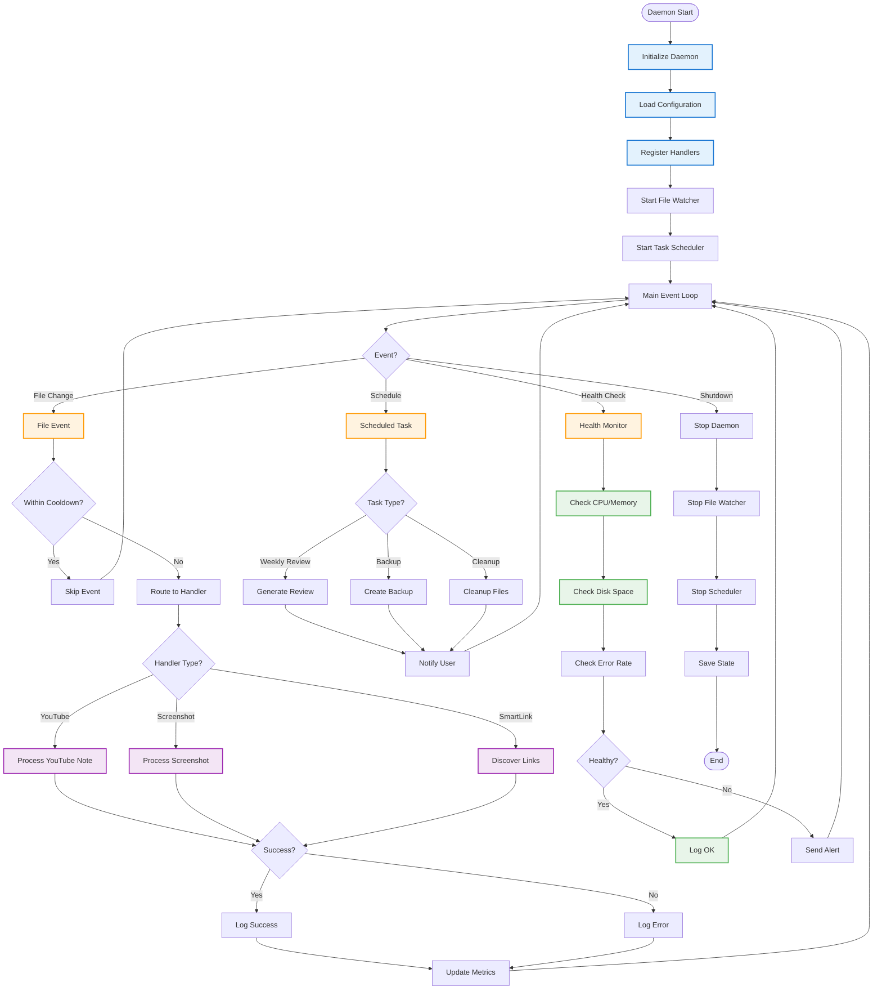

# Daemon Automation Workflow - Flowchart

**Purpose**: Background automation service for continuous knowledge processing  
**Service**: `automation_daemon.py`  
**Handlers**: Feature-specific automation handlers

## Workflow Overview

The Daemon Automation system runs as a background service, watching for file changes and scheduled events to automatically process notes without manual intervention.

---

## Mermaid Flowchart



---

## Feature Handlers

### 1. YouTube Handler
**Trigger**: YouTube note saved  
**Actions**: Fetch transcript → Extract quotes → Update note

### 2. Screenshot Handler
**Trigger**: New screenshot image  
**Actions**: OCR → AI enhancement → Create note

### 3. Smart Link Handler
**Trigger**: Note without links  
**Actions**: Find connections → Suggest/insert links

---

## Configuration

```yaml
daemon:
  log_level: INFO
  
youtube_handler:
  enabled: true
  cooldown_seconds: 60
  
screenshot_handler:
  enabled: true
  auto_enhance: true
  
smartlink_handler:
  enabled: false
  auto_insert: false
```

---

## Management Commands

```bash
# Start daemon
inneros daemon start

# Stop daemon
inneros daemon stop

# Check status
inneros daemon status

# View logs
inneros daemon logs --tail 50
```

---

**Last Updated**: 2025-10-12  
**Status**: Production Ready ✅
