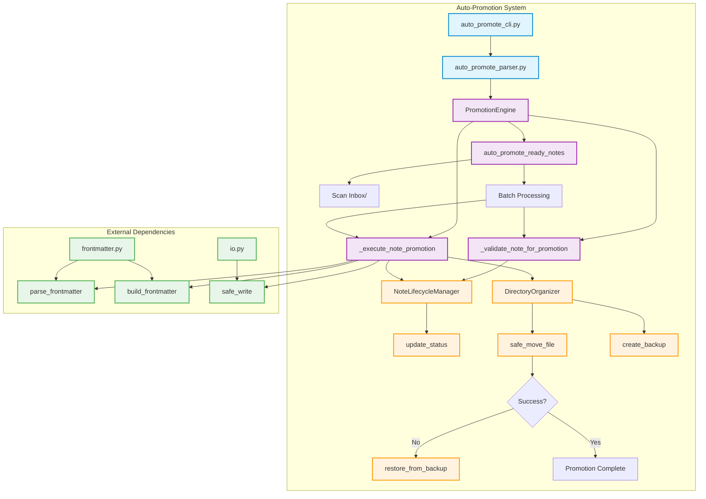

# Auto-Promotion Workflow - Quality-Gated Automation

**Purpose**: Automated note promotion based on quality thresholds  
**Created**: 2025-10-15  
**Status**: 🟢 **READY** - v2.0 infrastructure complete, implementing in Option 2  
**Epic**: Note Lifecycle Auto-Promotion System

---

## Overview

The Auto-Promotion workflow automatically promotes notes from `Inbox/` to their target directories (`Fleeting Notes/`, `Literature/`, `Permanent Notes/`) when they meet quality thresholds. This eliminates manual triage for high-quality notes and enables true knowledge flow automation.

**Key Components**:
- **PromotionEngine** (625 LOC) - Quality validation and promotion logic
- **NoteLifecycleManager** (222 LOC) - Status tracking
- **DirectoryOrganizer** - Safe file moves with backup/rollback
- **Quality Threshold**: Default 0.7 (configurable)

---

## Complete Auto-Promotion Flowchart

```mermaid
flowchart TD
    %% Entry Point
    Start([Auto-Promotion Triggered]) --> Mode{Run Mode?}
    
    Mode -->|--dry-run| DryRun[Preview Mode]
    Mode -->|Execute| Execute[Execution Mode]
    
    %% Common Path
    DryRun --> ScanInbox[Scan Inbox/ Directory]
    Execute --> ScanInbox
    
    ScanInbox --> FindNotes[Find All *.md Files]
    FindNotes --> HasNotes{Notes Found?}
    
    HasNotes -->|No| NoNotes[Return: 0 candidates]
    HasNotes -->|Yes| IterateNotes[Iterate Through Notes]
    
    %% Per-Note Processing
    IterateNotes --> ReadNote[Read Note Metadata]
    ReadNote --> HasQuality{Has quality_score?}
    
    HasQuality -->|No| Skip1[Skip: No quality score]
    HasQuality -->|Yes| CheckStatus{Status?}
    
    CheckStatus -->|draft, published, archived| Skip2[Skip: Wrong status]
    CheckStatus -->|inbox or promoted| CheckQuality{Quality >= 0.7?}
    
    CheckQuality -->|No| Skip3[Skip: Below threshold]
    CheckQuality -->|Yes| CheckType{Has type field?}
    
    CheckType -->|No| Skip4[Skip: Missing type]
    CheckType -->|Yes| ValidateType{Valid type?}
    
    ValidateType -->|Invalid| Skip5[Skip: Invalid type]
    ValidateType -->|fleeting, literature, permanent| Candidate[✅ Promotion Candidate]
    
    %% Dry-Run vs Execute
    Candidate --> IsDryRun{Dry-Run Mode?}
    
    IsDryRun -->|Yes| PreviewAdd[Add to Preview List]
    IsDryRun -->|No| PromoteNote[Execute Promotion]
    
    PreviewAdd --> LogPreview[Log: Would promote to X]
    LogPreview --> NextNote{More Notes?}
    
    %% Execution Path
    PromoteNote --> DetermineTarget{Target Directory?}
    
    DetermineTarget -->|type: fleeting| TargetFleeting[Target: Fleeting Notes/]
    DetermineTarget -->|type: literature| TargetLit[Target: Literature/]
    DetermineTarget -->|type: permanent| TargetPerm[Target: Permanent Notes/]
    
    TargetFleeting --> MoveFile[Safe File Move]
    TargetLit --> MoveFile
    TargetPerm --> MoveFile
    
    MoveFile --> UpdateMetadata[Update Frontmatter]
    UpdateMetadata --> SetType[Set type field]
    SetType --> SetStatus[Set status: promoted]
    SetStatus --> SetDate[Set promoted_date]
    
    SetDate --> UpdateLifecycle[Update Lifecycle Status]
    UpdateLifecycle --> MoveSuccess{Success?}
    
    MoveSuccess -->|Yes| LogSuccess[Log: Promoted to X]
    MoveSuccess -->|No| LogError[Log: Error]
    
    LogSuccess --> IncrementSuccess[Increment promoted_count]
    LogError --> IncrementError[Increment error_count]
    
    IncrementSuccess --> NextNote
    IncrementError --> NextNote
    
    %% Skip Paths
    Skip1 --> NextNote
    Skip2 --> NextNote
    Skip3 --> IncrementSkip[Increment skipped_count]
    Skip4 --> IncrementSkip
    Skip5 --> IncrementSkip
    
    IncrementSkip --> NextNote
    
    %% Loop Control
    NextNote -->|Yes| ReadNote
    NextNote -->|No| GenerateReport[Generate Results Report]
    
    %% Results
    GenerateReport --> ReportStats["📊 RESULTS<br/>Total Candidates: X<br/>Promoted: Y<br/>Skipped: Z<br/>Errors: E"]
    
    ReportStats --> ByType["By Type:<br/>• Fleeting: A promoted<br/>• Literature: B promoted<br/>• Permanent: C promoted"]
    
    ByType --> End([Return Results])
    NoNotes --> End
    
    %% Styling
    classDef entryClass fill:#e1f5ff,stroke:#0288d1,stroke-width:2px
    classDef scanClass fill:#fff3e0,stroke:#ff9800,stroke-width:2px
    classDef checkClass fill:#fff9c4,stroke:#fbc02d,stroke-width:2px
    classDef skipClass fill:#ffebee,stroke:#f44336,stroke-width:2px
    classDef candidateClass fill:#e8f5e9,stroke:#4caf50,stroke-width:3px
    classDef executeClass fill:#e3f2fd,stroke:#1976d2,stroke-width:2px
    classDef successClass fill:#c8e6c9,stroke:#388e3c,stroke-width:2px
    classDef errorClass fill:#ffcdd2,stroke:#d32f2f,stroke-width:2px
    classDef reportClass fill:#f3e5f5,stroke:#9c27b0,stroke-width:2px
    
    class Start,Mode,IsDryRun entryClass
    class ScanInbox,FindNotes,IterateNotes scanClass
    class HasNotes,HasQuality,CheckStatus,CheckQuality,CheckType,ValidateType,DetermineTarget,MoveSuccess,NextNote checkClass
    class Skip1,Skip2,Skip3,Skip4,Skip5,IncrementSkip skipClass
    class Candidate candidateClass
    class DryRun,PreviewAdd,LogPreview executeClass
    class Execute,PromoteNote,MoveFile,UpdateMetadata,SetType,SetStatus,SetDate,UpdateLifecycle executeClass
    class TargetFleeting,TargetLit,TargetPerm executeClass
    class LogSuccess,IncrementSuccess successClass
    class LogError,IncrementError,NoNotes errorClass
    class GenerateReport,ReportStats,ByType,End reportClass
```



---

## Quality Threshold Decision Matrix

```mermaid
flowchart LR
    Note[Note in Inbox/] --> Quality{Quality Score}
    
    Quality -->|">= 0.7 High"| AutoPromote["✅ AUTO-PROMOTE<br/>Move to target directory<br/>Set status: published"]
    Quality -->|"0.4 - 0.7 Medium"| ManualReview["🟡 MANUAL REVIEW<br/>Remain in Inbox/<br/>Set status: promoted<br/>Await user decision"]
    Quality -->|"< 0.4 Low"| NeedsWork["🔴 NEEDS WORK<br/>Remain in Inbox/<br/>Set status: draft<br/>Enhance or archive"]
    
    AutoPromote --> Published[Published State]
    ManualReview --> UserDecision{User Action}
    NeedsWork --> Enhance{Enhance?}
    
    UserDecision -->|Promote| Published
    UserDecision -->|Enhance| NeedsWork
    UserDecision -->|Archive| Archived[Archived State]
    
    Enhance -->|Yes| ManualReview
    Enhance -->|No| Archived
    
    classDef highClass fill:#c8e6c9,stroke:#388e3c,stroke-width:2px
    classDef medClass fill:#fff9c4,stroke:#fbc02d,stroke-width:2px
    classDef lowClass fill:#ffcdd2,stroke:#d32f2f,stroke-width:2px
    classDef stateClass fill:#e3f2fd,stroke:#1976d2,stroke-width:2px
    
    class AutoPromote,Published highClass
    class ManualReview,UserDecision medClass
    class NeedsWork,Enhance lowClass
    class Archived stateClass
```



---

## Type-Based Promotion Targets

```mermaid
flowchart TD
    subgraph "Auto-Promotion by Type"
        Inbox[Inbox/<br/>quality >= 0.7] --> TypeCheck{Note Type?}
        
        TypeCheck -->|type: fleeting| Fleeting["📋 FLEETING NOTES/<br/>Short-lived ideas<br/>Maturation: 7-30 days<br/>→ Eventually Permanent"]
        TypeCheck -->|type: literature| Literature["📚 LITERATURE/<br/>Source material<br/>Claims & quotes<br/>→ Referenced knowledge"]
        TypeCheck -->|type: permanent| Permanent["⭐ PERMANENT NOTES/<br/>Atomic insights<br/>Fully integrated<br/>→ Active knowledge"]
        
        Fleeting --> FleetingStatus["Status: published<br/>Location: Fleeting Notes/<br/>Lifecycle: Temporary"]
        Literature --> LitStatus["Status: published<br/>Location: Literature/<br/>Lifecycle: Reference"]
        Permanent --> PermStatus["Status: published<br/>Location: Permanent Notes/<br/>Lifecycle: Permanent"]
        
        FleetingStatus --> Mature{Matured?}
        Mature -->|Yes, 7-30 days| PromotePerm[Auto-Promote to Permanent]
        Mature -->|No| FleetingStatus
        
        PromotePerm --> PermStatus
        LitStatus --> Active[Active Knowledge Base]
        PermStatus --> Active
    end
    
    classDef inboxClass fill:#fff3e0,stroke:#ff9800,stroke-width:2px
    classDef fleetingClass fill:#fff9c4,stroke:#fbc02d,stroke-width:2px
    classDef litClass fill:#e1f5ff,stroke:#0288d1,stroke-width:2px
    classDef permClass fill:#c8e6c9,stroke:#388e3c,stroke-width:2px
    classDef stateClass fill:#e3f2fd,stroke:#1976d2,stroke-width:2px
    
    class Inbox inboxClass
    class Fleeting,FleetingStatus fleetingClass
    class Literature,LitStatus litClass
    class Permanent,PermStatus,PromotePerm permClass
    class TypeCheck,Mature,Active stateClass
```



---

## Coordinator Integration Architecture



---

## CLI Command Examples

### **Dry-Run Mode (Preview)**
```bash
# Preview what would be promoted (no changes)
python3 development/src/cli/auto_promote_cli.py knowledge/ --dry-run

# Preview with custom threshold
python3 development/src/cli/auto_promote_cli.py knowledge/ --dry-run --quality 0.8

# Preview specific types only
python3 development/src/cli/auto_promote_cli.py knowledge/ --dry-run --types permanent,literature
```

### **Execution Mode**
```bash
# Auto-promote all eligible notes (quality >= 0.7)
python3 development/src/cli/auto_promote_cli.py knowledge/

# Custom quality threshold
python3 development/src/cli/auto_promote_cli.py knowledge/ --quality 0.6

# Promote only permanent notes
python3 development/src/cli/auto_promote_cli.py knowledge/ --types permanent

# Verbose output with progress
python3 development/src/cli/auto_promote_cli.py knowledge/ --verbose
```

### **Scheduled Automation**
```bash
# Daily cron job (8am)
0 8 * * * cd /path/to/inneros && python3 development/src/cli/auto_promote_cli.py knowledge/ >> .automation/logs/auto_promotion.log 2>&1

# Weekly batch with higher threshold
0 9 * * 0 cd /path/to/inneros && python3 development/src/cli/auto_promote_cli.py knowledge/ --quality 0.8 --verbose
```

---

## Validation & Safety

### **Pre-Promotion Validation**
1. ✅ **Quality score exists** - `frontmatter.quality_score`
2. ✅ **Meets threshold** - `quality_score >= 0.7`
3. ✅ **Valid status** - `status in ["inbox", "promoted"]`
4. ✅ **Type field present** - `frontmatter.type`
5. ✅ **Valid type** - `type in ["fleeting", "literature", "permanent"]`
6. ✅ **Target directory exists** - Create if missing

### **Safety Mechanisms**
1. **Backup Creation** - Before any file move
2. **Atomic Operations** - All-or-nothing promotion
3. **Rollback Capability** - Restore from backup on failure
4. **Dry-Run Mode** - Preview changes before execution
5. **Comprehensive Logging** - Track all operations
6. **Error Isolation** - One failure doesn't stop batch

---

## Success Metrics

### **Healthy Auto-Promotion**
- **Promotion Rate**: 60-80% of candidates promoted successfully
- **Error Rate**: <5% failures
- **Skip Rate**: 20-40% (below threshold or missing metadata)
- **Average Quality**: Promoted notes average 0.75+

### **Expected Results (Based on Current Data)**
- **Total Candidates**: ~40-50 notes in Inbox/
- **Auto-Promoted**: ~30-35 notes (quality >= 0.7)
- **Skipped**: ~10-15 notes (below threshold)
- **Errors**: <2 notes (missing type, etc.)

### **Impact Metrics**
- **Time Saved**: ~15-20 min/day manual triage elimination
- **Orphaned Notes Fixed**: 77 notes moved to correct locations
- **Misplaced Files Fixed**: 30 files moved to proper directories
- **Workflow Automation**: 100% hands-off for high-quality notes

---

## Error Handling

### **Common Issues & Resolution**

| Error | Cause | Resolution |
|-------|-------|------------|
| Missing `quality_score` | Note not AI-processed | Skip, process with `--process-inbox` first |
| Missing `type` field | Template not used | Skip, add type manually |
| Invalid type value | Typo or custom type | Skip, fix to fleeting/literature/permanent |
| Target directory missing | First-time setup | Auto-create with warning |
| File move failure | Permission or disk space | Log error, restore backup, skip |
| Metadata update failure | YAML parse error | Log error, rollback, skip |

### **Recovery Commands**
```bash
# Find notes that failed promotion
rg "promotion_error" .automation/logs/auto_promotion.log

# Retry failed promotions
python3 development/src/cli/auto_promote_cli.py knowledge/ --retry-failed

# Rollback last batch (TO BE IMPLEMENTED)
python3 development/src/cli/auto_promote_cli.py knowledge/ --rollback
```

---

## Implementation Status

### **✅ Complete (v2.0)**
- PromotionEngine.auto_promote_ready_notes() method
- NoteLifecycleManager status tracking
- DirectoryOrganizer safe file operations
- Quality validation logic
- Test infrastructure (72/72 passing)

### **🔄 In Progress (Option 2)**
- [ ] **PBI-002**: Add literature_dir initialization (90 min)
- [ ] **PBI-003**: CLI integration (90 min)
- [ ] **PBI-004**: Real data validation (60 min)

### **⏳ Planned (P1)**
- [ ] Scheduled automation integration
- [ ] Monitoring & metrics
- [ ] Rollback safety feature

---

## Related Documentation

- **[Note Lifecycle Complete](./10-note-lifecycle-complete.md)** - Full lifecycle with all states
- **[Inbox Processing Workflow](./09-inbox-processing-workflow.md)** - AI processing before promotion
- **[Fleeting Notes Lifecycle](./03-fleeting-notes-lifecycle.md)** - Fleeting maturation process
- **[Weekly Review Workflow](./02-weekly-review-workflow.md)** - Manual review alternative

---

**Last Updated**: 2025-10-15  
**Status**: 🟢 Ready for Implementation  
**Priority**: P0 - Critical Path for Workflow Automation  
**Epic**: Note Lifecycle Auto-Promotion System
