# YouTube Template + AI Integration - Project Manifest

**Created**: 2025-10-06 07:40 PDT  
**Status**: 📋 PLANNING - Ready for User Review & Approval  
**Type**: Phase 5 Extension (Integration Project)  
**Priority**: P1 - High-Impact Workflow Enhancement  
**Estimated Effort**: 1-2 weeks (TDD approach)

---

## 🎯 Project Vision

**Goal**: Seamless integration between Templater's YouTube template and AI transcript processing, creating a "one-button" workflow that captures rich metadata AND intelligent content extraction.

**User Experience**: After submitting the Templater prompts (URL + reason), the system automatically fetches the transcript, extracts relevant quotes, and updates the note—all without additional user input.

---

## 📊 Stakeholder Diagrams

### 1. User Workflow Flowchart

**Shows**: End-to-end user experience from template submission to enhanced note


### 2. System Dataflow Diagram

**Shows**: How data moves between components and external services


### 3. Processing State Machine

**Shows**: Note lifecycle from creation to AI-enhanced completion

```mermaid
stateDiagram-v2
    [*] --> Created: Template submits
    
    Created --> Queued: Add to processing queue<br/>frontmatter: ai_processed=false
    
    Queued --> Processing: Worker picks up job<br/>Update: processing=true
    
    Processing --> FetchingTranscript: Call transcript API
    
    FetchingTranscript --> TranscriptSuccess: Transcript received
    FetchingTranscript --> TranscriptFailed: No transcript available
    
    TranscriptSuccess --> ExtractingQuotes: Call Ollama LLM
    
    ExtractingQuotes --> QuotesSuccess: Quotes extracted
    ExtractingQuotes --> LLMFailed: LLM unavailable
    
    QuotesSuccess --> Enhancing: Parse & insert quotes
    
    Enhancing --> Enhanced: Note saved successfully<br/>frontmatter: ai_processed=true
    
    LLMFailed --> Retry: Retry attempt < 3
    Retry --> ExtractingQuotes: Wait & retry
    
    LLMFailed --> RetryExhausted: Max retries reached
    TranscriptFailed --> Failed: Update frontmatter<br/>status: failed
    RetryExhausted --> Failed
    
    Enhanced --> [*]: ✅ Complete
    Failed --> ManualProcessing: User triggers<br/>--force flag
    ManualProcessing --> Queued: Re-queue
    Failed --> [*]: ⚠️ Preserved without AI
    
    note right of Created
        Note has metadata:
        - Title, Channel, Thumb
        - User reason
        - video_url, video_id
    end note
    
    note right of Enhanced
        Enhanced note includes:
        - Original metadata
        - AI-extracted quotes
        - Processing timestamp
        - Quote statistics
    end note
    
    note right of Failed
        Failed note preserved:
        - All metadata intact
        - Error reason logged
        - Manual retry available
    end note
```



### 4. Error Handling & Recovery Flow

**Shows**: Graceful degradation and user recovery options

```mermaid
flowchart TD
    Start([Processing Triggered]) --> CheckTranscript{Can Fetch<br/>Transcript?}
    
    CheckTranscript -->|Yes| CheckLLM{Is Ollama<br/>Running?}
    CheckTranscript -->|No| TransError[Error: Transcript Unavailable]
    
    CheckLLM -->|Yes| Processing[Extract Quotes Successfully]
    CheckLLM -->|No| LLMError[Error: LLM Service Down]
    
    TransError --> UpdateNote1[Update Note Frontmatter:<br/>ai_processed: false<br/>error: transcript_unavailable]
    UpdateNote1 --> Notify1[Obsidian Notification:<br/>'Transcript not available<br/>for this video']
    Notify1 --> Note1[Note Preserved with:<br/>✓ Metadata<br/>✓ User reason<br/>✗ No AI quotes]
    Note1 --> Option1[User Options:<br/>1. Keep note as-is<br/>2. Add quotes manually<br/>3. Find alternative source]
    
    LLMError --> RetryLogic{Retry<br/>Attempt < 3?}
    RetryLogic -->|Yes| QueueRetry[Add to Retry Queue<br/>Wait 60s]
    QueueRetry --> WaitNotify[Notification:<br/>'Retrying in background...']
    WaitNotify --> CheckLLM
    
    RetryLogic -->|No| UpdateNote2[Update Note Frontmatter:<br/>ai_processed: false<br/>error: llm_unavailable<br/>retry_count: 3]
    UpdateNote2 --> Notify2[Obsidian Notification:<br/>'AI processing failed<br/>Manual retry available']
    Notify2 --> Note2[Note Preserved with:<br/>✓ Metadata<br/>✓ User reason<br/>✗ No AI quotes]
    Note2 --> Option2[User Options:<br/>1. Try manual CLI command<br/>2. Wait and retry later<br/>3. Keep note as-is]
    
    Processing --> Success[Update Note:<br/>ai_processed: true<br/>Insert AI quotes<br/>Add statistics]
    Success --> NotifySuccess[Notification:<br/>'Note enhanced with<br/>7 relevant quotes']
    NotifySuccess --> CompleteNote[✅ Complete Enhanced Note:<br/>✓ Metadata<br/>✓ User reason<br/>✓ AI quotes<br/>✓ Categories]
    
    Option1 --> Manual1[Manual Processing:<br/>workflow_demo.py<br/>--process-youtube-note<br/>--force]
    Option2 --> Manual2[Manual Processing:<br/>workflow_demo.py<br/>--process-youtube-note<br/>--force]
    
    Manual1 --> CheckTranscript
    Manual2 --> CheckLLM
    
    CompleteNote --> End([System Complete])
    Option1 --> End
    Option2 --> End
    
    style TransError fill:#FFA07A
    style LLMError fill:#FFA07A
    style Note1 fill:#FFE4B5
    style Note2 fill:#FFE4B5
    style CompleteNote fill:#90EE90
    style Success fill:#90EE90
    style Manual1 fill:#87CEEB
    style Manual2 fill:#87CEEB
```



### 5. Component Interaction Timeline

**Shows**: Sequence of operations from user action to completion

```mermaid
sequenceDiagram
    actor User
    participant Templater
    participant Bridge as TemplaterBridge
    participant Queue as ProcessingQueue
    participant Processor as YouTubeProcessor
    participant Enhancer as NoteEnhancer
    participant File as Note File
    participant Ollama as Ollama LLM
    
    User->>Templater: Enter YouTube URL
    Templater->>Templater: Fetch metadata (oEmbed)
    User->>Templater: Enter "Why saving this"
    Templater->>File: Create note with metadata
    
    Note over Templater,File: ✅ Phase 1: Note Created (3-5 seconds)
    
    Templater->>Bridge: trigger_processing(note_path, url)
    Bridge->>Queue: add_to_queue(note_path, video_id)
    Queue-->>Bridge: job_id, position in queue
    Bridge-->>Templater: trigger_id
    Templater->>User: Show notification<br/>"Processing in background..."
    
    Note over User,Templater: User continues working
    
    Queue->>Processor: process_next_job()
    Processor->>Processor: Fetch transcript (YouTube API)
    Processor->>Ollama: Extract quotes with context
    
    Note over Processor,Ollama: ⏱️ Phase 2: AI Processing (30-60s)
    
    Ollama-->>Processor: 7 extracted quotes
    Processor->>Enhancer: enhance_note(quotes_data)
    Enhancer->>File: Read current content
    File-->>Enhancer: Note structure
    Enhancer->>Enhancer: Parse & insert quotes
    Enhancer->>File: Write enhanced content
    Enhancer->>File: Update frontmatter
    
    Note over Enhancer,File: ✅ Phase 3: Enhancement (1-2s)
    
    Enhancer-->>Processor: Enhancement complete
    Processor-->>Queue: update_status(completed)
    Queue-->>Bridge: job_completed(trigger_id)
    Bridge->>User: Show notification<br/>"Note enhanced with 7 quotes"
    
    User->>File: Open enhanced note
    File-->>User: Complete note with AI quotes
    
    Note over User,File: ✅ Total Time: 35-70 seconds
```



---

## 📊 Current State Analysis

### ✅ What's Working
1. **Templater Template** (`knowledge/Templates/youtube-video.md`)
   - oEmbed API fetches: title, channel, thumbnail
   - 2 prompts: YouTube URL + "Why saving this"
   - Creates: `lit-YYYYMMDD-HHMM-{slug}.md` in Inbox/
   - Beautiful note structure with metadata

2. **AI Transcript Pipeline** (TDD Iterations 1-4 COMPLETE)
   - YouTubeTranscriptFetcher: Fetches full transcript
   - ContextAwareQuoteExtractor: AI-powered quote extraction
   - YouTubeTemplateFormatter: Markdown formatting with categories
   - YouTubeProcessor: End-to-end orchestration
   - 39 tests passing, production-ready

### ❌ The Gap
- **No connection** between the two systems
- Templater creates one note type, AI processor creates another
- User must manually run CLI command for AI processing
- No automatic trigger after template submission

---

## 👤 User Stories

### Epic 1: Seamless Template + AI Integration

#### Story 1.1: Automatic AI Processing Trigger
**As a** YouTube video capture user  
**I want** the AI transcript processing to run automatically after I submit the Templater prompts  
**So that** I don't have to remember to run a separate command

**Acceptance Criteria**:
- [ ] Templater completion triggers AI processing without additional user action
- [ ] User sees progress/status indication during processing
- [ ] Processing completes within 60 seconds for typical videos
- [ ] Errors are reported clearly with fallback options

#### Story 1.2: In-Place Note Enhancement
**As a** knowledge worker  
**I want** the AI quotes to be added to my existing note (not create a new one)  
**So that** I have one complete note with both metadata and content

**Acceptance Criteria**:
- [ ] Templater-created note is enhanced in-place
- [ ] Original metadata (title, channel, thumbnail) is preserved
- [ ] AI quotes are inserted in designated section
- [ ] Frontmatter is updated with processing status

#### Story 1.3: Graceful Error Handling
**As a** user capturing YouTube videos  
**I want** the system to handle failures gracefully  
**So that** I still get a usable note even if AI processing fails

**Acceptance Criteria**:
- [ ] Note is created successfully even if transcript unavailable
- [ ] Note is created successfully even if LLM service is down
- [ ] User is notified of processing status (success/partial/failed)
- [ ] Manual retry option available if automatic processing fails

### Epic 2: User Control & Transparency

#### Story 2.1: Processing Status Visibility
**As a** user  
**I want** to see the processing status of my YouTube notes  
**So that** I know which notes have been fully processed

**Acceptance Criteria**:
- [ ] Frontmatter includes `ai_processed: true/false` field
- [ ] Processing timestamp recorded
- [ ] Quote count and summary statistics visible
- [ ] Status visible in Obsidian file browser (via frontmatter)

#### Story 2.2: Manual Processing Override
**As a** power user  
**I want** to manually trigger AI processing on existing notes  
**So that** I can reprocess with different settings or fix failed attempts

**Acceptance Criteria**:
- [ ] CLI command: `--process-youtube-note path/to/note.md`
- [ ] Batch command: `--process-youtube-notes` for multiple files
- [ ] `--force` flag to reprocess already-processed notes
- [ ] Dry-run mode to preview changes

#### Story 2.3: Configuration & Customization
**As a** user with specific needs  
**I want** to customize AI processing behavior  
**So that** the system adapts to my workflow preferences

**Acceptance Criteria**:
- [ ] Configure max quotes (default: 7, range: 3-12)
- [ ] Configure quality threshold (default: 0.7, range: 0.5-0.9)
- [ ] Enable/disable automatic processing (default: enabled)
- [ ] Choose processing trigger (immediate/delayed/manual)

---

## 🏗️ Technical Requirements

### R1: Template Integration Hook
**Priority**: P0 (Blocking)

**Requirements**:
- Templater template calls processing function at end of template execution
- Processing runs asynchronously (doesn't block template completion)
- Template creates note first, then enhances it
- Compatible with Templater's JavaScript execution environment

**Technical Approach**:
```javascript
// At end of youtube-video.md template
<%*
// ... existing template code ...

// Trigger AI processing asynchronously
tp.user.trigger_youtube_processing(fname, youtubeUrl, quickSummary);
%>
```

**Implementation Options**:
1. **Option A**: Templater user script that calls Python CLI
2. **Option B**: File watcher that detects new YouTube notes
3. **Option C**: Modified template that writes processing queue file

### R2: Note Enhancement System
**Priority**: P0 (Blocking)

**Requirements**:
- Detect existing note structure from Templater
- Insert AI quotes in correct section (after "Why I'm Saving This")
- Preserve all existing content and metadata
- Update frontmatter with processing metadata
- Handle edge cases (missing sections, malformed notes)

**Data Flow**:
```
1. Detect note: source: youtube, ai_processed: false
2. Extract video_id from frontmatter
3. Run YouTubeProcessor.process_video()
4. Parse existing note structure
5. Insert quotes section after "Why I'm Saving This"
6. Update frontmatter: ai_processed: true, processed_at: timestamp
7. Write enhanced note back to disk
```

### R3: Processing Queue System
**Priority**: P1 (High)

**Requirements**:
- Queue notes for processing (handles multiple videos added quickly)
- Process queue asynchronously (background task)
- Retry failed processing with exponential backoff
- Status tracking for each queued item
- Maximum queue size limit (prevent runaway processing)

**Technical Approach**:
- SQLite database for queue persistence
- Processing worker runs in background
- Status: pending → processing → completed/failed
- Configurable retry attempts (default: 3)

### R4: Error Handling & Fallbacks
**Priority**: P0 (Blocking)

**Requirements**:
- Handle transcript unavailable (videos with disabled captions)
- Handle LLM service unavailable (Ollama down/busy)
- Handle API rate limits (YouTube oEmbed or transcript API)
- Preserve note even if processing fails completely
- Log errors with context for debugging

**Fallback Strategy**:
```
1. Transcript unavailable → Note created with placeholder, manual prompt
2. LLM unavailable → Note created, queued for retry
3. API rate limit → Exponential backoff, retry queue
4. Complete failure → Note preserved, error logged, user notified
```

### R5: Performance Targets
**Priority**: P1 (High)

**Requirements**:
- Template submission → note creation: <3 seconds
- AI processing: <60 seconds (typical 10-15 minute video)
- Queue processing: <5 minutes for 10 videos
- No blocking of Obsidian UI during processing
- Progress indication visible to user

---

## 🔧 Technical Architecture

### Component Overview


### New Components to Build

#### 1. **YouTubeNoteEnhancer** (NEW)
```python
class YouTubeNoteEnhancer:
    """
    Enhances existing YouTube notes with AI-extracted quotes.
    
    Features:
    - Parse existing note structure
    - Insert quotes without destroying content
    - Update frontmatter metadata
    - Preserve wiki-links and formatting
    """
    
    def enhance_note(self, note_path: Path, quotes_data: Dict) -> EnhanceResult:
        """Enhance existing note with AI quotes."""
        
    def parse_note_structure(self, content: str) -> NoteStructure:
        """Parse note to identify insertion points."""
        
    def insert_quotes_section(self, content: str, quotes: str) -> str:
        """Insert quotes after 'Why I'm Saving This' section."""
```

#### 2. **ProcessingQueue** (NEW)
```python
class ProcessingQueue:
    """
    Manages background processing queue for YouTube notes.
    
    Features:
    - SQLite-backed queue persistence
    - Priority ordering (newest first)
    - Retry logic with exponential backoff
    - Status tracking and reporting
    """
    
    def add_to_queue(self, note_path: Path, metadata: Dict) -> QueueItem:
        """Add note to processing queue."""
        
    def process_queue(self, max_concurrent: int = 1) -> ProcessingReport:
        """Process queued items."""
        
    def get_status(self, note_path: Path) -> QueueStatus:
        """Get processing status for note."""
```

#### 3. **TemplaterBridge** (NEW)
```python
class TemplaterBridge:
    """
    Bridge between Templater JavaScript and Python processing.
    
    Features:
    - Templater user script registration
    - Async processing trigger
    - Status file communication
    - Error propagation to UI
    """
    
    def trigger_processing(self, note_path: Path, video_url: str) -> TriggerId:
        """Trigger processing from Templater."""
        
    def get_processing_status(self, trigger_id: str) -> ProcessingStatus:
        """Check status of triggered processing."""
```

#### 4. **YouTubeFileWatcher** (OPTIONAL - P2)
```python
class YouTubeFileWatcher:
    """
    Watches Inbox/ for new YouTube notes and triggers processing.
    
    Features:
    - Watchdog-based file system monitoring
    - Debouncing (wait for file writes to complete)
    - Automatic queue addition
    - Configurable enable/disable
    """
    
    def start_watching(self, directory: Path):
        """Start file system watching."""
        
    def on_youtube_note_created(self, path: Path):
        """Handle new YouTube note detection."""
```

---

## 📋 Implementation Plan

### Phase 1: Core Integration (Week 1)
**Goal**: Basic template → AI processing integration working

#### TDD Iteration 1: YouTubeNoteEnhancer (2-3 days)
- [ ] RED: Write failing tests for note parsing and enhancement
- [ ] GREEN: Implement note enhancement logic
- [ ] REFACTOR: Extract utilities, optimize structure
- [ ] VALIDATE: Test with real Templater-created notes

**Deliverables**:
- YouTubeNoteEnhancer class (250-300 LOC)
- 15+ comprehensive tests
- Real data validation with 5+ test notes

#### TDD Iteration 2: Processing Queue (2-3 days)
- [ ] RED: Write failing tests for queue management
- [ ] GREEN: Implement SQLite-backed queue
- [ ] REFACTOR: Extract retry logic, status tracking
- [ ] VALIDATE: Test with simulated concurrent processing

**Deliverables**:
- ProcessingQueue class (200-250 LOC)
- 12+ comprehensive tests
- Queue database schema and migration

#### TDD Iteration 3: CLI Integration (1-2 days)
- [ ] RED: Write failing tests for CLI commands
- [ ] GREEN: Implement --process-youtube-notes command
- [ ] REFACTOR: Extract command utilities
- [ ] VALIDATE: Test with real inbox notes

**Deliverables**:
- CLI commands in workflow_demo.py
- 8+ CLI integration tests
- User documentation

### Phase 2: Template Integration (Week 2)
**Goal**: Automatic trigger from Templater template

#### TDD Iteration 4: Templater Bridge (2-3 days)
- [ ] RED: Write failing tests for bridge communication
- [ ] GREEN: Implement Templater user script
- [ ] REFACTOR: Optimize async handling
- [ ] VALIDATE: Test end-to-end from template

**Deliverables**:
- TemplaterBridge class (150-200 LOC)
- Templater user script (.templater/scripts/)
- 10+ integration tests
- Updated youtube-video.md template

#### TDD Iteration 5: Error Handling & Polish (1-2 days)
- [ ] Comprehensive error handling
- [ ] User notifications (Obsidian notices)
- [ ] Configuration file support
- [ ] Documentation and user guide

**Deliverables**:
- Error handling utilities
- Configuration schema
- Complete user documentation
- Migration guide for existing notes

### Phase 3: Enhancement & Automation (Optional - Week 3)
**Goal**: File watcher and advanced features

#### TDD Iteration 6: File Watcher (2 days) - OPTIONAL
- [ ] RED: Write failing tests for file watching
- [ ] GREEN: Implement watchdog integration
- [ ] REFACTOR: Optimize debouncing
- [ ] VALIDATE: Test with rapid note creation

**Deliverables**:
- YouTubeFileWatcher class
- Daemon script for background running
- System service configuration (macOS LaunchAgent)

---

## 🎯 Success Criteria

### Must Have (P0)
- [x] Templater template creates note with metadata
- [ ] AI processing automatically triggered after template submission
- [ ] Note enhanced in-place with AI quotes
- [ ] Processing completes within 60 seconds
- [ ] Graceful error handling (transcript/LLM unavailable)
- [ ] Manual processing command available
- [ ] Zero data loss on processing failures

### Should Have (P1)
- [ ] Processing queue system for batch handling
- [ ] Retry logic for failed processing
- [ ] Status tracking visible in frontmatter
- [ ] Configuration file for customization
- [ ] Progress notifications in Obsidian
- [ ] Comprehensive error logging

### Could Have (P2)
- [ ] File watcher for automatic detection
- [ ] Background daemon for processing queue
- [ ] Advanced configuration options
- [ ] Processing analytics and reporting
- [ ] Batch reprocessing of old notes
- [ ] **Context-Aware Quote Extraction**: Use manually-entered "Key Takeaways" section as context input to AI
  - Parse user's manual notes from Key Takeaways section
  - Use as semantic hints to extract more relevant quotes from transcript
  - Match transcript segments to user's identified topics
  - Include timestamps for each matched quote
  - Preserve user's manual notes while enhancing with AI-extracted quotes

---

## 📊 Testing Strategy

### Unit Tests
- YouTubeNoteEnhancer: 15+ tests
- ProcessingQueue: 12+ tests
- TemplaterBridge: 10+ tests
- CLI commands: 8+ tests
- **Total**: 45+ unit tests

### Integration Tests
- End-to-end: Template → Processing → Enhanced Note (5 tests)
- Queue processing with retries (3 tests)
- Error scenarios (transcript unavailable, LLM down) (4 tests)
- **Total**: 12+ integration tests

### Real Data Validation
- Test with 10+ real YouTube videos
- Various content lengths (5min, 15min, 60min videos)
- Edge cases (no transcript, non-English, auto-captions only)
- Performance benchmarks on real hardware

---

## 🚨 Risk Assessment & Mitigation

### Technical Risks

**Risk 1: Templater Async Execution Complexity**
- **Impact**: High - Core integration blocker
- **Likelihood**: Medium
- **Mitigation**: Start with simpler trigger (file queue), add async later
- **Fallback**: Manual CLI command always works

**Risk 2: Note Structure Parsing Failures**
- **Impact**: Medium - Data corruption risk
- **Likelihood**: Low (with good tests)
- **Mitigation**: Comprehensive parsing tests, backup before enhancement
- **Fallback**: Processing fails gracefully, note preserved

**Risk 3: Processing Queue Performance**
- **Impact**: Medium - User experience degradation
- **Likelihood**: Low
- **Mitigation**: Async processing, progress indicators, queue size limits
- **Fallback**: Disable automatic trigger, use manual command

### User Experience Risks

**Risk 4: Processing Delays Feel Like Hang**
- **Impact**: Medium - User frustration
- **Likelihood**: High (first-time users)
- **Mitigation**: Clear progress indicators, status notifications
- **Fallback**: Set expectations in template ("Processing in background...")

**Risk 5: Failed Processing Not Obvious**
- **Impact**: Medium - Lost AI enhancements
- **Likelihood**: Medium
- **Mitigation**: Frontmatter status field, error notifications
- **Fallback**: Weekly review shows unprocessed notes

---

## 🔗 Integration Points

### Existing Systems to Leverage
1. ✅ **YouTubeProcessor** (TDD Iterations 1-4 COMPLETE)
   - YouTubeTranscriptFetcher
   - ContextAwareQuoteExtractor
   - YouTubeTemplateFormatter

2. ✅ **WorkflowManager** (Phase 5 AI Infrastructure)
   - Note processing patterns
   - Quality assessment
   - Metadata management

3. ✅ **DirectoryOrganizer** (Safety-First File Operations)
   - Backup before modification
   - Atomic file operations
   - Rollback capability

4. ✅ **Templater Template** (Existing)
   - oEmbed metadata fetching
   - User prompt collection
   - File naming and placement

### External Dependencies
- **Templater**: Obsidian plugin (user has installed)
- **youtube-transcript-api**: Python library (already integrated)
- **Ollama**: LLM service (already configured)
- **SQLite**: Queue persistence (Python stdlib)
- **Watchdog** (optional): File system monitoring

---

## 📁 File Structure

```
development/
├── src/
│   ├── ai/
│   │   ├── youtube_note_enhancer.py          # NEW - Note enhancement
│   │   ├── youtube_processing_queue.py       # NEW - Queue management
│   │   ├── templater_bridge.py               # NEW - Template integration
│   │   └── youtube_file_watcher.py           # NEW (optional) - File watching
│   └── cli/
│       └── workflow_demo.py                  # EXTEND - Add YouTube commands
└── tests/
    └── unit/
        ├── test_youtube_note_enhancer.py     # NEW - 15+ tests
        ├── test_youtube_processing_queue.py  # NEW - 12+ tests
        ├── test_templater_bridge.py          # NEW - 10+ tests
        └── test_youtube_integration.py       # NEW - End-to-end tests

knowledge/
├── Templates/
│   └── youtube-video.md                      # EXTEND - Add processing trigger
└── .templater/
    └── scripts/
        └── youtube_processing.js             # NEW - Templater user script

Projects/
└── ACTIVE/
    └── youtube-template-ai-integration-manifest.md  # THIS FILE
```

---

## 📝 Configuration Schema

```yaml
# .automation/config/youtube_processing_config.yaml

youtube_processing:
  # Automatic processing settings
  auto_process:
    enabled: true                    # Enable/disable automatic processing
    trigger: "immediate"             # immediate | delayed | manual
    delay_seconds: 5                 # If delayed trigger
  
  # Processing parameters
  extraction:
    max_quotes: 7                    # Maximum quotes per video
    min_quality: 0.7                 # Minimum relevance score (0-1)
    categories:                      # Quote categories to include
      - key-insight
      - actionable
      - quote
      - definition
  
  # Queue settings
  queue:
    max_size: 50                     # Maximum queued items
    max_concurrent: 1                # Concurrent processing jobs
    retry_attempts: 3                # Retry failed processing
    retry_delay: 60                  # Seconds between retries
  
  # Performance
  performance:
    timeout_seconds: 120             # Max processing time per video
    progress_updates: true           # Show progress notifications
  
  # Error handling
  errors:
    notify_user: true                # Show error notifications
    fallback_to_manual: true         # Offer manual retry on failure
    preserve_incomplete: true        # Keep note even if processing fails
```

---

## 🎉 Expected Outcomes

### User Experience Improvements
- **90% reduction** in manual steps (2 prompts → done vs. 2 prompts + CLI command)
- **<60 seconds** from template submission to enhanced note
- **Zero context switching** (everything happens in Obsidian)
- **Graceful degradation** (usable note even if AI processing fails)

### Technical Improvements
- **Reusable queue system** for other automation needs
- **Templater integration patterns** applicable to other templates
- **Enhanced note enhancement** capabilities for future features
- **Production-ready error handling** and retry logic

### Workflow Transformation
- **Capture friction eliminated** (one-button YouTube saving)
- **AI enhancement automatic** (no need to remember to process)
- **Rich metadata + content** in single note
- **Scalable to high volume** (queue handles many videos)

---

## 🚀 Next Steps

### Immediate Actions (After Approval)
1. **Review & Approve** this manifest
2. **Prioritize user stories** (must-have vs. nice-to-have)
3. **Choose Phase 1 vs. Phase 1+2** (CLI-only vs. full auto-trigger)
4. **Create TDD Iteration 1 branch** (`feat/youtube-note-enhancer-tdd-1`)
5. **Begin RED phase** (write failing tests)

### Decision Points
- **Q1**: Start with manual CLI command or full auto-trigger from template?
  - **Option A**: CLI-only (faster, simpler, works immediately)
  - **Option B**: Full integration (better UX, more complex)
  
- **Q2**: Include file watcher in initial release?
  - **Yes**: Full automation from day one
  - **No**: Add later as enhancement (recommended)

- **Q3**: Processing queue priority?
  - **P0**: Essential for handling multiple videos
  - **P1**: Nice to have, manual works initially

---

**Status**: 📋 **READY FOR REVIEW** - Awaiting user approval to begin implementation

**Estimated Timeline**: 
- Phase 1 (Core Integration): 1 week
- Phase 2 (Template Integration): 1 week
- Phase 3 (Optional Enhancements): 1 week

**Total Effort**: 2-3 weeks for complete system
