# Fleeting Notes Lifecycle - Flowchart

**Purpose**: Health monitoring, triage, and promotion of fleeting notes  
**CLI**: `fleeting_cli.py`  
**Manager**: `WorkflowManager`

## Workflow Overview

The Fleeting Notes Lifecycle manages the journey of quick-capture notes from initial creation through maturation and eventual promotion to permanent status.

---

## Mermaid Flowchart

```mermaid
flowchart TD
    Start([User Captures Thought]) --> CreateNote[Create Fleeting Note]
    CreateNote --> InitialMetadata[Set Initial Metadata]
    InitialMetadata --> SetType["type: fleeting"]
    SetType --> SetStatus["status: inbox"]
    SetStatus --> InboxDir["Save to Inbox/"]
    InboxDir --> WaitMaturation[Note Matures Over Time]
    
    %% Health Monitoring Path
    WaitMaturation --> HealthCheck{Health Check\nTriggered?}
    HealthCheck -->|Yes| FleetingHealth[Run Fleeting Health]
    
    FleetingHealth --> ScanFleeting[Scan Fleeting Notes]
    ScanFleeting --> AnalyzeAge[Analyze Note Age]
    AnalyzeAge --> CalculateMetrics[Calculate Health Metrics]
    
    CalculateMetrics --> AgeDistribution[Age Distribution]
    AgeDistribution --> QualityDistribution[Quality Distribution]
    QualityDistribution --> LinkDistribution[Link Distribution]
    LinkDistribution --> IdentifyStale[Identify Stale Notes]
    
    IdentifyStale --> GenerateHealthReport[Generate Health Report]
    GenerateHealthReport --> HealthOutput{Output Format?}
    HealthOutput -->|normal| DisplayHealth[Display Health Summary]
    HealthOutput -->|json| ExportHealthJSON[Export JSON]
    HealthOutput -->|export| ExportHealthFile[Export to File]
    
    DisplayHealth --> ShowHealthStats[Show Statistics]
    ShowHealthStats --> ShowAgeBreakdown[Show Age Breakdown]
    ShowAgeBreakdown --> ShowStaleNotes[Show Stale Notes >30d]
    ShowStaleNotes --> ShowQualityAvg[Show Average Quality]
    ShowQualityAvg --> HealthEnd([End])
    
    ExportHealthJSON --> HealthEnd
    ExportHealthFile --> HealthEnd
    
    %% Triage Path
    HealthCheck -->|No| TriageCheck{Triage\nTriggered?}
    TriageCheck -->|Yes| FleetingTriage[Run Fleeting Triage]
    
    FleetingTriage --> LoadAllFleeting[Load All Fleeting Notes]
    LoadAllFleeting --> FilterQuality{Quality Filter}
    FilterQuality --> ApplyThreshold["Quality > threshold\n(default: 0.7)"]
    ApplyThreshold --> QualifiedNotes[Qualified Notes]
    
    QualifiedNotes --> AITriage[AI Triage Analysis]
    AITriage --> AnalyzeReadiness[Analyze Promotion Readiness]
    AnalyzeReadiness --> CheckCompleteness[Check Content Completeness]
    CheckCompleteness --> CheckConnectivity[Check Link Integration]
    CheckConnectivity --> GenerateRecommendation[Generate Recommendation]
    
    GenerateRecommendation --> ClassifyAction{Classify Action}
    ClassifyAction -->|Ready| RecommendPromote[Recommend: Promote]
    ClassifyAction -->|Needs Work| RecommendEnhance[Recommend: Enhance]
    ClassifyAction -->|Archive| RecommendArchive[Recommend: Archive]
    
    RecommendPromote --> CreateTriageReport[Create Triage Report]
    RecommendEnhance --> CreateTriageReport
    RecommendArchive --> CreateTriageReport
    
    CreateTriageReport --> TriageOutput{Output Format?}
    TriageOutput -->|normal| DisplayTriage[Display Triage Report]
    TriageOutput -->|json| ExportTriageJSON[Export JSON]
    TriageOutput -->|export| ExportTriageFile[Export to File]
    
    DisplayTriage --> ShowTriageStats[Show Statistics]
    ShowTriageStats --> ShowReadyNotes[Show Ready to Promote]
    ShowReadyNotes --> ShowNeedsWork[Show Needs Enhancement]
    ShowNeedsWork --> ShowToArchive[Show Should Archive]
    ShowToArchive --> TriageEnd([End])
    
    ExportTriageJSON --> TriageEnd
    ExportTriageFile --> TriageEnd
    
    %% Promotion Path
    TriageCheck -->|No| PromotionCheck{User\nPromotes?}
    PromotionCheck -->|Yes| PromoteNote[Promote Note]
    PromoteNote --> ValidatePromotion{Note Eligible?}
    
    ValidatePromotion -->|No| PromotionError[Error: Not Eligible]
    ValidatePromotion -->|Yes| SelectDestination{Select Destination}
    
    SelectDestination -->|permanent| MoveToPermanent["Move to Permanent Notes/"]
    SelectDestination -->|literature| MoveToLiterature["Move to Literature/"]
    
    MoveToPermanent --> UpdatePromotionStatus["Update status: published"]
    MoveToLiterature --> UpdatePromotionStatus
    
    UpdatePromotionStatus --> AddPromotionDate[Add promoted_at timestamp]
    AddPromotionDate --> RewriteLinks[Update All Backlinks]
    RewriteLinks --> VerifyPromotion{Promotion\nSuccessful?}
    
    VerifyPromotion -->|Yes| PromotionSuccess[Success Message]
    VerifyPromotion -->|No| PromotionFailed[Rollback & Error]
    
    PromotionSuccess --> PromotionEnd([End])
    PromotionFailed --> PromotionEnd
    PromotionError --> PromotionEnd
    
    PromotionCheck -->|No| WaitMaturation

    %% Styling
    classDef captureClass fill:#e1f5ff,stroke:#0288d1,stroke-width:2px
    classDef healthClass fill:#f3e5f5,stroke:#9c27b0,stroke-width:2px
    classDef triageClass fill:#fff3e0,stroke:#ff9800,stroke-width:2px
    classDef promoteClass fill:#e8f5e9,stroke:#4caf50,stroke-width:2px
    classDef errorClass fill:#ffebee,stroke:#f44336,stroke-width:2px
    classDef decisionClass fill:#fff9c4,stroke:#f57f17,stroke-width:2px
    
    class CreateNote,InitialMetadata,SetType,SetStatus,InboxDir captureClass
    class FleetingHealth,ScanFleeting,AnalyzeAge,CalculateMetrics healthClass
    class FleetingTriage,AITriage,AnalyzeReadiness,GenerateRecommendation triageClass
    class PromoteNote,MoveToPermanent,MoveToLiterature,PromotionSuccess promoteClass
    class PromotionError,PromotionFailed errorClass
    class HealthCheck,TriageCheck,PromotionCheck,FilterQuality,ClassifyAction,SelectDestination decisionClass
```



---

## Command Details

### 1. **Fleeting Health** (`--fleeting-health`)
**Purpose**: Monitor health and identify issues with fleeting notes

**Metrics Collected**:

#### Age Analysis
- **Fresh**: <7 days (still maturing)
- **Mature**: 7-30 days (ready for review)
- **Stale**: >30 days (needs attention)

#### Quality Analysis
- **High Quality**: Score >0.7 (well-developed)
- **Medium Quality**: Score 0.4-0.7 (needs work)
- **Low Quality**: Score <0.4 (needs significant enhancement)

#### Connectivity Analysis
- **Well Connected**: >3 links (integrated)
- **Some Links**: 1-3 links (partial integration)
- **Isolated**: 0 links (orphaned)

**Health Indicators**:
```
🟢 Healthy: <20% stale, >70% well-connected, avg quality >0.7
🟡 Fair: 20-40% stale, 40-70% well-connected, avg quality 0.5-0.7
🔴 Needs Attention: >40% stale, <40% well-connected, avg quality <0.5
```

**Output Example**:
```markdown
# Fleeting Notes Health Report - 2025-10-12

## Overview
📊 Total Fleeting Notes: 42
🏥 Health Status: 🟢 Healthy

## Age Distribution
- Fresh (<7 days): 12 notes (28.6%)
- Mature (7-30 days): 22 notes (52.4%)
- Stale (>30 days): 8 notes (19.0%)

## Quality Distribution
- High (>0.7): 28 notes (66.7%)
- Medium (0.4-0.7): 10 notes (23.8%)
- Low (<0.4): 4 notes (9.5%)
- Average Quality: 0.74

## Connectivity
- Well Connected (>3 links): 25 notes (59.5%)
- Some Links (1-3): 13 notes (31.0%)
- Isolated (0 links): 4 notes (9.5%)

## Stale Notes (Needs Attention)
1. quick-capture-thoughts.md (45 days old, quality: 0.62)
2. meeting-notes-sept.md (38 days old, quality: 0.58)
3. random-idea-capture.md (35 days old, quality: 0.71)

## Recommendations
- 🟡 Review 8 stale notes (>30 days)
- 🟡 Enhance 4 low-quality notes
- 🟢 Consider promoting 15+ mature, high-quality notes
```

---

### 2. **Fleeting Triage** (`--fleeting-triage`)
**Purpose**: AI-powered triage to classify notes and recommend actions

**Triage Criteria**:

#### Ready to Promote
- Quality score >0.7
- Age >7 days (mature)
- Links >2 (well-connected)
- Content complete and structured
- **Action**: Promote to permanent

#### Needs Enhancement
- Quality score 0.4-0.7
- Missing key information
- Few or weak connections
- Structure needs improvement
- **Action**: Enhance before promotion

#### Should Archive
- Low relevance to current knowledge
- Duplicate content
- Temporary/time-sensitive information
- Quality <0.4 and no connections
- **Action**: Archive or delete

**AI Analysis Per Note**:
1. **Content Completeness**: Is the idea fully developed?
2. **Relevance**: Does it connect to existing knowledge?
3. **Quality**: Is it well-structured and clear?
4. **Actionability**: What's the next step?
5. **Priority**: How urgent is action?

**Output Example**:
```markdown
# Fleeting Notes Triage Report - 2025-10-12

## Statistics
- Total Analyzed: 42 notes
- Ready to Promote: 8 notes (19.0%)
- Needs Enhancement: 15 notes (35.7%)
- Should Archive: 3 notes (7.1%)
- Continue Maturing: 16 notes (38.1%)

## Ready to Promote (High Priority)

### 1. zettelkasten-workflow-insights.md
**Quality**: 0.85 | **Age**: 14 days | **Links**: 6
**Status**: ✅ Ready

**Rationale**:
Well-developed thoughts on workflow optimization with strong 
connections to existing notes. Content is complete and adds 
value to the knowledge base. Ready for permanent status.

**Recommendation**: Promote to Permanent Notes

---

### 2. ai-integration-patterns.md
**Quality**: 0.82 | **Age**: 21 days | **Links**: 4
**Status**: ✅ Ready

**Rationale**:
Comprehensive analysis of AI integration patterns with clear 
examples. Well-connected to related concepts and demonstrates 
depth of understanding.

**Recommendation**: Promote to Permanent Notes

---

## Needs Enhancement (Medium Priority)

### 3. quick-idea-about-automation.md
**Quality**: 0.58 | **Age**: 12 days | **Links**: 1
**Status**: 🔨 Needs Work

**Rationale**:
Good core idea but lacks development. Needs more detail, 
examples, and connections to related concepts. Consider 
expanding before promotion.

**Enhancement Suggestions**:
- Add specific examples
- Link to related automation concepts
- Develop implementation details

---

## Should Archive (Low Priority)

### 4. temp-meeting-notes.md
**Quality**: 0.35 | **Age**: 42 days | **Links**: 0
**Status**: 📦 Archive

**Rationale**:
Time-sensitive meeting notes no longer relevant. No connections 
to permanent knowledge. Safe to archive.

**Recommendation**: Archive to Archive/meetings/
```

---

### 3. **Promote Note** (Via Core Workflow CLI)
**Purpose**: Promote a fleeting note to permanent or literature status

**See**: `01-core-workflow.md` for detailed promotion flow

---

## Lifecycle Stages

```
┌─────────────────────────────────────────────────────────────┐
│                    FLEETING NOTE LIFECYCLE                   │
└─────────────────────────────────────────────────────────────┘

Stage 1: CAPTURE (0-7 days)
├─ Quick thought captured in Inbox/
├─ Initial AI enhancement (tags, quality, links)
├─ Status: inbox → promoted
└─ Type: fleeting

Stage 2: MATURATION (7-30 days)
├─ Note develops through edits
├─ Connections strengthen
├─ Quality improves
└─ Health monitoring active

Stage 3: TRIAGE (Manual or AI-triggered)
├─ AI analyzes promotion readiness
├─ Classifies: Ready / Needs Work / Archive
├─ Generates actionable recommendations
└─ User reviews and decides

Stage 4: PROMOTION (User action)
├─ Validate eligibility
├─ Select destination (permanent/literature)
├─ Update metadata (status: published)
├─ Move file to destination directory
└─ Rewrite all backlinks

Stage 5: PERMANENT (Final state)
├─ Status: published
├─ Location: Permanent Notes/ or Literature/
├─ Full integration into knowledge base
└─ Regular connection discovery
```

---

## Use Cases

### Use Case 1: Daily Health Check
**Frequency**: Daily (morning routine)
**Goal**: Monitor fleeting note health and identify stale notes

```bash
# Quick health check
fleeting_cli.py fleeting-health

# Review stale notes (>30 days)
# Take action on low-quality notes
```

**Time**: 5 minutes

---

### Use Case 2: Weekly Triage Session
**Frequency**: Weekly (Sunday)
**Goal**: Process mature fleeting notes for promotion

```bash
# Generate triage report
fleeting_cli.py fleeting-triage --export triage.md

# Review recommendations
# Promote ready notes
# Enhance needs-work notes
# Archive low-value notes
```

**Time**: 30-45 minutes

---

### Use Case 3: Automated Monitoring
**Frequency**: Continuous (via daemon)
**Goal**: Track fleeting note health automatically

```bash
# Generate health metrics for dashboard
fleeting_cli.py fleeting-health --format json > fleeting-health.json

# Alert on critical issues
# Track trends over time
```

---

## Best Practices

### 1. **Maturation Period**
- Let notes sit for 7-14 days before promotion
- Allows connections to emerge naturally
- Prevents premature promotion of incomplete ideas

### 2. **Quality Over Speed**
- Don't rush promotion for quantity
- Focus on developing high-quality permanent notes
- Better to have fewer, well-developed notes

### 3. **Regular Triage**
- Weekly triage sessions maintain hygiene
- Prevents accumulation of stale notes
- Keeps fleeting notes directory manageable

### 4. **Archive Liberally**
- Not every fleeting note becomes permanent
- Archive time-sensitive or low-value notes
- Preserves flexibility for quick capture

### 5. **Connection Building**
- Add links as ideas develop
- Use connection discovery for suggestions
- Well-connected notes are easier to promote

---

## Architecture

```
FleetingCLI
    ↓
WorkflowManager
    ↓
    ├─→ AnalyticsManager (health metrics)
    ├─→ AIEnhancementManager (triage analysis)
    └─→ CoreWorkflowManager (promotion)
```

**Key Components**:
- `FleetingCLI`: Command-line interface
- `FleetingFormatter`: Report formatting
- `WorkflowManager`: Orchestration
- `AnalyticsManager`: Health analysis
- `AIEnhancementManager`: Triage intelligence

---

## Success Metrics

- **Health Monitoring**: <2s for 100+ fleeting notes
- **Triage Generation**: <5s for 50+ notes
- **AI Accuracy**: >80% user agreement on recommendations
- **Stale Note Rate**: <20% of fleeting notes >30 days
- **Promotion Rate**: 15-25% of fleeting notes promoted monthly

---

**Last Updated**: 2025-10-12  
**Status**: Production Ready ✅
