# YouTube Processing Workflow - Flowchart

**Purpose**: Automated transcript fetching and AI-powered quote extraction from YouTube videos  
**CLI**: `youtube_cli.py`  
**Daemon Handler**: `YouTubeFeatureHandler`

## Workflow Overview

The YouTube Processing Workflow automatically extracts meaningful quotes from YouTube video transcripts using AI analysis, transforming video content into Zettelkasten-compatible knowledge notes.

---

## Mermaid Flowchart

```mermaid
flowchart TD
    Start([User Creates YouTube Note]) --> CreateNote[Create Note in Obsidian]
    CreateNote --> UseTemplate["Use Template: YouTube"]
    UseTemplate --> PasteURL[Paste YouTube URL in body]
    PasteURL --> SaveNote[Save Note]
    
    SaveNote --> DaemonTrigger{Daemon\nWatching?}
    
    %% Manual Processing Path
    DaemonTrigger -->|No| ManualPath[Manual Processing]
    ManualPath --> RunCLI[Run YouTube CLI]
    RunCLI --> SingleOrBatch{Process Type?}
    
    SingleOrBatch -->|single| ProcessSingle[Process Single Note]
    SingleOrBatch -->|batch| ProcessBatch[Batch Process All]
    
    %% Automated Processing Path
    DaemonTrigger -->|Yes| FileEvent[File Watch Event]
    FileEvent --> CooldownCheck{Within\nCooldown?}
    CooldownCheck -->|Yes| SkipProcessing[Skip - Too Soon]
    CooldownCheck -->|No| ProcessAuto[Auto Process]
    SkipProcessing --> End1([End])
    
    %% Common Processing Flow
    ProcessSingle --> StartProcessing[Start Processing]
    ProcessBatch --> FindYouTubeNotes[Find All YouTube Notes]
    FindYouTubeNotes --> BatchLoop[Process Each Note]
    ProcessAuto --> StartProcessing
    BatchLoop --> StartProcessing
    
    StartProcessing --> ParseNote[Parse Note Content]
    ParseNote --> ExtractVideoID[Extract Video ID]
    ExtractVideoID --> ValidateID{Valid\nVideo ID?}
    
    ValidateID -->|No| ErrorNoID[Error: No Video ID]
    ValidateID -->|Yes| CheckCache{In Cache?}
    
    ErrorNoID --> End2([End])
    
    %% Cache Path
    CheckCache -->|Yes| LoadFromCache[Load Cached Transcript]
    CheckCache -->|No| FetchTranscript[Fetch from YouTube API]
    
    FetchTranscript --> APIRequest[Unofficial API Request]
    APIRequest --> APISuccess{Success?}
    
    APISuccess -->|No| APIError[Error: API Failed]
    APISuccess -->|Yes| CacheTranscript[Cache Transcript]
    
    CacheTranscript --> ProcessTranscript[Process Transcript]
    LoadFromCache --> ProcessTranscript
    APIError --> End3([End])
    
    %% Transcript Processing
    ProcessTranscript --> ParseSegments[Parse Transcript Segments]
    ParseSegments --> ValidateSegments{Has\nSegments?}
    
    ValidateSegments -->|No| ErrorNoTranscript[Error: No Transcript]
    ValidateSegments -->|Yes| PrepareContext[Prepare Context Window]
    
    ErrorNoTranscript --> End4([End])
    
    %% AI Quote Extraction
    PrepareContext --> AIExtraction[AI Quote Extraction]
    AIExtraction --> BuildPrompt[Build Extraction Prompt]
    BuildPrompt --> CallOllama[Call Ollama API]
    CallOllama --> OllamaSuccess{Success?}
    
    OllamaSuccess -->|No| OllamaError[Error: AI Failed]
    OllamaSuccess -->|Yes| ParseResponse[Parse AI Response]
    
    OllamaError --> End5([End])
    
    ParseResponse --> ExtractQuotes[Extract Quote Objects]
    ExtractQuotes --> ValidateQuotes{Valid\nQuotes?}
    
    ValidateQuotes -->|No| ErrorNoQuotes[Error: No Valid Quotes]
    ValidateQuotes -->|Yes| FilterQuality[Filter by Quality]
    
    ErrorNoQuotes --> End6([End])
    
    %% Quality Filtering
    FilterQuality --> ApplyThreshold["Quality > threshold"]
    ApplyThreshold --> FilterCategory{Category\nFilter?}
    
    FilterCategory -->|Yes| ApplyCategoryFilter[Filter by Categories]
    FilterCategory -->|No| QuotesReady[Quotes Ready]
    
    ApplyCategoryFilter --> QuotesReady
    
    %% Quote Insertion
    QuotesReady --> PreviewMode{Preview\nMode?}
    
    PreviewMode -->|Yes| DisplayQuotes[Display Quotes Only]
    PreviewMode -->|No| InsertQuotes[Insert Quotes into Note]
    
    DisplayQuotes --> End7([End])
    
    InsertQuotes --> FormatQuotes[Format Quotes Markdown]
    FormatQuotes --> FindInsertPoint[Find Insertion Point]
    FindInsertPoint --> InsertSection[Insert Quotes Section]
    InsertSection --> UpdateMetadata[Update Frontmatter]
    
    UpdateMetadata --> AddProcessedFlag["Add processed: true"]
    AddProcessedFlag --> AddTimestamp["Add processed_at: timestamp"]
    AddTimestamp --> AddQuoteCount["Add quotes_extracted: count"]
    AddQuoteCount --> SaveUpdatedNote[Save Updated Note]
    
    SaveUpdatedNote --> VerifySave{Save\nSuccessful?}
    
    VerifySave -->|No| SaveError[Error: Save Failed]
    VerifySave -->|Yes| LogMetrics[Log Metrics]
    
    SaveError --> End8([End])
    
    %% Completion
    LogMetrics --> RecordProcessingTime[Record Processing Time]
    RecordProcessingTime --> RecordQuoteCount[Record Quote Count]
    RecordQuoteCount --> UpdateCacheStats[Update Cache Stats]
    UpdateCacheStats --> SuccessMessage[Success Message]
    
    SuccessMessage --> BatchCheck{Batch\nMode?}
    
    BatchCheck -->|Yes| MoreNotes{More\nNotes?}
    BatchCheck -->|No| End9([End])
    
    MoreNotes -->|Yes| BatchLoop
    MoreNotes -->|No| BatchSummary[Display Batch Summary]
    BatchSummary --> End10([End])

    %% Styling
    classDef captureClass fill:#e1f5ff,stroke:#0288d1,stroke-width:2px
    classDef apiClass fill:#fff3e0,stroke:#ff9800,stroke-width:2px
    classDef aiClass fill:#f3e5f5,stroke:#9c27b0,stroke-width:2px
    classDef insertClass fill:#e8f5e9,stroke:#4caf50,stroke-width:2px
    classDef errorClass fill:#ffebee,stroke:#f44336,stroke-width:2px
    classDef decisionClass fill:#fff9c4,stroke:#f57f17,stroke-width:2px
    
    class CreateNote,UseTemplate,PasteURL,SaveNote captureClass
    class APIRequest,FetchTranscript,CheckCache,CacheTranscript apiClass
    class AIExtraction,BuildPrompt,CallOllama,ParseResponse,ExtractQuotes aiClass
    class InsertQuotes,FormatQuotes,InsertSection,UpdateMetadata,SaveUpdatedNote insertClass
    class ErrorNoID,APIError,OllamaError,ErrorNoQuotes,SaveError errorClass
    class DaemonTrigger,CooldownCheck,ValidateID,CheckCache,PreviewMode,VerifySave decisionClass
```



---

## Processing Modes

### Mode 1: Manual Single Note Processing
**Command**: `youtube_cli.py process-note <path>`

**Use Case**: Process a specific YouTube note on demand

**Flow**:
1. User specifies note path
2. CLI validates note exists
3. Processes single note through full pipeline
4. Displays results

**Example**:
```bash
youtube_cli.py process-note knowledge/Inbox/YouTube/ai-video.md
```

---

### Mode 2: Manual Batch Processing
**Command**: `youtube_cli.py batch-process`

**Use Case**: Process all unprocessed YouTube notes in inbox

**Flow**:
1. Scan `knowledge/Inbox/YouTube/` directory
2. Filter for unprocessed notes (`processed: false` or missing flag)
3. Process each note sequentially
4. Display batch summary with statistics

**Example**:
```bash
youtube_cli.py batch-process --preview
```

---

### Mode 3: Automated Daemon Processing
**Trigger**: File save event (via daemon)

**Use Case**: Automatic processing when YouTube note is saved

**Flow**:
1. Daemon detects YouTube note save event
2. Cooldown check (prevents duplicate processing <60s)
3. Automatically processes note
4. Updates note with quotes
5. Logs metrics

**Configuration**:
```yaml
youtube_handler:
  enabled: true
  cooldown_seconds: 60
  auto_process: true
```

---

## Component Details

### 1. **Video ID Extraction**
**Purpose**: Extract YouTube video ID from note content

**Extraction Sources** (priority order):
1. Frontmatter `video_id` field
2. URL in note body
3. Embedded YouTube link

**Supported URL Formats**:
- `https://www.youtube.com/watch?v=VIDEO_ID`
- `https://youtu.be/VIDEO_ID`
- `https://www.youtube.com/embed/VIDEO_ID`
- `https://m.youtube.com/watch?v=VIDEO_ID`

**Fallback**: Body parser extracts from first YouTube URL found

---

### 2. **Transcript Fetching**
**Purpose**: Retrieve video transcript from YouTube

**Method**: Unofficial YouTube Transcript API (free, no API key)

**Cache Strategy**:
- **TTL**: 7 days
- **Location**: `.automation/cache/youtube_transcripts.json`
- **Key**: Video ID
- **Benefits**: 99% reduction in API calls, faster processing

**Performance**:
- **Cache Hit**: <100ms
- **Cache Miss**: 2-5 seconds (API request)

**Error Handling**:
- No transcript available → Error message
- API rate limit → Use cached version if available
- Network error → Retry with backoff

---

### 3. **AI Quote Extraction**
**Purpose**: Extract meaningful quotes from transcript using AI

**AI Model**: Ollama (local LLM)
- **Default Model**: `llama3.2:latest`
- **Temperature**: 0.3 (low creativity, high consistency)
- **Max Tokens**: 2048

**Extraction Criteria**:
- Key insights or main ideas
- Practical advice or recommendations
- Unique perspectives or novel concepts
- Quotable statements
- Actionable information

**Quote Object Structure**:
```json
{
  "quote": "The actual quote text...",
  "timestamp": "12:34",
  "relevance_score": 0.85,
  "category": "insight",
  "context": "Brief context..."
}
```

**Categories**:
- `insight`: Key insights or realizations
- `advice`: Practical recommendations
- `definition`: Concept definitions
- `example`: Illustrative examples
- `quote`: Memorable quotes

**Quality Filtering**:
- **Default Threshold**: 0.7 (configurable)
- **Filter**: Only quotes above threshold are kept
- **Typical Extraction**: 3-5 quotes per video

---

### 4. **Quote Insertion**
**Purpose**: Insert formatted quotes into note

**Insertion Point**:
- After `## Quotes` heading (if exists)
- Before `## Notes` heading (if exists)
- At end of file (fallback)

**Format**:
```markdown
## Quotes

### Key Insight at 12:34
> The actual quote text that was extracted from the transcript...

**Relevance**: 0.85  
**Context**: Brief context about what was being discussed...

---

### Practical Advice at 15:42
> Another insightful quote from the video...

**Relevance**: 0.82  
**Context**: Context for this quote...
```

**Metadata Update**:
```yaml
processed: true
processed_at: 2025-10-12 14:30:00
quotes_extracted: 3
video_duration: "15:42"
```

---

## Daemon Integration

### File Watch Pattern
**Directory**: `knowledge/Inbox/YouTube/`
**Pattern**: `*.md`
**Events**: File save/modify

### Cooldown System
**Purpose**: Prevent duplicate processing from file watch loops

**Implementation**:
- Track last processing time per file
- Skip if processed <60 seconds ago
- Reset cooldown after successful processing

**Impact**: 98% reduction in processing events

### Health Monitoring
**Metrics Tracked**:
- Total videos processed
- Success rate
- Average processing time
- Cache hit rate
- Error counts by type

**Dashboard**: Available via `inneros daemon-status`

---

## Performance Metrics

### Processing Speed
- **With Cache**: <2 seconds per note
- **Without Cache**: 5-10 seconds per note
- **Target**: <10 seconds per video

### Cache Effectiveness
- **Hit Rate**: >80% (typical)
- **API Reduction**: 99% fewer calls
- **Storage**: ~1KB per cached transcript

### AI Processing
- **Transcript Analysis**: 2-5 seconds
- **Quote Extraction**: 3-7 seconds
- **Total AI Time**: 5-12 seconds

### Success Rates
- **Transcript Fetch**: 95% (some videos lack transcripts)
- **AI Extraction**: 98% (occasional parse errors)
- **Overall Success**: 93%

---

## Error Handling

### Common Errors

#### 1. **No Video ID Found**
**Cause**: Note missing YouTube URL
**Solution**: Add URL to note body or frontmatter
**Impact**: Cannot process

#### 2. **Transcript Not Available**
**Cause**: Video has no transcript or is private
**Solution**: Manual note-taking required
**Impact**: Cannot extract quotes

#### 3. **API Rate Limiting**
**Cause**: Too many requests in short time
**Solution**: Cache prevents this; cooldown active
**Impact**: Temporary processing delay

#### 4. **AI Extraction Failed**
**Cause**: Ollama unavailable or response parse error
**Solution**: Check Ollama service status
**Impact**: Cannot extract quotes

#### 5. **File Save Error**
**Cause**: Permission issue or concurrent write
**Solution**: Retry or manual save
**Impact**: Quotes displayed but not saved

---

## Use Cases

### Use Case 1: Learning from Tutorial Videos
**Scenario**: Developer watches coding tutorial

**Flow**:
1. Create YouTube note while watching
2. Paste video URL
3. Save note (daemon auto-processes)
4. Review extracted quotes
5. Link to related project notes

**Time Saved**: 10-15 minutes of manual note-taking

---

### Use Case 2: Research Content Analysis
**Scenario**: Researcher analyzes multiple interviews

**Flow**:
1. Create notes for all videos
2. Run batch processing
3. Review all extracted quotes
4. Identify patterns across videos
5. Create synthesis note

**Time Saved**: 2-3 hours for 10 videos

---

### Use Case 3: Conference Talk Archive
**Scenario**: Developer archives conference presentations

**Flow**:
1. Create YouTube note for each talk
2. Daemon auto-processes as created
3. Quotes automatically extracted
4. Easy reference for future projects

**Benefit**: Searchable quote database from conferences

---

## Architecture

```
YouTubeCLI
    ↓
YouTubeCLIProcessor
    ↓
    ├─→ VideoIDExtractor (parsing)
    ├─→ TranscriptCache (caching)
    ├─→ YouTubeTranscriptFetcher (API)
    ├─→ QuoteExtractor (AI)
    └─→ NoteUpdater (insertion)

Daemon Path:
YouTubeFeatureHandler
    ↓
YouTubeCLIProcessor (same pipeline)
```

**Key Components**:
- `YouTubeCLI`: Command-line interface
- `YouTubeCLIProcessor`: Core processing logic
- `YouTubeTranscriptFetcher`: API integration
- `QuoteExtractor`: AI-powered extraction
- `TranscriptCache`: Performance optimization
- `YouTubeFeatureHandler`: Daemon integration

---

## Configuration

### CLI Configuration
```yaml
youtube:
  default_quality_threshold: 0.7
  max_quotes_per_video: 10
  cache_ttl_days: 7
  ollama_model: "llama3.2:latest"
```

### Daemon Configuration
```yaml
youtube_handler:
  enabled: true
  cooldown_seconds: 60
  auto_process: true
  quality_threshold: 0.7
```

---

## Best Practices

### 1. **Use Templates**
- Always use YouTube template for consistency
- Template ensures proper metadata structure
- Enables reliable video ID extraction

### 2. **Quality Thresholds**
- Default 0.7 is good for most content
- Lower (0.5) for breadth, higher (0.8) for precision
- Adjust based on video content type

### 3. **Category Filtering**
- Filter by category for focused extraction
- `--categories insight,advice` for actionable content
- Leave unfiltered for comprehensive capture

### 4. **Cache Management**
- Cache automatically expires after 7 days
- Manual clear: Delete `.automation/cache/youtube_transcripts.json`
- Monitor hit rate via daemon status

### 5. **Batch Processing**
- Process multiple videos during downtime
- Use `--preview` to verify before committing
- Export report for record-keeping

---

**Last Updated**: 2025-10-12  
**Status**: Production Ready ✅  
**Daemon Integration**: Complete ✅
