# Connection Discovery Workflow - Flowchart

**Purpose**: Semantic link discovery and knowledge graph enrichment  
**CLI**: `connections_demo.py`  
**Manager**: `ConnectionManager`

## Workflow Overview

The Connection Discovery Workflow uses AI embeddings to find semantic relationships between notes, suggesting bidirectional links to strengthen knowledge connectivity.

---

## Mermaid Flowchart

```mermaid
flowchart TD
    Start([User Invokes Connection Discovery]) --> LoadVault[Load All Notes from Vault]
    LoadVault --> FilterNotes[Filter Valid Notes]
    FilterNotes --> ExtractContent[Extract Note Content]
    
    ExtractContent --> CheckEmbeddings{Embeddings\nCached?}
    
    %% Generate Embeddings
    CheckEmbeddings -->|No| GenerateEmbeddings[Generate Embeddings]
    CheckEmbeddings -->|Yes| LoadCachedEmbeddings[Load from Cache]
    
    GenerateEmbeddings --> BatchNotes[Batch Notes]
    BatchNotes --> ProcessBatch[Process Each Batch]
    ProcessBatch --> CallEmbeddingAPI[Call Embedding API]
    CallEmbeddingAPI --> StoreEmbeddings[Store in Vector Space]
    StoreEmbeddings --> CacheEmbeddings[Cache Embeddings]
    CacheEmbeddings --> AllEmbeddings[All Embeddings Ready]
    
    LoadCachedEmbeddings --> AllEmbeddings
    
    %% Similarity Calculation
    AllEmbeddings --> SelectTargetNote{Target Note\nSpecified?}
    
    SelectTargetNote -->|Yes| SingleNoteMode[Single Note Mode]
    SelectTargetNote -->|No| VaultWideMode[Vault-Wide Mode]
    
    SingleNoteMode --> GetTargetEmbedding[Get Target Note Embedding]
    GetTargetEmbedding --> CompareSingle[Compare to All Notes]
    
    VaultWideMode --> CompareAll[Compare All Pairs]
    
    CompareSingle --> CalculateSimilarity[Calculate Cosine Similarity]
    CompareAll --> CalculateSimilarity
    
    CalculateSimilarity --> RankByScore[Rank by Similarity Score]
    RankByScore --> ApplyThreshold[Apply Threshold]
    ApplyThreshold --> FilterExisting[Filter Existing Links]
    FilterExisting --> TopMatches[Get Top N Matches]
    
    %% Generate Suggestions
    TopMatches --> GenerateSuggestions[Generate Link Suggestions]
    GenerateSuggestions --> ForEachMatch[For Each Match]
    ForEachMatch --> ExtractReason[Extract Connection Reason]
    ExtractReason --> CalculateConfidence[Calculate Confidence Score]
    CalculateConfidence --> CreateSuggestion[Create Suggestion Object]
    
    CreateSuggestion --> MoreMatches{More\nMatches?}
    MoreMatches -->|Yes| ForEachMatch
    MoreMatches -->|No| AllSuggestions[All Suggestions Ready]
    
    %% Output
    AllSuggestions --> OutputFormat{Output\nFormat?}
    
    OutputFormat -->|interactive| InteractiveMode[Interactive Review]
    OutputFormat -->|json| JSONOutput[JSON Export]
    OutputFormat -->|report| ReportGeneration[Generate Report]
    
    %% Interactive Mode
    InteractiveMode --> DisplaySuggestion[Display Suggestion]
    DisplaySuggestion --> ShowDetails[Show Similarity Score]
    ShowDetails --> ShowPreview[Show Note Previews]
    ShowPreview --> UserDecision{User\nDecision?}
    
    UserDecision -->|accept| InsertLink[Insert Bidirectional Links]
    UserDecision -->|skip| NextSuggestion[Skip to Next]
    UserDecision -->|quit| ExitInteractive([End])
    
    InsertLink --> UpdateSourceNote[Update Source Note]
    UpdateSourceNote --> UpdateTargetNote[Update Target Note]
    UpdateTargetNote --> SaveChanges[Save Both Notes]
    SaveChanges --> NextSuggestion
    
    NextSuggestion --> MoreSuggestions{More\nSuggestions?}
    MoreSuggestions -->|Yes| DisplaySuggestion
    MoreSuggestions -->|No| ShowSummary[Show Summary]
    ShowSummary --> End1([End])
    
    %% JSON Output
    JSONOutput --> ExportJSON[Export JSON File]
    ExportJSON --> End2([End])
    
    %% Report Generation
    ReportGeneration --> CreateReport[Create Markdown Report]
    CreateReport --> SectionOverview[Overview Section]
    SectionOverview --> SectionTopConnections[Top Connections]
    SectionTopConnections --> SectionOrphans[Orphaned Notes]
    SectionOrphans --> SectionClusters[Potential Clusters]
    SectionClusters --> SaveReport[Save Report File]
    SaveReport --> End3([End])

    %% Styling
    classDef loadClass fill:#e3f2fd,stroke:#1976d2,stroke-width:2px
    classDef aiClass fill:#fff3e0,stroke:#ff9800,stroke-width:2px
    classDef suggestionClass fill:#f3e5f5,stroke:#9c27b0,stroke-width:2px
    classDef interactiveClass fill:#e8f5e9,stroke:#4caf50,stroke-width:2px
    classDef decisionClass fill:#fff9c4,stroke:#f57f17,stroke-width:2px
    
    class LoadVault,FilterNotes,ExtractContent loadClass
    class GenerateEmbeddings,CallEmbeddingAPI,CalculateSimilarity aiClass
    class GenerateSuggestions,CreateSuggestion,DisplaySuggestion suggestionClass
    class InteractiveMode,InsertLink,SaveChanges interactiveClass
    class CheckEmbeddings,SelectTargetNote,OutputFormat,UserDecision decisionClass
```



---

## Command Details

### 1. **Basic Discovery** (`connections_demo.py .`)
**Purpose**: Generate connection suggestions for entire vault

**Flow**:
1. Load all markdown notes
2. Generate or load embeddings
3. Calculate pairwise similarities
4. Generate link suggestions
5. Display in interactive mode

**Example**:
```bash
python3 connections_demo.py .
```

---

### 2. **Single Note Discovery** (`--target <note>`)
**Purpose**: Find connections for specific note

**Flow**:
1. Load target note
2. Generate/load its embedding
3. Compare to all other notes
4. Show top N most similar notes
5. Interactive review of suggestions

**Example**:
```bash
python3 connections_demo.py . --target "knowledge/Permanent Notes/ai-workflow.md"
```

---

### 3. **Report Generation** (`--report`)
**Purpose**: Generate comprehensive connection analysis report

**Report Sections**:
- **Overview**: Total notes, links, orphans
- **Top Connections**: Strongest semantic matches
- **Orphaned Notes**: Notes with no connections
- **Potential Clusters**: Related note groups
- **Network Metrics**: Graph statistics

**Example**:
```bash
python3 connections_demo.py . --report --output report.md
```

---

## Similarity Calculation

### Embedding Generation
**Method**: Sentence Transformers
**Model**: `all-MiniLM-L6-v2`
**Dimensions**: 384

**Process**:
1. Extract note content (body + frontmatter)
2. Preprocess text (remove markdown, clean)
3. Generate embedding vector
4. Cache for future use

**Performance**: ~100ms per note

---

### Cosine Similarity
**Formula**:
```
similarity = (A · B) / (||A|| × ||B||)
```

**Score Range**: 0.0 (unrelated) to 1.0 (identical)

**Thresholds**:
- **0.8-1.0**: Very strong connection
- **0.7-0.8**: Strong connection
- **0.6-0.7**: Moderate connection
- **0.5-0.6**: Weak connection
- **<0.5**: Not suggested

**Default Threshold**: 0.65

---

## Interactive Mode

### Suggestion Display Format
```
━━━━━━━━━━━━━━━━━━━━━━━━━━━━━━━━━━━━━━━━━━━━━━━━━
Suggestion #1 (Score: 0.87 - Very Strong)
━━━━━━━━━━━━━━━━━━━━━━━━━━━━━━━━━━━━━━━━━━━━━━━━━

Source:  knowledge/Fleeting Notes/ai-integration-patterns.md
Target:  knowledge/Permanent Notes/workflow-automation.md

Reason:
Both notes discuss AI integration strategies for automation
workflows, with overlapping concepts around API design and
error handling.

Shared Concepts:
• API integration patterns
• Error handling strategies
• Automation workflows
• AI service orchestration

Preview (Source):
> This note explores patterns for integrating AI services
> into existing workflows, focusing on...

Preview (Target):
> Workflow automation requires careful consideration of
> failure modes and recovery strategies...

━━━━━━━━━━━━━━━━━━━━━━━━━━━━━━━━━━━━━━━━━━━━━━━━━

[A]ccept  [S]kip  [V]iew full notes  [Q]uit
```

### User Actions
- **Accept (A)**: Insert bidirectional links in both notes
- **Skip (S)**: Move to next suggestion
- **View (V)**: Open both notes in editor
- **Quit (Q)**: Exit and show summary

---

## Link Insertion

### Bidirectional Links
**Format**: `[[note-name]]`

**Insertion Strategy**:
1. Find or create "Related Notes" section
2. Add link with context
3. Update both source and target
4. Save changes atomically

**Example**:
```markdown
## Related Notes
- [[workflow-automation]] - Shares AI integration patterns
- [[error-handling-strategies]] - Similar approach to failure modes
```

---

## Use Cases

### Use Case 1: New Note Integration
**Scenario**: Just created a new permanent note

**Flow**:
```bash
# Find connections for new note
python3 connections_demo.py . --target "knowledge/Permanent Notes/new-note.md"

# Review and accept suggestions
# Note becomes integrated into knowledge graph
```

**Benefit**: Immediate integration instead of isolated note

---

### Use Case 2: Orphan Resolution
**Scenario**: Weekly review identified orphaned notes

**Flow**:
```bash
# Generate report to find orphans
python3 connections_demo.py . --report --output orphan-analysis.md

# Review orphans section
# Run targeted discovery for each orphan
python3 connections_demo.py . --target "knowledge/orphan-note.md"

# Accept connections to integrate
```

**Benefit**: Systematically resolve isolation

---

### Use Case 3: Knowledge Clustering
**Scenario**: Identify groups of related notes for MOC creation

**Flow**:
```bash
# Generate full connection report
python3 connections_demo.py . --report

# Review "Potential Clusters" section
# Create MOC for each cluster
# Link cluster notes to MOC
```

**Benefit**: Discover emergent knowledge structures

---

## Architecture

```
ConnectionsDemo (CLI)
    ↓
ConnectionManager
    ↓
    ├─→ EmbeddingGenerator (vector creation)
    ├─→ SimilarityCalculator (matching)
    ├─→ SuggestionEngine (recommendation)
    └─→ LinkInserter (bidirectional links)
```

**Key Components**:
- `ConnectionsDemo`: CLI interface
- `ConnectionManager`: Core connection logic
- `EmbeddingGenerator`: Sentence transformers
- `SimilarityCalculator`: Cosine similarity
- `SuggestionEngine`: Recommendation logic
- `LinkInserter`: Note updating

---

## Performance Metrics

### Embedding Generation
- **Speed**: ~100ms per note
- **Cache**: Persistent across runs
- **Batch Size**: 32 notes optimal

### Similarity Calculation
- **Speed**: <5s for 200 notes
- **Pairs**: O(n²) comparisons
- **Optimization**: Early threshold cutoff

### Interactive Mode
- **Latency**: <100ms per suggestion
- **Throughput**: ~10 suggestions/minute

---

## Best Practices

### 1. **Regular Discovery**
- Run weekly during review
- Focus on new notes
- Batch process additions

### 2. **Threshold Tuning**
- Start with 0.65 default
- Lower (0.55) for more suggestions
- Raise (0.75) for high precision

### 3. **Incremental Integration**
- Don't link everything at once
- Focus on high-confidence matches
- Build graph gradually

### 4. **Cache Management**
- Embeddings cached by default
- Regenerate after major edits
- Monitor cache size

### 5. **Quality Over Quantity**
- Better to have 5 strong links than 20 weak ones
- Review suggestions critically
- Skip low-confidence matches

---

**Last Updated**: 2025-10-12  
**Status**: Production Ready ✅
