# Tag Enhancement Workflow - Flowchart

**Purpose**: AI-powered tag analysis and improvement suggestions  
**CLI**: `advanced_tag_enhancement_cli.py`  
**Manager**: `TagEnhancementManager`

## Workflow Overview

The Tag Enhancement Workflow uses AI to analyze existing tags, identify issues (vague, inconsistent, redundant), and suggest high-quality replacements to improve knowledge organization.

---

## Mermaid Flowchart

```mermaid
flowchart TD
    Start([User Invokes Tag Enhancement]) --> LoadVault[Load All Notes from Vault]
    LoadVault --> ExtractTags[Extract All Tags]
    ExtractTags --> AnalyzeTags[Analyze Tag Quality]
    
    AnalyzeTags --> ScanForIssues[Scan for Issues]
    ScanForIssues --> CheckVague{Vague\nTags?}
    CheckVague -->|Yes| IdentifyVague[Identify Vague Tags]
    CheckVague -->|No| CheckInconsistent{Inconsistent\nTags?}
    
    IdentifyVague --> CheckInconsistent
    CheckInconsistent -->|Yes| IdentifyInconsistent[Identify Inconsistent Tags]
    CheckInconsistent -->|No| CheckRedundant{Redundant\nTags?}
    
    IdentifyInconsistent --> CheckRedundant
    CheckRedundant -->|Yes| IdentifyRedundant[Identify Redundant Tags]
    CheckRedundant -->|No| AllIssuesFound[All Issues Identified]
    
    IdentifyRedundant --> AllIssuesFound
    AllIssuesFound --> PrioritizeIssues[Prioritize by Impact]
    PrioritizeIssues --> BatchIssues[Create Issue Batches]
    
    %% AI Enhancement
    BatchIssues --> ProcessBatch[Process Each Batch]
    ProcessBatch --> ForEachTag[For Each Problematic Tag]
    
    ForEachTag --> AnalyzeContext[Analyze Tag Context]
    AnalyzeContext --> FindUsages[Find Tag Usages]
    FindUsages --> ExtractNoteContexts[Extract Note Contexts]
    ExtractNoteContexts --> AIAnalysis[AI Analysis]
    
    AIAnalysis --> BuildPrompt[Build Enhancement Prompt]
    BuildPrompt --> CallLLM[Call LLM API]
    CallLLM --> ParseResponse[Parse AI Response]
    ParseResponse --> ValidateSuggestions{Valid\nSuggestions?}
    
    ValidateSuggestions -->|No| SkipTag[Skip Tag]
    ValidateSuggestions -->|Yes| ExtractAlternatives[Extract Alternative Tags]
    
    SkipTag --> MoreInBatch{More in\nBatch?}
    ExtractAlternatives --> RankAlternatives[Rank by Confidence]
    RankAlternatives --> CreateSuggestion[Create Suggestion Object]
    CreateSuggestion --> MoreInBatch
    
    MoreInBatch -->|Yes| ForEachTag
    MoreInBatch -->|No| NextBatch{More\nBatches?}
    NextBatch -->|Yes| ProcessBatch
    NextBatch -->|No| AllSuggestions[All Suggestions Generated]
    
    %% Output
    AllSuggestions --> OutputMode{Output\nMode?}
    
    OutputMode -->|interactive| InteractiveReview[Interactive Review]
    OutputMode -->|preview| PreviewMode[Preview Mode]
    OutputMode -->|report| ReportMode[Report Mode]
    OutputMode -->|json| JSONMode[JSON Export]
    
    %% Interactive Mode
    InteractiveReview --> DisplayTag[Display Tag Issue]
    DisplayTag --> ShowContext[Show Usage Context]
    ShowContext --> ShowSuggestions[Show Alternatives]
    ShowSuggestions --> UserChoice{User\nDecision?}
    
    UserChoice -->|accept| ApplyChange[Apply Tag Changes]
    UserChoice -->|skip| NextTag[Skip to Next]
    UserChoice -->|custom| ManualEdit[Manual Edit]
    UserChoice -->|quit| ExitInteractive[Show Summary]
    
    ApplyChange --> FindAffectedNotes[Find All Notes with Tag]
    FindAffectedNotes --> UpdateEachNote[Update Each Note]
    UpdateEachNote --> ReplaceTag[Replace Old Tag]
    ReplaceTag --> SaveNote[Save Note]
    SaveNote --> TrackChange[Track Change]
    TrackChange --> NextTag
    
    ManualEdit --> ApplyChange
    
    NextTag --> MoreToReview{More\nTags?}
    MoreToReview -->|Yes| DisplayTag
    MoreToReview -->|No| ExitInteractive
    ExitInteractive --> End1([End])
    
    %% Preview Mode
    PreviewMode --> DisplayAllSuggestions[Display All Suggestions]
    DisplayAllSuggestions --> GroupByIssueType[Group by Issue Type]
    GroupByIssueType --> ShowStatistics[Show Statistics]
    ShowStatistics --> End2([End])
    
    %% Report Mode
    ReportMode --> GenerateReport[Generate Full Report]
    GenerateReport --> SectionSummary[Summary Section]
    SectionSummary --> SectionVague[Vague Tags Section]
    SectionVague --> SectionInconsistent[Inconsistent Tags Section]
    SectionInconsistent --> SectionRedundant[Redundant Tags Section]
    SectionRedundant --> SectionRecommendations[Recommendations]
    SectionRecommendations --> SaveReportFile[Save Report]
    SaveReportFile --> End3([End])
    
    %% JSON Mode
    JSONMode --> ExportJSONFile[Export JSON]
    ExportJSONFile --> End4([End])

    %% Styling
    classDef scanClass fill:#e3f2fd,stroke:#1976d2,stroke-width:2px
    classDef aiClass fill:#fff3e0,stroke:#ff9800,stroke-width:2px
    classDef interactiveClass fill:#e8f5e9,stroke:#4caf50,stroke-width:2px
    classDef reportClass fill:#f3e5f5,stroke:#9c27b0,stroke-width:2px
    classDef decisionClass fill:#fff9c4,stroke:#f57f17,stroke-width:2px
    
    class LoadVault,ExtractTags,AnalyzeTags,ScanForIssues scanClass
    class AIAnalysis,BuildPrompt,CallLLM,ParseResponse aiClass
    class InteractiveReview,DisplayTag,ApplyChange,UpdateEachNote interactiveClass
    class GenerateReport,SectionSummary,SaveReportFile reportClass
    class CheckVague,CheckInconsistent,CheckRedundant,OutputMode,UserChoice decisionClass
```



---

## Tag Issue Types

### 1. **Vague Tags**
**Definition**: Tags that are too generic or ambiguous

**Examples**:
- `stuff` → Too generic
- `things` → No meaning
- `misc` → Catch-all
- `notes` → Redundant (everything is a note)

**Impact**: Poor searchability, no organization value

**AI Enhancement**:
- Analyze note content where tag is used
- Suggest specific, contextual alternatives
- Example: `stuff` → `project-ideas`, `meeting-notes`, `quick-captures`

---

### 2. **Inconsistent Tags**
**Definition**: Similar concepts with different tag names

**Examples**:
- `javascript`, `js`, `JavaScript`
- `machine-learning`, `ml`, `machinelearning`
- `project-management`, `pm`, `project_mgmt`

**Impact**: Fragmented organization, missed connections

**AI Enhancement**:
- Identify tag variants
- Suggest canonical form
- Example: All variants → `javascript`

---

### 3. **Redundant Tags**
**Definition**: Multiple tags with overlapping meaning

**Examples**:
- `python-programming` + `python` (redundant)
- `web-development` + `web-dev` + `webdev` (duplicates)
- `ai` + `artificial-intelligence` + `machine-learning` (overlapping)

**Impact**: Tag bloat, confusion

**AI Enhancement**:
- Identify semantic overlap
- Suggest consolidation
- Example: Keep `python`, remove `python-programming`

---

## Command Details

### 1. **Analyze Tags** (`--analyze`)
**Purpose**: Scan vault and identify all tag issues

**Flow**:
1. Extract all tags from all notes
2. Analyze each tag for quality issues
3. Categorize by issue type
4. Generate summary report

**Example**:
```bash
python3 advanced_tag_enhancement_cli.py . --analyze
```

**Output**:
```
Tag Analysis Report
===================

Total Tags: 342
Unique Tags: 287
Problematic Tags: 68 (23.7%)

Issue Breakdown:
- Vague: 24 tags (35.3%)
- Inconsistent: 31 tags (45.6%)
- Redundant: 13 tags (19.1%)

Most Common Issues:
1. "js" has 3 variants (javascript, JS, JavaScript)
2. "stuff" used in 15 notes (too vague)
3. "ml" and "machine-learning" overlap (12 notes)
```

---

### 2. **Interactive Enhancement** (`--enhance --interactive`)
**Purpose**: Review and apply tag improvements interactively

**Flow**:
1. Load all problematic tags
2. Generate AI suggestions for each
3. Present suggestions one at a time
4. User accepts, skips, or customizes
5. Apply changes to affected notes
6. Show summary of changes

**Example**:
```bash
python3 advanced_tag_enhancement_cli.py . --enhance --interactive
```

**Interactive Session**:
```
━━━━━━━━━━━━━━━━━━━━━━━━━━━━━━━━━━━━━━━━━━━━━━━━━
Tag Enhancement #1 of 68
━━━━━━━━━━━━━━━━━━━━━━━━━━━━━━━━━━━━━━━━━━━━━━━━━

Current Tag: "stuff"
Issue Type: Vague (too generic)
Occurrences: 15 notes

Context Analysis:
• 5 notes: Project planning and ideas
• 4 notes: Meeting notes and decisions
• 3 notes: Quick captures and thoughts
• 3 notes: Technical snippets

AI Suggestions (ranked by confidence):
1. "project-ideas" (0.92) - For project planning notes
2. "meeting-notes" (0.88) - For meeting-related content
3. "quick-captures" (0.85) - For rapid thought captures
4. "code-snippets" (0.82) - For technical content

Affected Notes:
- knowledge/Inbox/project-brainstorm.md
- knowledge/Fleeting Notes/team-meeting-sept.md
- knowledge/Inbox/random-thought.md
... and 12 more

━━━━━━━━━━━━━━━━━━━━━━━━━━━━━━━━━━━━━━━━━━━━━━━━━

[A]ccept split  [S]kip  [C]ustom tag  [V]iew notes  [Q]uit

Choice: A

✅ Split tag "stuff" into context-appropriate tags:
   • 5 notes tagged "project-ideas"
   • 4 notes tagged "meeting-notes"
   • 3 notes tagged "quick-captures"
   • 3 notes tagged "code-snippets"

Press any key to continue...
```

---

### 3. **Preview Mode** (`--enhance --preview`)
**Purpose**: See all suggestions without applying changes

**Example**:
```bash
python3 advanced_tag_enhancement_cli.py . --enhance --preview
```

**Output**:
```markdown
# Tag Enhancement Preview

## Vague Tags (24 issues)

### "stuff" → Multiple alternatives
- Split into: project-ideas, meeting-notes, quick-captures
- Affects: 15 notes
- Confidence: 0.88

### "misc" → Contextual replacement
- Replace with: uncategorized
- Affects: 8 notes
- Confidence: 0.75

## Inconsistent Tags (31 issues)

### "javascript" variants → Canonical form
- Merge: js, JavaScript, Javascript
- Into: javascript
- Affects: 42 notes
- Confidence: 0.95

## Redundant Tags (13 issues)

### "python-programming" → Consolidate
- Remove redundant tag
- Keep: python
- Affects: 18 notes
- Confidence: 0.92
```

---

### 4. **Report Generation** (`--report`)
**Purpose**: Generate comprehensive analysis report

**Example**:
```bash
python3 advanced_tag_enhancement_cli.py . --report --output tag-analysis.md
```

---

## AI Enhancement Process

### Context Gathering
**For each problematic tag**:
1. Find all notes using the tag
2. Extract note titles and content snippets
3. Analyze common themes
4. Identify context patterns

**Example Context**:
```python
{
  "tag": "stuff",
  "usages": [
    {
      "note": "project-brainstorm.md",
      "title": "Project Ideas for Q4",
      "context": "Brainstorming new features..."
    },
    {
      "note": "team-meeting.md",
      "title": "Team Sync Meeting",
      "context": "Discussed project timeline..."
    }
  ]
}
```

---

### AI Prompt Construction
**Prompt Template**:
```
Analyze this tag and suggest improvements.

Tag: "{tag}"
Issue: {issue_type}
Usages: {usage_count} notes

Context samples:
{context_snippets}

Tasks:
1. Identify why this tag is problematic
2. Suggest 3-5 high-quality replacement tags
3. For each suggestion:
   - Provide specific tag name (kebab-case)
   - Explain why it's better
   - Estimate confidence (0.0-1.0)

Output JSON format.
```

---

### Response Parsing
**Expected Response**:
```json
{
  "analysis": "Tag 'stuff' is too vague...",
  "suggestions": [
    {
      "tag": "project-ideas",
      "rationale": "5 notes discuss project planning",
      "confidence": 0.92,
      "affected_notes": [...]
    },
    {
      "tag": "meeting-notes",
      "rationale": "4 notes are meeting records",
      "confidence": 0.88,
      "affected_notes": [...]
    }
  ]
}
```

---

## Use Cases

### Use Case 1: Vault Cleanup
**Scenario**: Growing vault with inconsistent tagging

**Flow**:
```bash
# Analyze current state
python3 advanced_tag_enhancement_cli.py . --analyze

# Preview suggestions
python3 advanced_tag_enhancement_cli.py . --enhance --preview

# Apply interactively
python3 advanced_tag_enhancement_cli.py . --enhance --interactive
```

**Time**: 30-60 minutes for 300+ tags

---

### Use Case 2: New Tagging Standard
**Scenario**: Implementing consistent tagging guidelines

**Flow**:
1. Define canonical tag list
2. Run analysis to find violations
3. Use AI to suggest migrations
4. Apply in batch

**Benefit**: Systematic migration to standard

---

### Use Case 3: Quarterly Review
**Scenario**: Regular tag hygiene maintenance

**Flow**:
```bash
# Monthly quick analysis
python3 advanced_tag_enhancement_cli.py . --analyze --export monthly-report.md

# Quarterly deep clean
python3 advanced_tag_enhancement_cli.py . --enhance --interactive
```

**Benefit**: Prevents tag degradation over time

---

## Architecture

```
AdvancedTagEnhancementCLI
    ↓
TagEnhancementManager
    ↓
    ├─→ TagAnalyzer (issue detection)
    ├─→ ContextGatherer (usage analysis)
    ├─→ AIEnhancer (suggestions)
    └─→ TagUpdater (application)
```

---

## Performance Metrics

- **Analysis Speed**: <5s for 300+ tags
- **AI Enhancement**: ~2s per tag
- **Batch Processing**: 296 tags/second
- **Success Rate**: >85% useful suggestions

---

**Last Updated**: 2025-10-12  
**Status**: Production Ready ✅
