# Inbox Processing Workflow - Detailed Flowchart

**Purpose**: AI-enhanced batch processing of inbox notes with comprehensive enrichment  
**CLI**: `core_workflow_cli.py --process-inbox`  
**Manager**: `WorkflowManager.process_inbox_note()`  
**Duration**: <10s per note average

---

## Workflow Overview

The Inbox Processing Workflow is the primary entry point for new knowledge into the InnerOS system. It takes raw notes from the Inbox directory and enriches them with AI-generated metadata, quality scores, semantic connections, and summaries, preparing them for promotion to permanent or literature status.

---

## Mermaid Flowchart

```mermaid
flowchart TD
    Start([User: process-inbox command]) --> InitCLI[Initialize CoreWorkflowCLI]
    InitCLI --> ParseArgs[Parse Command Arguments]
    ParseArgs --> CheckVault{Vault Path Valid?}
    
    CheckVault -->|No| ErrorVault[Error: Invalid vault path]
    CheckVault -->|Yes| InitManager[Initialize WorkflowManager]
    ErrorVault --> End1([End with Error])
    
    InitManager --> ScanInbox[Scan Inbox Directory]
    ScanInbox --> FilterNotes[Filter Markdown Files]
    FilterNotes --> CountNotes{Notes Found?}
    
    CountNotes -->|No| NoNotes[Display: No notes to process]
    CountNotes -->|Yes| StartBatch[Start Batch Processing]
    NoNotes --> End2([End Success])
    
    StartBatch --> InitProgress[Initialize Progress Tracker]
    InitProgress --> ProcessLoop{More Notes?}
    
    %% Main Processing Loop
    ProcessLoop -->|Yes| LoadNote[Load Note from Disk]
    ProcessLoop -->|No| BatchComplete[Batch Complete]
    
    LoadNote --> ParseYAML[Parse YAML Frontmatter]
    ParseYAML --> CheckParsed{Parse Success?}
    
    CheckParsed -->|No| SkipNote[Skip: Malformed YAML]
    CheckParsed -->|Yes| ExtractContent[Extract Note Content]
    SkipNote --> LogError1[Log Parse Error]
    LogError1 --> ProcessLoop
    
    ExtractContent --> CheckProcessed{Already Processed?}
    CheckProcessed -->|Yes| SkipProcessed[Skip: Already enhanced]
    CheckProcessed -->|No| StartAI[Start AI Processing]
    SkipProcessed --> LogSkip[Log: Already processed]
    LogSkip --> ProcessLoop
    
    %% AI Processing Pipeline
    StartAI --> CheckOllama{Ollama Available?}
    CheckOllama -->|No| ErrorOllama[Error: AI service unavailable]
    CheckOllama -->|Yes| GenerateTags[Generate AI Tags]
    ErrorOllama --> LogError2[Log AI Error]
    LogError2 --> ProcessLoop
    
    GenerateTags --> ExtractKeywords[Extract Content Keywords]
    ExtractKeywords --> CallTagAPI[Call Ollama Tag Generation]
    CallTagAPI --> ValidateTags{Valid Tags?}
    
    ValidateTags -->|No| UseFallback1[Use Keyword Fallback]
    ValidateTags -->|Yes| FormatTags[Format Tags: kebab-case]
    UseFallback1 --> FormatTags
    
    FormatTags --> CalculateQuality[Calculate Quality Score]
    CalculateQuality --> CheckWordCount[Check Word Count]
    CheckWordCount --> CheckStructure[Check Note Structure]
    CheckStructure --> CheckMetadata[Check Metadata Completeness]
    CheckMetadata --> ComputeScore[Compute Final Score: 0.0-1.0]
    
    ComputeScore --> DiscoverConnections[Discover Semantic Connections]
    DiscoverConnections --> GenerateEmbedding[Generate Note Embedding]
    GenerateEmbedding --> CompareVault[Compare with Vault Notes]
    CompareVault --> RankConnections[Rank by Similarity: >0.65]
    RankConnections --> FilterTop[Filter Top 5 Connections]
    
    FilterTop --> CreateSummary[Create AI Summary]
    CreateSummary --> CheckLength{Note Length?}
    CheckLength -->|<500 words| SkipSummary[Skip: Too short]
    CheckLength -->|≥500 words| CallSummaryAPI[Call Ollama Summarization]
    
    CallSummaryAPI --> ValidateSummary{Summary Valid?}
    ValidateSummary -->|No| UseFallback2[Use Extractive Summary]
    ValidateSummary -->|Yes| FormatSummary[Format Summary]
    UseFallback2 --> FormatSummary
    SkipSummary --> UpdateMetadata
    
    FormatSummary --> UpdateMetadata[Update Note Metadata]
    UpdateMetadata --> AddTags[Add ai_tags to frontmatter]
    AddTags --> AddQuality[Add quality_score to frontmatter]
    AddQuality --> AddConnections[Add related_notes to frontmatter]
    AddConnections --> AddSummary[Add ai_summary to frontmatter]
    AddSummary --> AddTimestamp[Add ai_processed timestamp]
    
    AddTimestamp --> WriteNote[Write Updated Note to Disk]
    WriteNote --> VerifyWrite{Write Success?}
    
    VerifyWrite -->|No| ErrorWrite[Error: Write failed]
    VerifyWrite -->|Yes| IncrementSuccess[Increment Success Count]
    ErrorWrite --> LogError3[Log Write Error]
    LogError3 --> ProcessLoop
    
    IncrementSuccess --> UpdateProgress[Update Progress Display]
    UpdateProgress --> CheckTimeout{Timeout Exceeded?}
    CheckTimeout -->|Yes| TimeoutBatch[Abort: Timeout]
    CheckTimeout -->|No| ProcessLoop
    
    TimeoutBatch --> DisplayTimeout[Display: Timeout warning]
    DisplayTimeout --> End3([End Partial Success])
    
    BatchComplete --> GenerateStats[Generate Processing Stats]
    GenerateStats --> CountSuccess[Count: Successful]
    CountSuccess --> CountSkipped[Count: Skipped]
    CountSkipped --> CountErrors[Count: Errors]
    CountErrors --> CalcDuration[Calculate Total Duration]
    
    CalcDuration --> DisplayResults[Display Results Summary]
    DisplayResults --> ShowSuccess[Show: X notes processed]
    ShowSuccess --> ShowQuality[Show: Avg quality score]
    ShowQuality --> ShowConnections[Show: Total connections found]
    ShowConnections --> ShowDuration[Show: Total time]
    ShowDuration --> CheckFormat{Output Format?}
    
    CheckFormat -->|normal| DisplayNormal[Display Formatted Output]
    CheckFormat -->|json| DisplayJSON[Output JSON]
    
    DisplayNormal --> End4([End Success])
    DisplayJSON --> End4

    %% Styling
    classDef initClass fill:#e1f5ff,stroke:#0288d1,stroke-width:2px
    classDef processClass fill:#fff3e0,stroke:#ff9800,stroke-width:2px
    classDef aiClass fill:#f3e5f5,stroke:#9c27b0,stroke-width:2px
    classDef successClass fill:#e8f5e9,stroke:#4caf50,stroke-width:2px
    classDef errorClass fill:#ffebee,stroke:#f44336,stroke-width:2px
    classDef decisionClass fill:#fff9c4,stroke:#fbc02d,stroke-width:2px
    
    class InitCLI,InitManager,InitProgress initClass
    class LoadNote,ParseYAML,ExtractContent,WriteNote processClass
    class GenerateTags,CalculateQuality,DiscoverConnections,CreateSummary aiClass
    class IncrementSuccess,BatchComplete,DisplayResults successClass
    class ErrorVault,ErrorOllama,ErrorWrite,TimeoutBatch errorClass
    class CheckVault,CountNotes,CheckParsed,CheckProcessed,CheckOllama,ValidateTags,CheckLength,ValidateSummary,VerifyWrite,CheckTimeout,CheckFormat decisionClass
```



---

## Detailed Component Breakdown

### 1. **Initialization Phase**

**Steps**:
1. Parse CLI arguments (vault path, format, dry-run)
2. Validate vault directory exists
3. Initialize `WorkflowManager` with vault path
4. Set up logging and progress tracking

**Error Handling**:
- Invalid vault path → Exit with error message
- Permission errors → Display helpful troubleshooting
- Missing directories → Auto-create if flag set

---

### 2. **Inbox Scanning Phase**

**Steps**:
1. Scan `knowledge/Inbox/` directory
2. Filter for `.md` files only
3. Exclude hidden files (`.DS_Store`, etc.)
4. Sort by creation date (oldest first)

**Output**: List of `Path` objects for processing

---

### 3. **AI Processing Pipeline** (Per Note)

#### 3a. **Tag Generation**
**Method**: `WorkflowManager._generate_ai_tags()`

**Process**:
1. Extract note content (strip YAML)
2. Call Ollama with prompt:
   ```
   Extract 3-8 semantic tags from this note.
   Format: kebab-case, no duplicates.
   Focus on: concepts, technologies, methods, domains.
   ```
3. Parse response (comma-separated list)
4. Validate tags (kebab-case, unique, relevant)
5. **Fallback**: Extract keywords if API fails

**Performance**: ~2-3 seconds per note

---

#### 3b. **Quality Scoring**
**Method**: `WorkflowManager._calculate_quality_score()`

**Factors** (weighted average):
- **Word Count** (30%): 0-100 words = 0.2, 300+ = 1.0
- **Structure** (25%): Has headers, lists, links
- **Metadata** (20%): Complete frontmatter fields
- **Clarity** (15%): Sentence complexity, readability
- **Tags** (10%): Presence and relevance of tags

**Output**: Float 0.0-1.0 (2 decimal places)

**Thresholds**:
- `≥0.7` → Ready for promotion
- `0.4-0.7` → Needs development
- `<0.4` → Requires significant work

---

#### 3c. **Connection Discovery**
**Method**: `ConnectionManager.find_similar_notes()`

**Process**:
1. Generate embedding for note content
   - Model: `all-MiniLM-L6-v2`
   - Dimension: 384
2. Load cached embeddings for vault notes
3. Calculate cosine similarity for all pairs
4. Filter connections >0.65 similarity
5. Rank by similarity score
6. Return top 5 connections with scores

**Performance**: ~1-2 seconds per note

**Output Format**:
```yaml
related_notes:
  - note: "[[Zettelkasten Method]]"
    similarity: 0.78
  - note: "[[Note-Taking Systems]]"
    similarity: 0.72
```

---

#### 3d. **Summary Generation**
**Method**: `AISummarizer.generate_summary()`

**Process**:
1. Check note length (must be ≥500 words)
2. Call Ollama for abstractive summary:
   ```
   Summarize this note in 2-3 sentences.
   Focus on: main idea, key points, insights.
   ```
3. Validate summary (50-150 words)
4. **Fallback**: Extractive summary (first N sentences)

**Performance**: ~3-4 seconds per note

**Conditions**:
- Skip if <500 words (too short)
- Skip if already has manual summary
- Use extractive fallback if API fails

---

### 4. **Metadata Update Phase**

**Frontmatter Fields Added**:
```yaml
ai_processed: true
ai_processed_date: "2025-10-12 22:00:00"
ai_tags: [knowledge-management, zettelkasten, note-taking]
quality_score: 0.78
related_notes:
  - "[[Note Title 1]]"
  - "[[Note Title 2]]"
ai_summary: "Brief 2-3 sentence summary of the note..."
```

**Safeguards**:
- Preserve existing user tags
- Don't overwrite manual fields
- Merge with existing related_notes
- Atomic file write (temp file → rename)

---

### 5. **Progress Tracking**

**Display Format**:
```
Processing inbox notes... [████████░░] 8/10 (80%)
Current: fleeting-2025-10-12-research-notes.md
⏱️  Elapsed: 48s | Remaining: ~12s
✅ Success: 7 | ⚠️  Skipped: 1 | ❌ Errors: 0
```

**Updates**:
- Real-time progress bar
- Current note being processed
- Time estimates (ETA)
- Running counts of success/skip/error

---

### 6. **Results Summary**

**Output Format**:
```
═══════════════════════════════════════
📥 INBOX PROCESSING COMPLETE
═══════════════════════════════════════

✅ Successfully Processed: 8 notes
⚠️  Skipped (already processed): 2 notes
❌ Errors: 0 notes

📊 Quality Metrics:
   Average Quality Score: 0.75
   High Quality (≥0.7): 5 notes
   Medium Quality (0.4-0.7): 3 notes
   Low Quality (<0.4): 0 notes

🔗 Connections:
   Total Connections Found: 28
   Average per Note: 3.5 links

⏱️  Performance:
   Total Duration: 1m 22s
   Average per Note: 8.2s
   Rate: 7.3 notes/minute

✨ Next Steps:
   • Review high-quality notes for promotion
   • Enhance low-quality notes with more content
   • Run weekly review to see promotion candidates
```

---

## Command Usage

### Basic Usage
```bash
# Process all inbox notes
python3 development/src/cli/core_workflow_cli.py . --process-inbox

# With specific vault path
python3 development/src/cli/core_workflow_cli.py /path/to/vault --process-inbox

# JSON output for automation
python3 development/src/cli/core_workflow_cli.py . --process-inbox --format json

# Dry-run mode (preview without changes)
python3 development/src/cli/core_workflow_cli.py . --process-inbox --dry-run
```

### Advanced Options
```bash
# Skip already processed notes
python3 development/src/cli/core_workflow_cli.py . --process-inbox --skip-processed

# Process only new notes (last 7 days)
python3 development/src/cli/core_workflow_cli.py . --process-inbox --recent 7

# Verbose output with AI details
python3 development/src/cli/core_workflow_cli.py . --process-inbox --verbose

# Export processing report
python3 development/src/cli/core_workflow_cli.py . --process-inbox --export report.md
```

---

## Integration Points

### WorkflowManager Methods
```python
# Main orchestration method
result = workflow_manager.process_inbox_note(note_path)

# Individual AI features
tags = workflow_manager._generate_ai_tags(content)
quality = workflow_manager._calculate_quality_score(note)
connections = connection_manager.find_similar_notes(note_path)
summary = ai_summarizer.generate_summary(content)
```

### Manager Dependencies
```
CoreWorkflowCLI
    ↓
WorkflowManager (facade)
    ↓
    ├─→ OllamaClient (AI API)
    ├─→ ConnectionManager (link discovery)
    ├─→ AISummarizer (summary generation)
    ├─→ AITagger (tag generation)
    └─→ QualityScorer (quality calculation)
```

---

## Error Handling

### Common Errors

**1. Ollama Unavailable**
- **Detection**: Connection refused on port 11434
- **Fallback**: Keyword-based tags, skip summary
- **Message**: "⚠️  AI service unavailable. Using fallback methods."

**2. Malformed YAML**
- **Detection**: YAML parse exception
- **Action**: Skip note, log error
- **Message**: "❌ Skipped: Invalid YAML in [filename]"

**3. Write Permission Error**
- **Detection**: Permission denied on file write
- **Action**: Skip note, continue processing
- **Message**: "❌ Error: Cannot write to [filename]"

**4. Timeout Exceeded**
- **Detection**: Processing time >5 minutes
- **Action**: Abort remaining notes
- **Message**: "⏱️  Timeout: Partial processing complete"

---

## Performance Benchmarks

### Expected Duration (Per Note)
| Component | Duration | % of Total |
|-----------|----------|------------|
| Load & Parse | 0.1s | 1% |
| Tag Generation | 2-3s | 30% |
| Quality Scoring | 0.5s | 5% |
| Connection Discovery | 1-2s | 20% |
| Summary Generation | 3-4s | 40% |
| Write & Update | 0.3s | 4% |
| **Total Average** | **8-10s** | **100%** |

### Optimization Techniques
- **Embedding Caching**: 99% cache hit rate reduces connection discovery to <1s
- **Batch Processing**: Parallel API calls (future enhancement)
- **Skip Processed**: Flag prevents re-processing (saves ~8s per note)
- **Fast Mode**: Skip summary for notes <500 words

---

## Use Cases

### Daily Workflow
**Scenario**: Morning inbox processing
```bash
# Process new notes from yesterday
python3 src/cli/core_workflow_cli.py . --process-inbox --recent 1
```

### Weekly Review Prep
**Scenario**: Prepare for weekly review
```bash
# Process all unprocessed notes
python3 src/cli/core_workflow_cli.py . --process-inbox --skip-processed

# Then generate review
python3 src/cli/weekly_review_cli.py . --weekly-review
```

### Bulk Processing
**Scenario**: Initial system setup with many notes
```bash
# Process entire inbox with progress
python3 src/cli/core_workflow_cli.py . --process-inbox --verbose

# Export detailed report
python3 src/cli/core_workflow_cli.py . --process-inbox --export initial-processing.md
```

---

## Success Metrics

**Target Performance**:
- ✅ Processing Speed: <10s per note
- ✅ AI Coverage: 100% of processable notes
- ✅ Quality Average: ≥0.75 across vault
- ✅ Connection Rate: ≥3 links per note
- ✅ Error Rate: <1% failures
- ✅ Batch Success: ≥95% completion rate

**Quality Indicators**:
- Most notes score 0.7+ (ready for promotion)
- Semantic connections accurately represent relationships
- AI tags match manual tagging patterns
- Summaries accurately capture main ideas

---

## Troubleshooting

### Issue: "No notes found in inbox"
**Cause**: Empty inbox or incorrect vault path  
**Solution**: Verify `knowledge/Inbox/` exists and contains `.md` files

### Issue: "AI service unavailable"
**Cause**: Ollama not running  
**Solution**: Start Ollama: `ollama serve` in terminal

### Issue: "Processing takes too long"
**Cause**: Large notes or slow API responses  
**Solution**: Use `--skip-processed` flag or check Ollama performance

### Issue: "Quality scores all low"
**Cause**: Notes genuinely need improvement  
**Solution**: Review and enhance note content before processing

---

## Related Workflows

- **[Weekly Review](./02-weekly-review-workflow.md)**: Use processed notes for promotion candidates
- **[Fleeting Triage](./03-fleeting-notes-lifecycle.md)**: Follow-up triage for processed fleeting notes
- **[Connection Discovery](./05-connection-discovery-workflow.md)**: Deep dive into semantic connections
- **[Tag Enhancement](./06-tag-enhancement-workflow.md)**: Improve AI-generated tags

---

**Last Updated**: 2025-10-12  
**Status**: Production Ready ✅  
**CLI**: `core_workflow_cli.py --process-inbox`  
**Average Duration**: 8-10s per note
