# Complete Note Lifecycle - Visual Flowchart

**Purpose**: Visual representation of all note lifecycle pathways and status transitions  
**Created**: 2025-10-13  
**Status**: 🔴 **CRITICAL** - Documents missing status update bug

---

## Overview

This flowchart shows the complete journey of notes through the InnerOS system, from initial capture to final state (permanent or archived). It highlights the **critical bug** where notes are AI-processed but status field remains unchanged.

---

## Complete Note Lifecycle Flowchart

```mermaid
flowchart TD
    %% Entry Points
    Start([Note Created]) --> EntryType{Entry Method?}
    
    EntryType -->|Quick Capture| CaptureInbox[Create in Inbox/]
    EntryType -->|Import Article| ImportInbox[Import to Inbox/]
    EntryType -->|Voice Note| VoiceInbox[Transcribe to Inbox/]
    EntryType -->|Screenshot| ScreenshotInbox[OCR to Inbox/]
    
    %% Initial State
    CaptureInbox --> InitStatus["📝 INITIAL STATE<br/>Location: Inbox/<br/>Type: fleeting/literature/permanent<br/>Status: inbox"]
    ImportInbox --> InitStatus
    VoiceInbox --> InitStatus
    ScreenshotInbox --> InitStatus
    
    %% AI Processing Stage
    InitStatus --> WaitProcess{Awaiting AI<br/>Processing?}
    WaitProcess -->|Yes| RunInboxProcess[Run --process-inbox]
    
    RunInboxProcess --> AIProcessing["🤖 AI PROCESSING<br/>• Generate tags<br/>• Calculate quality<br/>• Find connections<br/>• Create summary"]
    
    AIProcessing --> BugPoint["🐛 CRITICAL BUG<br/>Status should update but doesn't!"]
    
    BugPoint --> CurrentBug["❌ CURRENT BEHAVIOR<br/>Location: Inbox/ (stays)<br/>Type: unchanged<br/>Status: inbox (WRONG!)<br/>AI metadata: ✅ Added"]
    
    BugPoint --> ShouldBe["✅ CORRECT BEHAVIOR<br/>Location: Inbox/ (stays)<br/>Type: unchanged<br/>Status: inbox → promoted<br/>AI metadata: ✅ Added"]
    
    %% Current Bug Path (What Actually Happens)
    CurrentBug --> BugLoop["⚠️ STUCK IN LOOP<br/>• Appears in weekly review<br/>• Treated as unprocessed<br/>• No clear next step"]
    BugLoop -.->|Reprocessed| RunInboxProcess
    
    %% Correct Path (After Fix)
    ShouldBe --> PromotedState["✅ PROMOTED STATE<br/>Location: Inbox/<br/>Type: fleeting/literature/permanent<br/>Status: promoted<br/>Ready for: Triage/Review"]
    
    %% Triage Decision Point
    PromotedState --> TriageCheck{Run Triage?}
    
    TriageCheck -->|--fleeting-triage| FleetingTriage[AI Triage Analysis]
    TriageCheck -->|--weekly-review| WeeklyReview[Weekly Review]
    TriageCheck -->|Skip| ManualReview[Manual Review]
    
    FleetingTriage --> QualityCheck{Quality Score?}
    WeeklyReview --> QualityCheck
    ManualReview --> QualityCheck
    
    %% Quality-Based Routing
    QualityCheck -->|">0.7 High"| ReadyPromote["🟢 READY TO PROMOTE<br/>Quality: >0.7<br/>Links: >2<br/>Age: >7 days"]
    QualityCheck -->|"0.4-0.7 Medium"| NeedsWork["🟡 NEEDS WORK<br/>Quality: 0.4-0.7<br/>Needs: Enhancement"]
    QualityCheck -->|"<0.4 Low"| ConsiderArchive["🔴 CONSIDER ARCHIVE<br/>Quality: <0.4<br/>Action: Improve or Archive"]
    
    %% Ready to Promote Path
    ReadyPromote --> PromoteDecision{Promote Where?}
    
    PromoteDecision -->|--to fleeting| PromoteToFleeting[Promote to Fleeting Notes/]
    PromoteDecision -->|--to literature| PromoteToLit[Promote to Literature/]
    PromoteDecision -->|--to permanent| PromoteToPerm[Promote to Permanent Notes/]
    
    %% Fleeting Notes Path
    PromoteToFleeting --> FleetingState["📋 FLEETING STATE<br/>Location: Fleeting Notes/<br/>Type: fleeting<br/>Status: published<br/>Next: Maturation"]
    
    FleetingState --> Maturation[Maturation Period<br/>7-30 days]
    Maturation --> FleetingMature{Mature Enough?}
    
    FleetingMature -->|Yes| PromoteFleetingPerm[Promote to Permanent]
    FleetingMature -->|No| Maturation
    
    PromoteFleetingPerm --> PermanentState
    
    %% Literature Path
    PromoteToLit --> LitState["📚 LITERATURE STATE<br/>Location: Literature/<br/>Type: literature<br/>Status: published<br/>Contains: Claims, Quotes"]
    
    LitState --> LitIntegrated[Integrated into Knowledge Base]
    
    %% Permanent Path
    PromoteToPerm --> PermanentState["⭐ PERMANENT STATE<br/>Location: Permanent Notes/<br/>Type: permanent<br/>Status: published<br/>State: Fully Integrated"]
    
    PermanentState --> ActiveKnowledge[Active Knowledge Base]
    
    %% Needs Work Path
    NeedsWork --> EnhanceDecision{User Action?}
    EnhanceDecision -->|Enhance Content| Enhance[Add Content/Links]
    EnhanceDecision -->|Keep as Draft| MarkDraft["Status: draft"]
    
    Enhance --> ReprocessEnhanced[Reprocess Enhanced Note]
    ReprocessEnhanced --> PromotedState
    
    MarkDraft --> DraftState["📝 DRAFT STATE<br/>Location: Inbox/<br/>Type: unchanged<br/>Status: draft<br/>Action: Work in Progress"]
    
    DraftState --> DraftReady{Mark Ready?}
    DraftReady -->|Yes| PromotedState
    DraftReady -->|No| DraftState
    
    %% Archive Path
    ConsiderArchive --> ArchiveDecision{Archive?}
    ArchiveDecision -->|Yes| ArchiveNote[Move to Archive/]
    ArchiveDecision -->|No| AttemptImprove[Attempt to Improve]
    
    AttemptImprove --> Enhance
    
    ArchiveNote --> ArchivedState["📦 ARCHIVED STATE<br/>Location: Archive/<br/>Type: unchanged<br/>Status: archived<br/>State: Preserved, Inactive"]
    
    %% Time-based Archive
    ActiveKnowledge --> StaleCheck{Stale Check<br/>>90 days?}
    StaleCheck -->|Yes, No Activity| ConsiderArchive
    StaleCheck -->|No| ActiveKnowledge
    
    LitIntegrated --> StaleCheck
    
    %% Final States
    ActiveKnowledge --> End1([End: Active Knowledge])
    LitIntegrated --> End2([End: Referenced Knowledge])
    ArchivedState --> End3([End: Archived])
    BugLoop --> End4([End: Stuck in Loop])
    
    %% Styling
    classDef entryClass fill:#e1f5ff,stroke:#0288d1,stroke-width:2px
    classDef inboxClass fill:#fff3e0,stroke:#ff9800,stroke-width:2px
    classDef aiClass fill:#f3e5f5,stroke:#9c27b0,stroke-width:2px
    classDef bugClass fill:#ffebee,stroke:#f44336,stroke-width:3px
    classDef promotedClass fill:#e8f5e9,stroke:#4caf50,stroke-width:2px
    classDef publishedClass fill:#e3f2fd,stroke:#1976d2,stroke-width:2px
    classDef draftClass fill:#fff9c4,stroke:#f57f17,stroke-width:2px
    classDef archivedClass fill:#f5f5f5,stroke:#9e9e9e,stroke-width:2px
    classDef decisionClass fill:#fff9c4,stroke:#fbc02d,stroke-width:2px
    
    class CaptureInbox,ImportInbox,VoiceInbox,ScreenshotInbox entryClass
    class InitStatus,BugLoop inboxClass
    class AIProcessing,FleetingTriage,WeeklyReview aiClass
    class BugPoint,CurrentBug bugClass
    class ShouldBe,PromotedState,ReadyPromote promotedClass
    class FleetingState,LitState,PermanentState,ActiveKnowledge,LitIntegrated publishedClass
    class DraftState,MarkDraft draftClass
    class ArchivedState archivedClass
    class EntryType,WaitProcess,TriageCheck,QualityCheck,PromoteDecision,EnhanceDecision,ArchiveDecision,StaleCheck,FleetingMature,DraftReady decisionClass
```



---

## Status Field Transitions

### **Complete Status Flow**


---

## Type-Based Pathways

### **Pathway Comparison**


---

## Location + Type + Status Matrix

| Location | Type | Status | Meaning | Next Step |
|----------|------|--------|---------|-----------|
| `Inbox/` | `fleeting` | `inbox` | New capture, unprocessed | Run AI processing |
| `Inbox/` | `fleeting` | `promoted` | AI-processed, ready | Triage or promote |
| `Inbox/` | `fleeting` | `draft` | Work in progress | Continue editing |
| `Inbox/` | `literature` | `inbox` | Imported, unprocessed | Run AI processing |
| `Inbox/` | `literature` | `promoted` | AI-processed, ready | Add claims/quotes |
| `Inbox/` | `permanent` | `inbox` | High-quality capture | Run AI processing |
| `Inbox/` | `permanent` | `promoted` | Ready for permanent | Promote immediately |
| `Fleeting Notes/` | `fleeting` | `published` | Active fleeting note | Mature 7-30 days |
| `Literature/` | `literature` | `published` | Active literature | Reference as needed |
| `Permanent Notes/` | `permanent` | `published` | Active knowledge | Maintain connections |
| `Archive/` | `*` | `archived` | Preserved, inactive | No action needed |

---

## Bug Impact Visualization

### **Current State (With Bug)**

```mermaid
flowchart TD
    Note[New Note Created] --> Process[AI Processing Runs]
    Process --> Metadata["✅ Metadata Added<br/>• Tags<br/>• Quality<br/>• Connections"]
    Metadata --> Status["❌ Status Unchanged<br/>Still shows: inbox"]
    Status --> Review[Weekly Review]
    Review --> Confusion["❓ Confusion<br/>Appears as 'unprocessed'<br/>but has AI metadata"]
    Confusion --> Reprocess["♻️ Gets Reprocessed<br/>Waste of time"]
    Reprocess --> Process
    
    classDef goodClass fill:#e8f5e9,stroke:#4caf50
    classDef badClass fill:#ffebee,stroke:#f44336
    classDef confusedClass fill:#fff3e0,stroke:#ff9800
    
    class Metadata goodClass
    class Status,Reprocess badClass
    class Confusion,Review confusedClass
```



### **Fixed State (After Implementation)**

```mermaid
flowchart TD
    Note[New Note Created] --> Process[AI Processing Runs]
    Process --> Metadata["✅ Metadata Added<br/>• Tags<br/>• Quality<br/>• Connections"]
    Metadata --> Status["✅ Status Updated<br/>inbox → promoted"]
    Status --> Review[Weekly Review]
    Review --> Clear["✅ Clear Path<br/>Shows as 'ready to promote'<br/>with confidence score"]
    Clear --> Action["🎯 Take Action<br/>Promote or enhance"]
    Action --> Published[Published State]
    
    classDef goodClass fill:#e8f5e9,stroke:#4caf50
    
    class Metadata,Status,Clear,Action,Published goodClass
```



---

## CLI Commands by Lifecycle Stage

### **Stage 1: Initial Capture → AI Processing**
```bash
# Create note (manual or automated)
# Then run AI processing
python3 src/cli/core_workflow_cli.py . --process-inbox

# Expected: status: inbox → status: promoted ⚠️ CURRENTLY BROKEN
```

### **Stage 2: Promoted → Triage**
```bash
# Review fleeting notes ready for promotion
python3 src/cli/fleeting_cli.py . --fleeting-triage --min-quality 0.7

# Weekly review all promoted notes
python3 src/cli/weekly_review_cli.py . --weekly-review
```

### **Stage 3: Promoted → Published**
```bash
# Promote specific note
python3 src/cli/core_workflow_cli.py . --promote-note path/to/note.md --to permanent

# Batch promote high-quality notes
python3 src/cli/core_workflow_cli.py . --promote-note --batch --min-quality 0.7
```

### **Stage 4: Published → Active**
```bash
# Monitor health of published notes
python3 src/cli/weekly_review_cli.py . --enhanced-metrics

# Find stale notes (>90 days)
# Identify orphaned notes (no links)
```

### **Stage 5: Active → Archive**
```bash
# Archive specific note (TO BE IMPLEMENTED)
python3 src/cli/core_workflow_cli.py . --archive-note path/to/note.md

# Bulk archive stale notes (TO BE IMPLEMENTED)
python3 src/cli/core_workflow_cli.py . --archive-stale --days 90
```

---

## Validation & Repair

### **Detect Orphaned Notes**
```bash
# Find notes with AI metadata but still status:inbox
rg --type md -l "ai_processed: true" knowledge/Inbox/ | \
while read f; do
    if rg -q "status: inbox" "$f"; then
        echo "ORPHANED: $f"
    fi
done
```

### **Repair Orphaned Notes** (TO BE IMPLEMENTED)
```bash
# Fix notes stuck in inbox status after AI processing
python3 src/cli/core_workflow_cli.py . --repair-status

# Preview changes first
python3 src/cli/core_workflow_cli.py . --repair-status --dry-run
```

### **Status Distribution Report**
```bash
# Count notes by status
rg "^status:" knowledge/ --type md | \
cut -d: -f3 | \
sort | \
uniq -c | \
sort -rn
```

---

## Success Metrics

### **Healthy Lifecycle Distribution**

| Status | Target % | Description |
|--------|----------|-------------|
| `inbox` | 5-10% | New captures awaiting processing |
| `promoted` | 10-20% | Processed, awaiting review/promotion |
| `published` | 60-70% | Active knowledge in permanent locations |
| `draft` | 5-10% | Work in progress notes |
| `archived` | 5-15% | Completed or obsolete notes |

### **Unhealthy Indicators**

- ⚠️ **>30% inbox**: Processing backlog
- ⚠️ **>40% promoted**: Review backlog
- ⚠️ **<50% published**: Low promotion rate
- ⚠️ **Many with ai_processed but status:inbox**: Bug active

---

## Implementation Checklist

### **P0: Fix Critical Bug** ⚠️
- [ ] Add status update in `process_inbox_note()`
- [ ] Set `status: promoted` after AI processing
- [ ] Add `processed_date` timestamp
- [ ] Write unit tests for status transition
- [ ] Test with real inbox notes

### **P1: Implement Missing Features**
- [ ] Add `archive_note()` method
- [ ] Implement `mark_as_draft()` method
- [ ] Add `repair-status` CLI command
- [ ] Create status validation script

### **P2: Documentation & Monitoring**
- [ ] Update all workflow diagrams
- [ ] Add status field to templates
- [ ] Create dashboard for status distribution
- [ ] Add alerting for unhealthy distributions

---

**Related Documents**:
- [Note Lifecycle Status Management](../note-lifecycle-status-management.md)
- [Inbox Processing Workflow](./09-inbox-processing-workflow.md)
- [Fleeting Notes Lifecycle](./03-fleeting-notes-lifecycle.md)
- [Weekly Review Workflow](./02-weekly-review-workflow.md)

**Last Updated**: 2025-10-13  
**Status**: 🔴 Critical Documentation - Bug Identified  
**Priority**: P0 - Immediate Fix Required
