# Workflow Enhancement: Complete Directory Integration

**Created**: 2025-10-13  
**Priority**: 🔴 **CRITICAL** - Complete the note lifecycle automation  
**Goal**: Ensure notes flow automatically through directories based on status and type

---

## 🎯 Current State Analysis

### ✅ **What's Already Working**

1. **Directory Paths Defined** (Line 74-77):
   ```python
   self.inbox_dir = self.base_dir / "Inbox"
   self.fleeting_dir = self.base_dir / "Fleeting Notes"
   self.permanent_dir = self.base_dir / "Permanent Notes"
   self.archive_dir = self.base_dir / "Archive"
   ```

2. **Promotion Functions Exist**:
   - `promote_note()` - Basic promotion with file move
   - `promote_fleeting_note()` - Advanced promotion with DirectoryOrganizer backup
   - `promote_fleeting_notes_batch()` - Batch processing

3. **Safe File Operations**:
   - DirectoryOrganizer integration (P0+P1 from previous work)
   - Automatic backups before moves
   - Link preservation ready

### 🔴 **Missing Pieces**

1. **Literature Directory Not Initialized** (Line 1918 uses it but not in `__init__`)
   ```python
   # Used in promote_fleeting_note() but not defined in __init__
   target_dir = self.base_dir / "Literature Notes"
   ```

2. **Status Not Updated After AI Processing** (Critical Bug)
   - `process_inbox_note()` adds AI metadata
   - **But never sets `status: promoted`**
   - Notes stuck in `status: inbox` forever

3. **No Automatic Promotion Trigger**
   - Notes processed but remain in Inbox/
   - Manual `--promote-note` command required
   - No integration with triage decisions

---

## 🧑‍💻 User Stories

### P0 — Status Update & Tests (Unblocker)
- As a user processing notes via `--process-inbox`, I want notes to update `status: promoted` with a `processed_date` so that weekly review and automation can act on them.
- As a maintainer, I want offline-safe unit tests that fail when status/timestamp are missing so CI prevents regressions without network/AI calls.

Acceptance Criteria:
- Running `--process-inbox` (fast-mode) on a note in `Inbox/` with `status: inbox` persists `status: promoted` and `processed_date` to disk.
- Unit tests run locally and in CI without external calls and complete in <2s.

### P1 — Complete Directory Integration
- As a literature reader, I want literature notes promoted to `Literature Notes/` with `status: published` so that source-based notes live in the right place.
- As a workflow maintainer, I want `literature_dir` initialized in `WorkflowManager.__init__()` so no hardcoded paths are used during promotion.
- As a user promoting any note, I want `promote_note()` to support `permanent | literature | fleeting` and set `status: published` consistently, preserving links with backup/rollback.

Acceptance Criteria:
- `literature_dir` exists by default; `promote_note()` routes all three types correctly and sets `status: published` with `promoted_date`.
- DirectoryOrganizer integration ensures backup exists and links are preserved (validated by existing tests); all changes offline-safe.

### P2 — Auto-Promotion & Preview
- As an operator, I want `auto_promote_ready_notes(min_quality=0.7, preview)` to move `status: promoted` high-quality notes to their target directories with an option to preview.
- As a CLI user, I want `--auto-promote` with `--promotion-quality` and `--preview` flags to run end-to-end without network dependence.

Acceptance Criteria:
- Preview lists candidate promotions with reasons; execute mode moves files and sets `status: published`.
- CLI returns non-zero on errors; runs offline using existing metadata (quality, type) in fast-mode.

---

## 🔧 Implementation Plan

### **Phase 1: Fix Critical Status Update Bug** ⚠️ P0

**File**: `development/src/ai/workflow_manager.py`  
**Function**: `process_inbox_note()` (around line 250-400)

**Current Code** (After AI processing):
```python
# Line ~390-400 (approximate, after all AI processing)
if not results.get("error"):
    # Update note with frontmatter changes
    updated_content = build_frontmatter(frontmatter, body)
    safe_write(note_path, updated_content)
    results["file_updated"] = True
```

**Fixed Code**:
```python
# Line ~390-400 (after all AI processing)
if not results.get("error"):
    # ✅ UPDATE STATUS AFTER SUCCESSFUL AI PROCESSING
    frontmatter["status"] = "promoted"
    frontmatter["processed_date"] = datetime.now().strftime("%Y-%m-%d %H:%M")
    
    # Update note with frontmatter changes
    updated_content = build_frontmatter(frontmatter, body)
    safe_write(note_path, updated_content)
    results["file_updated"] = True
    results["status_updated"] = "promoted"
```

**Impact**: 
- ✅ Notes marked as `promoted` after AI processing
- ✅ Can be distinguished from unprocessed notes
- ✅ Ready for triage/promotion workflows
- ✅ Won't appear in weekly review as "needing processing"

---

### **Phase 2: Complete Directory Initialization** 🏗️ P1

**File**: `development/src/ai/workflow_manager.py`  
**Function**: `__init__()` (line 73-77)

**Current Code**:
```python
# Define workflow directories
self.inbox_dir = self.base_dir / "Inbox"
self.fleeting_dir = self.base_dir / "Fleeting Notes"
self.permanent_dir = self.base_dir / "Permanent Notes"
self.archive_dir = self.base_dir / "Archive"
```

**Enhanced Code**:
```python
# Define workflow directories - complete set
self.inbox_dir = self.base_dir / "Inbox"
self.fleeting_dir = self.base_dir / "Fleeting Notes"
self.literature_dir = self.base_dir / "Literature Notes"  # ✅ ADD THIS
self.permanent_dir = self.base_dir / "Permanent Notes"
self.archive_dir = self.base_dir / "Archive"

# Ensure all directories exist
for directory in [self.inbox_dir, self.fleeting_dir, self.literature_dir, 
                  self.permanent_dir, self.archive_dir]:
    directory.mkdir(parents=True, exist_ok=True)
```

**Impact**:
- ✅ All directories consistently defined
- ✅ Literature notes have proper home
- ✅ No hardcoded paths in promotion logic
- ✅ Directories auto-created if missing

---

### **Phase 3: Enhanced Promotion Logic** 🚀 P1

**File**: `development/src/ai/workflow_manager.py`  
**Function**: `promote_note()` (line 506-575)

**Current Issues**:
- Only handles `permanent` and `fleeting` types
- Doesn't handle `literature` type
- Status set incorrectly for fleeting notes

**Enhanced Code**:
```python
def promote_note(self, note_path: str, target_type: str = "permanent") -> Dict:
    """
    Promote a note from inbox to its target directory.
    
    Args:
        note_path: Path to the note to promote
        target_type: Target note type ("permanent", "literature", or "fleeting")
        
    Returns:
        Promotion results
    """
    source_file = Path(note_path)
    
    if not source_file.exists():
        return {"error": "Source note not found"}
    
    # ✅ ENHANCED: Determine target directory with all types
    directory_map = {
        "permanent": self.permanent_dir,
        "literature": self.literature_dir,
        "fleeting": self.fleeting_dir
    }
    
    target_dir = directory_map.get(target_type)
    if not target_dir:
        return {"error": f"Invalid target type: {target_type}. Must be one of: {', '.join(directory_map.keys())}"}
    
    target_dir.mkdir(exist_ok=True)
    target_file = target_dir / source_file.name
    
    try:
        # Read and update content
        with open(source_file, 'r', encoding='utf-8') as f:
            content = f.read()
        
        frontmatter, body = parse_frontmatter(content)
        
        # ✅ FIXED: Update metadata for promotion - correct status for all types
        frontmatter["type"] = target_type
        frontmatter["status"] = "published"  # All promoted notes become "published"
        frontmatter["promoted_date"] = datetime.now().strftime("%Y-%m-%d %H:%M")
        
        # Add AI summary for long permanent notes
        if (target_type == "permanent" and 
            self.config["auto_summarize_long_notes"] and
            self.summarizer.should_summarize(content)):
            
            try:
                summary = self.summarizer.generate_summary(content)
                if summary:
                    frontmatter["ai_summary"] = summary
            except Exception:
                pass  # Don't fail promotion if summary fails
        
        # Rebuild and save to target location
        updated_content = build_frontmatter(frontmatter, body)
        safe_write(target_file, updated_content)
        
        # Remove from source location
        source_file.unlink()
        
        return {
            "success": True,
            "source": str(source_file),
            "target": str(target_file),
            "type": target_type,
            "status": "published",
            "has_summary": "ai_summary" in frontmatter
        }
        
    except Exception as e:
        return {"error": f"Failed to promote note: {e}"}
```

---

### **Phase 4: Auto-Promotion Integration** 🤖 P2

**New Method**: Add to `WorkflowManager` class

```python
def auto_promote_ready_notes(self, min_quality: float = 0.7, preview_mode: bool = False) -> Dict:
    """
    Automatically promote notes that are ready based on quality and status.
    
    Args:
        min_quality: Minimum quality score for auto-promotion
        preview_mode: If True, show what would be done without changes
        
    Returns:
        Dict with promotion results
    """
    results = {
        "promoted": [],
        "skipped": [],
        "errors": [],
        "preview_mode": preview_mode
    }
    
    # Scan inbox for notes with status: promoted (AI-processed and ready)
    inbox_files = list(self.inbox_dir.glob("*.md"))
    
    for note_path in inbox_files:
        try:
            content = note_path.read_text(encoding='utf-8')
            metadata, body = parse_frontmatter(content)
            
            # Only process notes that are "promoted" status (AI-processed)
            if metadata.get('status') != 'promoted':
                results["skipped"].append({
                    "path": str(note_path),
                    "reason": f"Status is '{metadata.get('status')}', not 'promoted'"
                })
                continue
            
            # Check quality threshold
            quality = metadata.get('quality_score', 0)
            if quality < min_quality:
                results["skipped"].append({
                    "path": str(note_path),
                    "reason": f"Quality {quality:.2f} below threshold {min_quality}"
                })
                continue
            
            # Determine target type from note metadata
            note_type = metadata.get('type', 'fleeting')
            
            # Auto-detect literature notes by presence of source/url
            if note_type == 'fleeting' and (metadata.get('source') or metadata.get('url')):
                note_type = 'literature'
            
            if preview_mode:
                results["promoted"].append({
                    "path": str(note_path),
                    "target_type": note_type,
                    "quality": quality,
                    "action": "would_promote"
                })
            else:
                # Actually promote the note
                promotion_result = self.promote_note(str(note_path), target_type=note_type)
                
                if promotion_result.get("success"):
                    results["promoted"].append({
                        "path": str(note_path),
                        "target": promotion_result["target"],
                        "type": note_type,
                        "quality": quality,
                        "action": "promoted"
                    })
                else:
                    results["errors"].append({
                        "path": str(note_path),
                        "error": promotion_result.get("error")
                    })
                    
        except Exception as e:
            results["errors"].append({
                "path": str(note_path),
                "error": str(e)
            })
    
    results["summary"] = {
        "promoted_count": len(results["promoted"]),
        "skipped_count": len(results["skipped"]),
        "error_count": len(results["errors"])
    }
    
    return results
```

---

### **Phase 5: CLI Integration** 💻 P2

**File**: `development/src/cli/core_workflow_cli.py`

**New Command**:
```python
# Add to argument parser
parser.add_argument('--auto-promote', action='store_true',
                   help='Automatically promote ready notes (status:promoted, quality>threshold)')
parser.add_argument('--promotion-quality', type=float, default=0.7,
                   help='Minimum quality score for auto-promotion (default: 0.7)')

# Add to main logic
if args.auto_promote:
    results = manager.auto_promote_ready_notes(
        min_quality=args.promotion_quality,
        preview_mode=args.preview
    )
    
    print(f"\n🎯 Auto-Promotion Results:")
    print(f"   ✅ Promoted: {results['summary']['promoted_count']} notes")
    print(f"   ⏭️  Skipped: {results['summary']['skipped_count']} notes")
    print(f"   ❌ Errors: {results['summary']['error_count']} errors")
    
    if results['promoted']:
        print(f"\n📋 Promoted Notes:")
        for item in results['promoted']:
            print(f"   • {Path(item['path']).name} → {item['type']} (quality: {item['quality']:.2f})")
```

**Usage**:
```bash
# Preview what would be promoted
python3 src/cli/core_workflow_cli.py . --auto-promote --preview

# Actually promote ready notes
python3 src/cli/core_workflow_cli.py . --auto-promote

# Higher quality threshold
python3 src/cli/core_workflow_cli.py . --auto-promote --promotion-quality 0.8
```

---

## 📊 Complete Workflow After Implementation

### **Automated Flow**

```mermaid
flowchart TD
    Create[Create Note in Inbox/] --> Process[Run --process-inbox]
    Process --> AIEnhance["AI Processing<br/>• Tags<br/>• Quality<br/>• Connections"]
    AIEnhance --> StatusUpdate["✅ status: promoted<br/>type: fleeting/literature/permanent"]
    
    StatusUpdate --> Review{Weekly Review or<br/>Auto-Promotion?}
    
    Review -->|Manual| Triage[--fleeting-triage]
    Review -->|Auto| AutoPromote[--auto-promote]
    
    Triage --> QualityCheck{Quality > 0.7?}
    AutoPromote --> QualityCheck
    
    QualityCheck -->|Yes| PromoteCmd[Promote to Target Dir]
    QualityCheck -->|No| Enhance[Enhance Content]
    
    PromoteCmd --> TypeCheck{Type?}
    
    TypeCheck -->|fleeting| FleetingDir["📋 Fleeting Notes/<br/>status: published"]
    TypeCheck -->|literature| LitDir["📚 Literature/<br/>status: published"]
    TypeCheck -->|permanent| PermanentDir["⭐ Permanent Notes/<br/>status: published"]
    
    Enhance --> Process
    
    FleetingDir --> Mature[Maturation Period]
    Mature --> PromotePerm["Promote to Permanent Notes/"]
    PromotePerm --> PermanentDir
    
    classDef processClass fill:#f3e5f5,stroke:#9c27b0
    classDef successClass fill:#e8f5e9,stroke:#4caf50
    classDef dirClass fill:#e3f2fd,stroke:#1976d2
    
    class AIEnhance,StatusUpdate,AutoPromote processClass
    class PromoteCmd successClass
    class FleetingDir,LitDir,PermanentDir dirClass
```



### **Directory Reading Patterns**

After implementation, workflows will read from correct directories:

1. **Inbox Processing** (`--process-inbox`)
   - Reads: `Inbox/*.md` with `status: inbox`
   - Writes: Same location, updates `status: promoted`

2. **Fleeting Triage** (`--fleeting-triage`)
   - Reads: `Inbox/*.md` with `status: promoted` AND `type: fleeting`
   - Reads: `Fleeting Notes/*.md` with `status: published`
   - Analyzes: Age, quality, connections

3. **Weekly Review** (`--weekly-review`)
   - Reads: All directories
   - Filters: Notes by status and quality
   - Generates: Promotion recommendations

4. **Auto-Promotion** (`--auto-promote`)
   - Reads: `Inbox/*.md` with `status: promoted` AND `quality > threshold`
   - Writes: Moves to target directory based on type
   - Updates: `status: published`

5. **Connection Discovery** (`--discover-connections`)
   - Reads: `Permanent Notes/*.md`
   - Reads: `Literature/*.md`
   - Reads: `Fleeting Notes/*.md`
   - Skips: `Inbox/` (not ready) and `Archive/` (inactive)

---

## 🧪 Testing Plan

### **Test 1: Status Update After Processing**
```bash
# Create test note
echo "---
type: fleeting
status: inbox
---
Test content" > knowledge/Inbox/test-status-update.md

# Process it
python3 src/cli/core_workflow_cli.py . --process-inbox

# Verify status updated
grep "status:" knowledge/Inbox/test-status-update.md
# Expected: status: promoted
```

### **Test 2: Literature Directory Initialization**
```python
# In Python
from src.ai.workflow_manager import WorkflowManager
manager = WorkflowManager()

# Verify all directories exist
assert hasattr(manager, 'literature_dir')
assert manager.literature_dir.exists()
print(f"✅ Literature dir: {manager.literature_dir}")
```

### **Test 3: Complete Note Journey**
```bash
# 1. Create note
echo "---
type: literature
source: https://example.com
status: inbox
---
Important article about Zettelkasten" > knowledge/Inbox/test-journey.md

# 2. Process with AI
python3 src/cli/core_workflow_cli.py . --process-inbox
# Expected: status: promoted, added quality_score, tags, etc.

# 3. Auto-promote (if quality > 0.7)
python3 src/cli/core_workflow_cli.py . --auto-promote
# Expected: Moved to Literature/, status: published

# 4. Verify final location
ls knowledge/Literature/test-journey.md
# Expected: File exists in Literature directory
```

---

## 📋 Implementation Checklist

### **P0: Critical Bug Fixes** (1-2 hours)
- [ ] Add `status: promoted` update in `process_inbox_note()`
- [ ] Add `processed_date` timestamp
- [ ] Test with real inbox notes
- [ ] Verify status persists across processing

### **P1: Directory Enhancement** (1 hour)
- [ ] Add `self.literature_dir` to `__init__()`
- [ ] Add directory auto-creation loop
- [ ] Update `promote_note()` to handle literature type
- [ ] Fix status assignment (all promoted = "published")
- [ ] Test promotion to all three target directories

### **P2: Automation Features** (2-3 hours)
- [ ] Implement `auto_promote_ready_notes()` method
- [ ] Add CLI integration for `--auto-promote`
- [ ] Add quality threshold parameter
- [ ] Add preview mode support
- [ ] Test end-to-end automation
- [ ] Update documentation and workflows

### **P3: Repair Existing Notes** (1 hour)
- [ ] Create repair script for orphaned notes
- [ ] Run on user's 77 inbox notes
- [ ] Verify status updates correct
- [ ] Test auto-promotion on repaired notes

---

## 🎯 Success Metrics

**After Implementation**:

1. **Status Distribution**:
   - `inbox`: 5-10% (new captures only)
   - `promoted`: 10-20% (processed, awaiting promotion)
   - `published`: 60-70% (in target directories)

2. **Directory Distribution**:
   - `Inbox/`: Only unprocessed or promoted notes
   - `Fleeting Notes/`: Active development notes
   - `Literature/`: Source-based knowledge
   - `Permanent Notes/`: Mature integrated knowledge
   - `Archive/`: Completed/obsolete notes

3. **Workflow Efficiency**:
   - Zero manual file moves required
   - Auto-promotion based on quality
   - Clear progression path for all notes
   - No more "stuck in inbox" syndrome

---

**Next Steps**: Ready to implement Phase 1 (status update fix) immediately?
