# YouTube Feature Handler - Daemon Integration Manifest

> **Purpose**: Integrate existing YouTube CLI processor into daemon automation system  
> **Created**: 2025-10-08  
> **Status**: 📋 PLANNING → READY FOR IMPLEMENTATION  
> **Type**: Iteration 9 - Feature Handler Integration  
> **Priority**: P1 - High Impact, Low Effort  
> **Estimated Effort**: 2.5 hours (TDD approach)

---

## 🎯 Project Vision

**Goal**: Complete the automation loop for YouTube video notes by integrating the fully-tested YouTube CLI processor into the daemon, enabling automatic transcript quote extraction when notes are saved.

**User Experience Transformation**:
- **Before**: Save YouTube note → Remember to run `youtube_cli.py` → Wait for processing → Check results
- **After**: Save YouTube note → Auto-detected by daemon → Quotes extracted in background → Notification on completion

**Strategic Importance**: Closes critical gap in automation coverage, demonstrating that all existing CLI tools can be daemon-enabled.

---

## 📊 Current State Assessment

### What Exists (Built in Previous Iterations)

#### YouTube CLI System ✅ (TDD Iteration 3)
- **Status**: Complete, tested, production-ready
- **Test Coverage**: 100% (16/16 tests passing)
- **Components**:
  - `YouTubeProcessor` - Core orchestration
  - `YouTubeTranscriptFetcher` - API integration
  - `YouTubeQuoteExtractor` - AI-powered quote extraction
  - `YouTubeNoteEnhancer` - Non-destructive note enhancement
  - `YouTubeCLIProcessor` - Validation and formatting

#### Daemon Infrastructure ✅ (TDD Iterations 1-8)
- **Status**: Production-ready with systemd integration
- **Test Coverage**: >95% (151/151 tests passing)
- **Components**:
  - Daemon lifecycle management
  - File watching with debouncing
  - Feature handler architecture
  - Health monitoring system
  - HTTP endpoints for metrics
  - Terminal dashboard UI

#### Existing Feature Handlers ✅
- **Screenshot Handler**: OneDrive → OCR → Note creation
- **SmartLink Handler**: Connection discovery → Suggestions

### The Integration Gap

```
┌──────────────────────────────────┐
│   YouTube CLI (Standalone)       │  ✅ Built & Tested
│                                  │
│   • youtube_cli.py              │
│   • youtube_processor.py        │
│   • youtube_transcript_fetcher  │
│   • youtube_quote_extractor     │
│   • 16/16 tests passing         │
└────────────┬─────────────────────┘
             │
             │ ❌ GAP: No daemon integration
             │ ❌ Requires manual CLI execution
             │ ❌ No automatic file watching
             │ ❌ No health monitoring
             │
             ▼
┌──────────────────────────────────┐
│   Daemon Feature Handlers        │
│                                  │
│   ✅ Screenshot Handler          │
│   ✅ SmartLink Handler           │
│   ❌ YouTube Handler (Missing)   │  ← THIS PROJECT
└──────────────────────────────────┘
```

**Impact of Gap**:
- Users must manually run CLI for each YouTube note (~10 notes/week)
- Time waste: ~2 min/video × 10 videos = 20 min/week
- Mental overhead: "Did I remember to process that video?"
- Inconsistent workflow: Screenshots auto-process, YouTube doesn't

---

## 🏗️ Technical Architecture

### System Integration Diagram

```mermaid
flowchart TB
    subgraph User["👤 User Workflow"]
        SaveNote[Save YouTube Note to Inbox]
        GetNotif[Receive Notification<br/>'Quotes extracted']
    end
    
    subgraph Daemon["🔧 Daemon (Existing)"]
        FileWatcher[File Watcher<br/>Monitors Inbox]
        EventHandler[Event Handler<br/>Debounced Processing]
        FeatureRegistry[Feature Handler Registry]
    end
    
    subgraph NewComponent["🆕 YouTube Handler (New)"]
        YouTubeHandler[YouTubeFeatureHandler<br/>Event Detection & Orchestration]
        ConfigLoader[YouTube Config<br/>enabled, min_quality, timeout]
        MetricsTracker[Metrics Tracker<br/>processing_time, success_rate]
    end
    
    subgraph ExistingYouTube["✅ YouTube CLI (Existing)"]
        YouTubeProcessor[YouTubeProcessor<br/>Main Orchestrator]
        TranscriptFetcher[YouTubeTranscriptFetcher<br/>API Integration]
        QuoteExtractor[YouTubeQuoteExtractor<br/>AI Quote Extraction]
        NoteEnhancer[YouTubeNoteEnhancer<br/>Note Update Logic]
    end
    
    subgraph External["🌐 External Services"]
        YouTubeAPI[YouTube Transcript API]
        Ollama[Ollama LLM<br/>Quote Extraction]
    end
    
    SaveNote -->|1. File created/modified| FileWatcher
    FileWatcher -->|2. Debounced event| EventHandler
    EventHandler -->|3. Route to handler| FeatureRegistry
    FeatureRegistry -->|4. Check source:youtube| YouTubeHandler
    
    YouTubeHandler -->|5. Load config| ConfigLoader
    ConfigLoader -->|6. Settings| YouTubeHandler
    
    YouTubeHandler -->|7. Process note| YouTubeProcessor
    YouTubeProcessor -->|8. Fetch transcript| TranscriptFetcher
    TranscriptFetcher -->|9. API call| YouTubeAPI
    YouTubeAPI -->|10. Transcript data| TranscriptFetcher
    
    TranscriptFetcher -->|11. Formatted text| YouTubeProcessor
    YouTubeProcessor -->|12. Extract quotes| QuoteExtractor
    QuoteExtractor -->|13. LLM request| Ollama
    Ollama -->|14. Extracted quotes| QuoteExtractor
    
    QuoteExtractor -->|15. Categorized quotes| YouTubeProcessor
    YouTubeProcessor -->|16. Enhance note| NoteEnhancer
    NoteEnhancer -->|17. Insert quotes section| SaveNote
    
    YouTubeProcessor -->|18. Track metrics| MetricsTracker
    MetricsTracker -->|19. Update health| YouTubeHandler
    YouTubeHandler -->|20. Success/failure| GetNotif
    
    style NewComponent fill:#90EE90
    style ExistingYouTube fill:#87CEEB
    style SaveNote fill:#FFD700
```



### Component Responsibilities

#### YouTubeFeatureHandler (New - ~200 LOC)
**Responsibilities**:
- Detect YouTube notes (`source: youtube` in frontmatter)
- Filter already-processed notes (`ai_processed: true`)
- Initialize YouTubeProcessor with config
- Track processing metrics (time, success/failure)
- Report health status to daemon
- Handle errors gracefully (no daemon crash)

**Interface** (follows FeatureHandler pattern):
```python
class YouTubeFeatureHandler:
    def __init__(self, config: YouTubeHandlerConfig):
        """Initialize with configuration"""
        
    def can_handle(self, event: FileEvent) -> bool:
        """Check if note is YouTube and unprocessed"""
        
    def handle(self, event: FileEvent) -> Dict[str, Any]:
        """Process YouTube note, return result"""
        
    def get_health(self) -> Dict[str, Any]:
        """Return handler health metrics"""
        
    def get_metrics(self) -> Dict[str, Any]:
        """Return processing metrics"""
```

#### YouTubeHandlerConfig (New - dataclass)
```python
@dataclass
class YouTubeHandlerConfig:
    enabled: bool = False
    vault_path: str = ""
    min_quality: float = 0.7
    max_quotes: int = 7
    categories: List[str] = field(default_factory=lambda: 
        ["key_insights", "actionable", "definitions"])
    processing_timeout: int = 60
```

---

## 📋 Implementation Roadmap (TDD Approach)

### Phase 1: RED - Write Failing Tests (30 min)

**Test File**: `development/tests/unit/automation/test_youtube_handler.py`

#### Test Categories
1. **Initialization Tests**
   - [ ] Handler initializes with valid config
   - [ ] Handler raises error with invalid config
   - [ ] Handler loads YouTubeProcessor correctly

2. **Event Detection Tests**
   - [ ] `can_handle()` returns True for YouTube notes
   - [ ] `can_handle()` returns False for non-YouTube notes
   - [ ] `can_handle()` returns False for already-processed notes
   - [ ] `can_handle()` checks frontmatter correctly

3. **Processing Tests**
   - [ ] `handle()` processes valid YouTube note successfully
   - [ ] `handle()` extracts quotes from transcript
   - [ ] `handle()` updates note with quotes section
   - [ ] `handle()` sets `ai_processed: true` in frontmatter
   - [ ] `handle()` preserves user's manual content

4. **Error Handling Tests**
   - [ ] Handles missing transcript gracefully
   - [ ] Handles LLM timeout gracefully
   - [ ] Handles malformed note structure
   - [ ] Returns error without crashing daemon

5. **Metrics Tests**
   - [ ] Tracks processing time correctly
   - [ ] Increments success counter on success
   - [ ] Increments failure counter on error
   - [ ] Calculates average processing time

6. **Health Monitoring Tests**
   - [ ] `get_health()` returns healthy after successes
   - [ ] `get_health()` returns unhealthy after failures
   - [ ] Health check includes recent errors
   - [ ] Health includes processing statistics

**Expected Test Output**: ~15 failing tests

---

### Phase 2: GREEN - Implement Minimum Code (45 min)

#### File 1: `development/src/automation/youtube_handler.py`

```python
"""
YouTube Feature Handler - TDD Iteration 9

Integrates YouTube CLI processor into daemon for automatic
quote extraction from video transcripts.

ADR-001 compliant: <500 LOC
"""

from pathlib import Path
from typing import Dict, Any, Optional
import logging
import time

from automation.config import YouTubeHandlerConfig
from automation.feature_handler_utils import FeatureMetricsTracker
from cli.youtube_processor import YouTubeProcessor
from utils.frontmatter import read_frontmatter, update_frontmatter


class YouTubeFeatureHandler:
    """
    YouTube transcript processing feature handler.
    
    Detects YouTube notes in Inbox, fetches transcripts,
    extracts AI-generated quotes, and enhances notes automatically.
    
    Size: ~200 LOC (ADR-001 compliant)
    """
    
    def __init__(self, config: YouTubeHandlerConfig):
        """Initialize YouTube handler with configuration."""
        self.config = config
        self.logger = logging.getLogger(__name__)
        self.metrics = FeatureMetricsTracker("youtube")
        
        # Initialize YouTube processor
        self.processor = YouTubeProcessor(
            knowledge_dir=Path(config.vault_path)
        )
        
        self.logger.info(f"YouTubeFeatureHandler initialized: vault={config.vault_path}")
    
    def can_handle(self, event) -> bool:
        """
        Check if event is for an unprocessed YouTube note.
        
        Returns True if:
        - File has 'source: youtube' in frontmatter
        - File doesn't have 'ai_processed: true'
        """
        try:
            note_path = Path(event.path)
            
            if not note_path.exists() or not note_path.suffix == ".md":
                return False
            
            # Read frontmatter
            metadata = read_frontmatter(note_path)
            
            # Check if it's a YouTube note
            if metadata.get("source") != "youtube":
                return False
            
            # Check if already processed
            if metadata.get("ai_processed") is True:
                self.logger.debug(f"Skipping already processed note: {note_path.name}")
                return False
            
            # Check if URL exists
            if not metadata.get("url"):
                self.logger.warning(f"YouTube note missing URL: {note_path.name}")
                return False
            
            return True
            
        except Exception as e:
            self.logger.error(f"Error checking if can handle: {e}")
            return False
    
    def handle(self, event) -> Dict[str, Any]:
        """
        Process YouTube note: fetch transcript and extract quotes.
        
        Returns:
            Dict with success status, quotes_added, and error info
        """
        start_time = time.time()
        note_path = Path(event.path)
        
        try:
            self.logger.info(f"Processing YouTube note: {note_path.name}")
            
            # Read metadata to get video URL
            metadata = read_frontmatter(note_path)
            video_url = metadata.get("url")
            
            # Process with YouTubeProcessor
            result = self.processor.process_note(
                note_path=note_path,
                video_url=video_url,
                min_quality=self.config.min_quality,
                max_quotes=self.config.max_quotes,
                categories=self.config.categories
            )
            
            if result.get("success"):
                quotes_count = result.get("quotes_added", 0)
                
                # Update metrics
                processing_time = time.time() - start_time
                self.metrics.record_event(
                    success=True,
                    processing_time=processing_time
                )
                
                self.logger.info(
                    f"Successfully processed {note_path.name}: "
                    f"{quotes_count} quotes in {processing_time:.2f}s"
                )
                
                return {
                    "success": True,
                    "quotes_added": quotes_count,
                    "processing_time": processing_time
                }
            else:
                # Processing failed
                error = result.get("error", "Unknown error")
                self.metrics.record_event(
                    success=False,
                    processing_time=time.time() - start_time
                )
                
                self.logger.error(f"Failed to process {note_path.name}: {error}")
                
                return {
                    "success": False,
                    "error": error
                }
                
        except Exception as e:
            processing_time = time.time() - start_time
            self.metrics.record_event(
                success=False,
                processing_time=processing_time
            )
            
            error_msg = f"YouTube handler error: {str(e)}"
            self.logger.error(error_msg, exc_info=True)
            
            return {
                "success": False,
                "error": error_msg
            }
    
    def get_health(self) -> Dict[str, Any]:
        """Return handler health status."""
        metrics = self.metrics.get_metrics()
        
        # Consider healthy if >80% success rate or <5 failures total
        is_healthy = (
            metrics["success_rate"] >= 0.8 or
            metrics["events_failed"] < 5
        )
        
        return {
            "is_healthy": is_healthy,
            "events_processed": metrics["events_processed"],
            "events_failed": metrics["events_failed"],
            "success_rate": metrics["success_rate"],
            "avg_processing_time": metrics["avg_processing_time"]
        }
    
    def get_metrics(self) -> Dict[str, Any]:
        """Return detailed processing metrics."""
        return self.metrics.get_metrics()
```

#### File 2: Update `development/src/automation/config.py`

Add YouTubeHandlerConfig dataclass:
```python
@dataclass
class YouTubeHandlerConfig:
    """YouTube handler configuration"""
    enabled: bool = False
    vault_path: str = ""
    min_quality: float = 0.7
    max_quotes: int = 7
    categories: List[str] = field(default_factory=lambda: 
        ["key_insights", "actionable", "definitions"])
    processing_timeout: int = 60
```

Add to DaemonConfig:
```python
@dataclass
class DaemonConfig:
    # ... existing fields ...
    youtube_handler: Optional[YouTubeHandlerConfig] = None
```

#### File 3: Update `development/src/automation/feature_handlers.py`

Register YouTube handler:
```python
from automation.youtube_handler import YouTubeFeatureHandler

def setup_feature_handlers(config: DaemonConfig) -> List[FeatureHandler]:
    """Setup and return all enabled feature handlers."""
    handlers = []
    
    # Existing handlers (screenshot, smart_link)
    # ...
    
    # YouTube handler
    if config.youtube_handler and config.youtube_handler.enabled:
        youtube_handler = YouTubeFeatureHandler(config.youtube_handler)
        handlers.append(youtube_handler)
        logger.info("YouTube handler enabled")
    
    return handlers
```

#### File 4: Update `development/daemon_config.yaml`

Add YouTube handler configuration:
```yaml
# YouTube transcript quote extraction handler
youtube_handler:
  enabled: true
  vault_path: ./knowledge
  min_quality: 0.7
  max_quotes: 7
  categories:
    - key_insights
    - actionable
    - definitions
  processing_timeout: 60
```

**Expected Outcome**: All 15 tests passing

---

### Phase 3: REFACTOR - Clean & Optimize (30 min)

#### Refactoring Tasks
1. **Extract Configuration Validation**
   - Validate vault_path exists
   - Validate min_quality range (0.0-1.0)
   - Validate max_quotes > 0

2. **Extract Event Detection Logic**
   - Move frontmatter checks to utility method
   - Add comprehensive logging

3. **Improve Error Messages**
   - User-friendly error descriptions
   - Actionable suggestions (e.g., "Check video URL format")

4. **Add Defensive Programming**
   - Handle missing transcript gracefully
   - Handle LLM timeout with clear messaging
   - Prevent daemon crash on handler error

5. **Optimize Performance**
   - Cache metadata reads if possible
   - Async processing if blocking detected

**Target**: Maintain 100% test coverage, improve code quality

---

### Phase 4: Integration Testing (30 min)

#### Integration Test Scenarios

**Test 1: End-to-End YouTube Processing**
```python
def test_e2e_youtube_note_processing():
    """
    1. Create YouTube note in Inbox
    2. Start daemon with YouTube handler enabled
    3. Wait for processing
    4. Verify quotes inserted
    5. Verify frontmatter updated
    6. Verify health metrics updated
    """
```

**Test 2: Multiple Notes Batch**
```python
def test_batch_youtube_processing():
    """
    1. Create 5 YouTube notes
    2. Daemon processes all automatically
    3. Verify all processed successfully
    4. Check metrics reflect 5 events
    """
```

**Test 3: Error Recovery**
```python
def test_youtube_handler_error_recovery():
    """
    1. Create note with invalid video URL
    2. Verify handler reports error
    3. Verify daemon continues running
    4. Verify health reflects failure
    """
```

**Test 4: Already-Processed Filter**
```python
def test_skip_already_processed():
    """
    1. Process YouTube note (gets quotes)
    2. Modify note (trigger file event)
    3. Verify handler skips (ai_processed: true)
    4. Verify no duplicate processing
    """
```

---

### Phase 5: Documentation (15 min)

#### Documentation Updates

**File 1**: `development/docs/FEATURE-HANDLERS.md`
```markdown
## YouTube Handler

Automatically extracts key quotes from YouTube video transcripts using AI.

### Configuration
```yaml
youtube_handler:
  enabled: true
  vault_path: ./knowledge
  min_quality: 0.7  # Quote relevance threshold
  max_quotes: 7     # Maximum quotes to extract
```

### Behavior
- Detects notes with `source: youtube` in frontmatter
- Fetches transcript from YouTube
- Extracts 3-7 most relevant quotes using AI
- Inserts quotes section after "Why I'm Saving This"
- Sets `ai_processed: true` to prevent reprocessing

### Metrics
- `events_processed`: Total YouTube notes processed
- `events_failed`: Processing failures
- `avg_processing_time`: Average time per video (typically 20-40s)
- `success_rate`: Percentage of successful extractions
```

**File 2**: `README.md` - Update with YouTube automation

**File 3**: Create `YOUTUBE-AUTOMATION-GUIDE.md` - User guide

---

## 📊 Success Metrics

### Functional Requirements ✅
- [ ] YouTube notes auto-detected when saved to Inbox
- [ ] Transcript fetched from YouTube API
- [ ] Quotes extracted using AI (Ollama)
- [ ] Quotes inserted into note without overwriting user content
- [ ] Frontmatter updated with processing status
- [ ] Already-processed notes skipped
- [ ] Health metrics tracked and reported

### Performance Requirements 📈
- [ ] Processing time <60 seconds per video
- [ ] Success rate >90% for videos with transcripts
- [ ] Zero daemon crashes from handler errors
- [ ] Memory usage <20MB per video processing

### Quality Requirements 🎯
- [ ] 100% test coverage (TDD approach)
- [ ] ADR-001 compliant (<500 LOC handler file)
- [ ] All existing tests still passing (151/151)
- [ ] Clean architecture (follows Screenshot/SmartLink pattern)

### User Value Metrics 💰
- [ ] Time saved: ~2 min per video
- [ ] Weekly time saved: ~20 min (10 videos/week)
- [ ] Reduced mental overhead: No CLI commands to remember
- [ ] Consistent workflow: All content types auto-processed

---

## 🔗 Integration Points

### Existing Systems to Integrate With

**1. Daemon Core**
- Event handler routing
- Feature handler registry
- Health aggregation system
- Metrics collection

**2. File Watcher**
- Inbox monitoring
- Event debouncing
- File pattern filtering

**3. YouTube CLI (Existing)**
- YouTubeProcessor orchestration
- YouTubeTranscriptFetcher API calls
- YouTubeQuoteExtractor AI extraction
- YouTubeNoteEnhancer note updates

**4. Health Monitoring**
- `/health` endpoint aggregation
- `/metrics` Prometheus export
- Terminal dashboard display

**5. Configuration System**
- YAML config loading
- Config validation
- Handler enable/disable

---

## 🚨 Risks & Mitigation

### Technical Risks

| Risk | Probability | Impact | Mitigation |
|------|-------------|--------|------------|
| **YouTube API rate limiting** | Medium | Medium | Implement exponential backoff, queue failed attempts |
| **LLM processing timeout** | Low | Medium | Already has 60s timeout config, fail gracefully |
| **Malformed transcript data** | Low | Low | Existing error handling in transcript fetcher |
| **Handler crashes daemon** | Very Low | High | Isolated try/catch, comprehensive error handling |
| **Memory leak during processing** | Very Low | Medium | Systemd restart policy, monitoring in place |

### Integration Risks

| Risk | Probability | Impact | Mitigation |
|------|-------------|--------|------------|
| **Config conflicts with existing handlers** | Low | Low | Separate config section, validated loading |
| **Event routing regression** | Very Low | High | Integration tests cover existing handlers |
| **Health monitoring conflicts** | Very Low | Medium | Follow established metrics pattern |

### User Experience Risks

| Risk | Probability | Impact | Mitigation |
|------|-------------|--------|------------|
| **Unexpected quote quality** | Medium | Low | User can adjust min_quality threshold |
| **Processing too slow** | Low | Medium | Background processing, notification on completion |
| **Quotes overwrite user content** | Very Low | High | YouTubeNoteEnhancer already non-destructive |

---

## 🎯 Acceptance Criteria

### Must Have ✅
- [x] YouTube notes automatically detected
- [x] Quotes extracted from transcripts
- [x] Notes enhanced without data loss
- [x] Health monitoring integrated
- [x] 100% test coverage
- [x] ADR-001 compliant
- [x] Zero existing test regressions

### Should Have 📝
- [ ] Processing time <60s average
- [ ] Success rate >90%
- [ ] User notification on completion
- [ ] Detailed error messages

### Nice to Have 🌟
- [ ] Retry failed extractions automatically
- [ ] Parallel processing for multiple notes
- [ ] Custom category selection per note
- [ ] Video metadata extraction (views, duration)

---

## 🔄 Deployment Plan

### Pre-Deployment Checklist
- [ ] All 15+ tests passing
- [ ] Integration tests validated
- [ ] Documentation complete
- [ ] Configuration examples provided
- [ ] Error scenarios tested

### Deployment Steps
1. **Merge handler code** to main branch
2. **Update daemon config** with youtube_handler section
3. **Restart daemon** (systemctl --user restart inneros-daemon)
4. **Monitor logs** for first YouTube note processing
5. **Validate health endpoint** shows YouTube handler
6. **Test with real YouTube notes** from user's Inbox

### Rollback Plan
If issues occur:
1. Set `youtube_handler.enabled: false` in config
2. Restart daemon
3. YouTube CLI still available for manual processing
4. No data loss (notes preserved)

---

## 📚 Related Documents

### Planning & Analysis
- `Projects/ACTIVE/youtube-feature-handler-integration.md` - Detailed TODO
- `Projects/ACTIVE/automation-epic-gap-analysis.md` - Why this was missed
- `Projects/ACTIVE/daemon-automation-system-current-state-roadmap.md` - This document

### Technical References
- `development/src/cli/YOUTUBE_CLI_README.md` - Existing YouTube CLI
- `development/docs/FEATURE-HANDLERS.md` - Handler architecture
- `.windsurf/workflows/complete-feature-development.md` - 4-phase development

### Lessons Learned (Reference)
- TDD Iteration 8: `daemon-systemd-service-tdd-iteration-8-lessons-learned.md`
- TDD Iteration 5: Feature handlers implementation
- TDD Iteration 3: YouTube CLI original build

---

## 🎉 Expected Impact

### Before YouTube Handler
```
User Flow:
1. Save YouTube note to Inbox
2. Remember to run: cd development && python3 src/cli/youtube_cli.py process-note <path>
3. Wait 20-40 seconds
4. Check if quotes were inserted
5. Repeat for each video

Time: ~2-3 min per video
Mental Load: High (must remember CLI command)
Consistency: Low (easy to forget)
```

### After YouTube Handler
```
User Flow:
1. Save YouTube note to Inbox
2. [Daemon auto-detects and processes]
3. [Receive notification when complete]

Time: 0 min (fully automated)
Mental Load: Zero
Consistency: 100% (always processed)
```

### Quantified Impact
- **Time Saved**: 2 min × 10 videos/week = **20 min/week**
- **Automation Coverage**: 40% → 60% (2/5 → 3/5 workflows)
- **User Satisfaction**: Consistent automation across all content types
- **System Completeness**: Demonstrates CLI-to-daemon migration pattern

---

**Next Action**: Begin Phase 1 (RED) - Write failing tests for YouTubeFeatureHandler

**Estimated Timeline**:
- Phase 1 (RED): 30 min
- Phase 2 (GREEN): 45 min  
- Phase 3 (REFACTOR): 30 min
- Phase 4 (Integration): 30 min
- Phase 5 (Documentation): 15 min
**Total**: 2.5 hours

**Ready to start?** 🚀
