# Reading Intake Pipeline: User Journey Flowchart

> **Purpose**: Complete user workflow for external content processing  
> **Created**: 2025-09-18  
> **Status**: Phase 5 Extension Design  

## 🔄 Complete User Journey Flow

```mermaid
flowchart TD
    %% Content Discovery Phase
    A[📱 User Discovers Content] --> B{Content Type?}
    B -->|Article/Blog| C[🔖 Save to Bookmarks]
    B -->|Video/Podcast| D[📺 Save URL/Transcript]
    B -->|Twitter Thread| E[🐦 Export Thread]
    B -->|PDF/Document| F[📄 Save File]
    B -->|RSS Feed| G[📡 Subscribe to Feed]
    
    %% Import Phase
    C --> H[📥 Import Session]
    D --> H
    E --> H
    F --> H
    G --> H
    
    H --> I[🤖 AI Pre-Processing]
    I --> J{Content Quality Check}
    J -->|High Quality| K[✅ Auto-Import to Inbox]
    J -->|Medium Quality| L[⚠️ Flag for Review]
    J -->|Low Quality| M[❌ Suggest Skip]
    
    %% User Review Phase
    L --> N[👤 User Reviews Flagged Items]
    M --> N
    N --> O{User Decision}
    O -->|Import| K
    O -->|Skip| P[🗑️ Archive/Delete]
    O -->|Edit First| Q[✏️ Manual Cleanup]
    Q --> K
    
    %% Inbox Processing Phase
    K --> R[📋 Inbox: status=inbox]
    R --> S[🤖 AI Enhancement]
    S --> T[🏷️ Auto-Tagging<br/>3-8 contextual tags]
    T --> U[📊 Quality Scoring<br/>0-1 scale + feedback]
    U --> V[🔗 Connection Discovery<br/>Link to existing notes]
    V --> W[📝 Claims Extraction<br/>Key assertions identified]
    W --> X[💬 Quotes Extraction<br/>Important passages]
    
    %% Triage Decision Phase
    X --> Y[👤 User Triage Session]
    Y --> Z{Promotion Decision}
    Z -->|Literature Note| AA[📚 Create Literature Note]
    Z -->|Fleeting Note| BB[💭 Create Fleeting Note]
    Z -->|Direct to Permanent| CC[📖 Create Permanent Note]
    Z -->|Archive| DD[📦 Archive with metadata]
    Z -->|Delete| EE[🗑️ Delete]
    
    %% Literature Note Path
    AA --> FF[📝 Literature Note Template]
    FF --> GG[✏️ User Adds Context<br/>Personal insights, reactions]
    GG --> HH[🤖 AI Review<br/>Quality check + suggestions]
    HH --> II{Ready for Promotion?}
    II -->|Yes| JJ[📖 Promote to Permanent]
    II -->|Needs Work| KK[📝 Return to Draft]
    KK --> GG
    
    %% Fleeting Note Path
    BB --> LL[💭 Fleeting Note Template]
    LL --> MM[✏️ User Adds Thoughts<br/>Quick insights, questions]
    MM --> NN[📅 Weekly Review Queue]
    NN --> OO{Weekly Review Decision}
    OO -->|Promote| PP[📖 Create Permanent Note]
    OO -->|Keep Fleeting| QQ[💭 Remain in Fleeting]
    OO -->|Archive| RR[📦 Archive]
    
    %% Permanent Note Creation
    CC --> SS[📖 Permanent Note Template]
    JJ --> SS
    PP --> SS
    SS --> TT[✏️ User Develops Ideas<br/>Synthesis, connections, insights]
    TT --> UU[🤖 AI Enhancement<br/>Link suggestions, related notes]
    UU --> VV[📊 Final Quality Check]
    VV --> WW{Quality Threshold Met?}
    WW -->|Yes| XX[✅ Publish to Permanent Notes]
    WW -->|Needs Work| YY[📝 Return to Draft]
    YY --> TT
    
    %% Knowledge Graph Integration
    XX --> ZZ[🕸️ Knowledge Graph Update]
    ZZ --> AAA[🔗 Bidirectional Links Created]
    AAA --> BBB[📈 Analytics Update]
    BBB --> CCC[🎯 Success: Integrated Knowledge]
    
    %% Archive Paths
    DD --> DDD[📦 Archived with Full Metadata]
    RR --> DDD
    DDD --> EEE[🔍 Searchable Archive]
    
    %% Performance Targets
    classDef performance fill:#e1f5fe
    class I,S,T,U,V,W,X performance
    
    %% User Control Points
    classDef userControl fill:#f3e5f5
    class N,O,Y,Z,GG,MM,TT userControl
    
    %% AI Enhancement Points
    classDef aiEnhanced fill:#e8f5e8
    class I,S,T,U,V,W,X,HH,UU aiEnhanced
```



## 🎯 Key User Experience Principles

### 1. **User Control at Every Decision Point**
- AI suggests, user decides
- Clear opt-out paths at each stage
- Manual override always available

### 2. **Progressive Enhancement**
- Start with simple import
- AI adds value incrementally
- User can stop at any comfort level

### 3. **Performance Targets**
- Import session: <30s per item
- AI processing: <10s per note
- Triage decision: User-paced
- Weekly review: <5s per candidate

## 📱 Detailed User Scenarios

### Scenario A: Article Discovery
```
User finds interesting article → 
Saves bookmark → 
Runs import command → 
AI extracts claims/quotes → 
User reviews in 30s → 
Creates literature note → 
Develops into permanent note
```

### Scenario B: Bulk Processing
```
User has 50 bookmarks → 
Batch import session → 
AI pre-filters (40 high, 8 medium, 2 low) → 
User reviews 10 flagged items → 
Bulk creates literature notes → 
Weekly review promotes best 5
```

### Scenario C: Research Session
```
User researching topic → 
Imports 10 related articles → 
AI identifies connections → 
User creates thematic permanent note → 
Links to existing knowledge → 
Builds comprehensive understanding
```

## 🔧 Technical Implementation Notes

### CLI Commands
```bash
# Import bookmarks
python3 src/cli/workflow_demo.py . --import-bookmarks bookmarks.html

# Process literature queue
python3 src/cli/workflow_demo.py . --process-literature

# Batch triage session
python3 src/cli/workflow_demo.py . --triage-inbox --batch

# Weekly review with reading intake
python3 src/cli/workflow_demo.py . --weekly-review --include-literature
```

### Quality Gates
1. **Import Filter**: Relevance, length, source credibility
2. **Enhancement Quality**: Tag accuracy, claim extraction completeness
3. **Promotion Readiness**: User insight, connection density, synthesis quality

### Fallback Strategies
- AI service unavailable → Manual processing mode
- Low confidence scores → Flag for human review
- Processing timeout → Graceful degradation
- User cancellation → Save progress, resume later

## 📊 Success Metrics

### User Experience
- Time from discovery to permanent note: <10 minutes active time
- User satisfaction with AI suggestions: >80% acceptance rate
- Workflow completion rate: >90% for imported items

### System Performance
- Import processing: <30s per item
- AI enhancement: <10s per note
- Connection discovery: <5s per note
- Weekly review: <5s per candidate

### Knowledge Quality
- Literature notes promoted: >60% within 2 weeks
- Permanent notes created: >40% of literature notes
- Knowledge graph density: Increased connections per note
- User engagement: Regular use of import pipeline

---

**Version**: 1.0  
**Next Review**: After Phase 5 Extension implementation  
**Status**: Design Complete → Ready for Development
