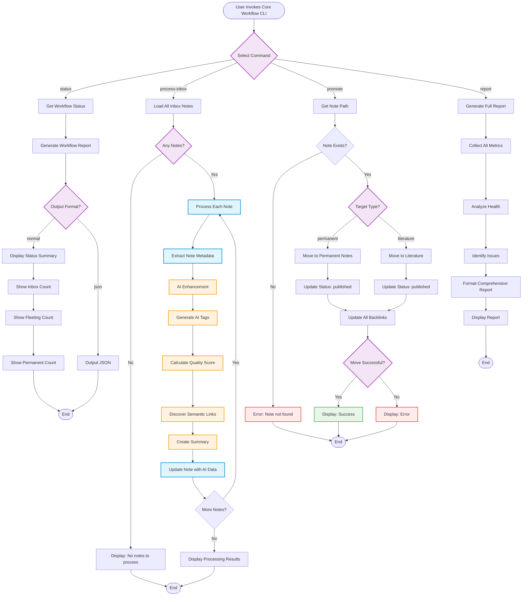

# Core Workflow - Flowchart

**Purpose**: Main workflow operations for inbox processing, status checking, and note promotion  
**CLI**: `core_workflow_cli.py`  
**Manager**: `WorkflowManager`

## Workflow Overview

The Core Workflow manages the fundamental operations of the InnerOS Zettelkasten system, handling note lifecycle from inbox to permanent status.

---

## Mermaid Flowchart



---

## Command Details

### 1. **Status** (`--status`)
**Purpose**: Display current workflow state and note counts

**Flow**:
1. Call `WorkflowManager.generate_workflow_report()`
2. Extract workflow status section
3. Display counts for: inbox, fleeting, permanent, archived
4. Show recent activity metrics

**Output**:
```
WORKFLOW STATUS REPORT
=====================
Inbox: 15 notes
Fleeting: 42 notes
Permanent: 128 notes
Archived: 89 notes
```

---

### 2. **Process Inbox** (`--process-inbox`)
**Purpose**: AI-enhance all notes in the inbox directory

**Flow**:
1. Scan `knowledge/Inbox/` for all markdown files
2. For each note:
   - Extract frontmatter metadata
   - Generate AI tags (3-8 contextual tags)
   - Calculate quality score (0.0-1.0)
   - Discover semantic connections to existing notes
   - Create abstractive summary
   - Update note with AI enhancements
3. Display processing summary with counts

**AI Processing Per Note**:
- **Tags**: Context-aware semantic tagging
- **Quality**: Multi-factor scoring (structure, depth, clarity)
- **Links**: Embedding-based similarity search
- **Summary**: Abstractive summarization with key points

**Performance**: <10s per note average

---

### 3. **Promote** (`--promote <path> <type>`)
**Purpose**: Promote a note from fleeting to permanent or literature

**Flow**:
1. Validate note exists and is eligible for promotion
2. Determine target directory based on type:
   - `permanent` → `knowledge/Permanent Notes/`
   - `literature` → `knowledge/Literature/`
3. Update frontmatter:
   - Change `status: inbox` → `status: published`
   - Add promotion timestamp
4. Move file to target directory
5. Update all backlinks in referencing notes
6. Verify integrity of move operation

**Safeguards**:
- Backup created before move
- Link rewriting for all references
- Validation of successful move
- Rollback capability on error

---

### 4. **Report** (`--report`)
**Purpose**: Generate comprehensive workflow health report

**Flow**:
1. Collect metrics from all note directories
2. Analyze workflow health indicators:
   - Inbox accumulation rate
   - Fleeting note aging
   - Promotion rate
   - Quality score distribution
3. Identify issues:
   - Stale notes (>30 days old)
   - Low-quality notes (score <0.5)
   - Orphaned notes (no links)
4. Format comprehensive report with recommendations

**Report Sections**:
- Workflow Status
- Health Indicators
- Issues & Recommendations
- Recent Activity
- Performance Metrics

---

## Architecture

```
CoreWorkflowCLI
    ↓
WorkflowManager
    ↓
CoreWorkflowManager (orchestration)
    ↓
    ├─→ AnalyticsManager (metrics)
    ├─→ AIEnhancementManager (AI processing)
    └─→ ConnectionManager (link discovery)
```

**Key Classes**:
- `CoreWorkflowCLI`: Command-line interface layer
- `WorkflowManager`: Facade/adapter for all managers
- `CoreWorkflowManager`: Core workflow orchestration
- `AnalyticsManager`: Metrics and reporting
- `AIEnhancementManager`: AI processing pipeline
- `ConnectionManager`: Semantic link discovery

---

## Success Metrics

- **Processing Speed**: <10s per note
- **AI Enhancement**: 100% coverage
- **Quality Target**: Average score >0.75
- **Connection Rate**: >3 links per note
- **Error Rate**: <1% failures

---

**Last Updated**: 2025-10-12  
**Status**: Production Ready ✅
