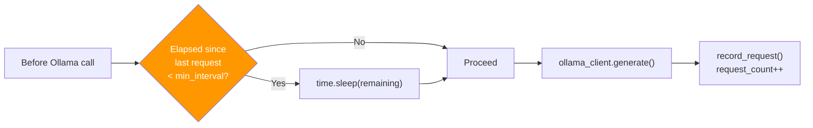

# LLM Deep Quality Scoring - Process Flow

## Entry Points

There are **two entry points** into the LLM scoring system:

1. **Web UI** (`batch_score_ui.py`) — `POST /start` triggers `score_notes_worker()` in a background thread
2. **Programmatic** (`llm_batch_scorer.py`) — `LLMBatchScorer.score_batch()` called directly

Both converge on `AIEnhancer.analyze_note_quality_deep()` for the actual scoring logic.

## Complete Flow

```mermaid
flowchart TD
    %% ── Entry Points ──
    A["🌐 Web UI: POST /start<br/>{path, use_llm, resume}"]
    B["🐍 Programmatic API<br/>LLMBatchScorer.score_batch()"]

    A --> C["Reset scoring_state<br/>Set mode: llm | heuristic"]
    C --> D["Spawn worker thread<br/>score_notes_worker()"]
    B --> E["LLMBatchScorer.score_batch()"]

    %% ── Checkpoint Resume ──
    D --> F{"resume=True AND<br/>checkpoint exists?"}
    E --> F
    F -- Yes --> G["Load .llm_scoring_checkpoint.json<br/>Populate scored_notes dict"]
    F -- No --> H["scored_notes = empty dict"]
    G --> I["Find all .md notes in vault<br/>Exclude: .git, .obsidian, etc."]
    H --> I

    %% ── Per-Note Loop ──
    I --> J["FOR each note_path in notes"]
    J --> K{"note.name in<br/>scored_notes?"}
    K -- Yes --> L["Skip: use cached result<br/>Append to results"]
    L --> J

    K -- No --> M["Read note content<br/>note_path.read_text()"]
    M --> N{"use_llm?"}

    %% ── Heuristic Branch ──
    N -- "False" --> O["enhancer._basic_quality_analysis()<br/>Weighted scoring: structural 30%,<br/>content 40%, zettelkasten 30%"]
    O --> P["Return: quality_score, suggestions,<br/>score_breakdown, zettelkasten_compliance"]

    %% ── LLM Branch ──
    N -- "True" --> Q["enhancer.analyze_note_quality_deep()<br/>use_llm=True"]
    Q --> R["Strip YAML frontmatter"]
    R --> S["_build_deep_analysis_prompt()<br/>Grammar + Coherence + Zettelkasten criteria"]
    S --> T["ollama_client.generate(prompt)<br/>→ llama3:latest"]
    T --> U["_parse_deep_analysis_response()"]

    %% ── Response Parsing ──
    U --> V{"JSON in ```code block```?"}
    V -- Yes --> W["json.loads() → full result"]
    V -- No --> X{"Bare JSON object<br/>found in response?"}
    X -- Yes --> Y{"json.loads()<br/>succeeds?"}
    Y -- Yes --> W
    Y -- "No (truncated)" --> Z["Regex fallback:<br/>Extract quality_score, coherence_score<br/>from truncated JSON"]
    X -- No --> Z
    Z --> W

    %% ── LLM Exception Handling ──
    T -- "Exception" --> AA["Fallback: _basic_quality_analysis()<br/>mode = 'heuristic_fallback'"]
    AA --> P

    %% ── Post-Score ──
    W --> BB["result.mode = 'llm'"]
    BB --> CC["Build note_result dict:<br/>score, coherence_score,<br/>grammar_issues, zettelkasten_feedback"]
    P --> CC

    CC --> DD["Append to scoring_state.results"]
    DD --> EE{"use_llm?"}
    EE -- Yes --> FF["Save checkpoint to disk<br/>.llm_scoring_checkpoint.json"]
    EE -- No --> GG["Calculate ETA<br/>Push SSE update"]
    FF --> GG

    GG --> HH{"More notes?"}
    HH -- Yes --> J
    HH -- No --> II["scoring_state.status = 'complete'<br/>Return aggregate stats:<br/>avg quality, avg coherence, errors"]

    %% ── Styling ──
    style A fill:#1a73e8,color:#fff
    style B fill:#1a73e8,color:#fff
    style N fill:#ff9800,color:#fff
    style K fill:#ff9800,color:#fff
    style V fill:#9c27b0,color:#fff
    style X fill:#9c27b0,color:#fff
    style Y fill:#9c27b0,color:#fff
    style T fill:#e91e63,color:#fff
    style AA fill:#f44336,color:#fff
    style II fill:#4caf50,color:#fff
    style W fill:#4caf50,color:#fff
```

## Rate Limiting (LLMBatchScorer path only)

## Key Classes and Responsibilities

| Class | File | Role |
|-------|------|------|
| `batch_score_ui.score_notes_worker()` | `src/cli/batch_score_ui.py` | Web UI worker thread, SSE updates, ETA |
| `LLMBatchScorer` | `src/ai/llm_batch_scorer.py` | Programmatic API, orchestrates batch |
| `CheckpointManager` | `src/ai/llm_batch_scorer.py` | Checkpoint persistence and recovery |
| `OllamaRateLimiter` | `src/ai/llm_batch_scorer.py` | Throttles Ollama API requests |
| `AIEnhancer.analyze_note_quality_deep()` | `src/ai/enhancer.py` | Core scoring logic, mode dispatch |
| `AIEnhancer._build_deep_analysis_prompt()` | `src/ai/enhancer.py` | Constructs Ollama prompt |
| `AIEnhancer._parse_deep_analysis_response()` | `src/ai/enhancer.py` | Parses JSON (with truncation fallback) |
| `AIEnhancer._basic_quality_analysis()` | `src/ai/enhancer.py` | Heuristic weighted scoring fallback |
