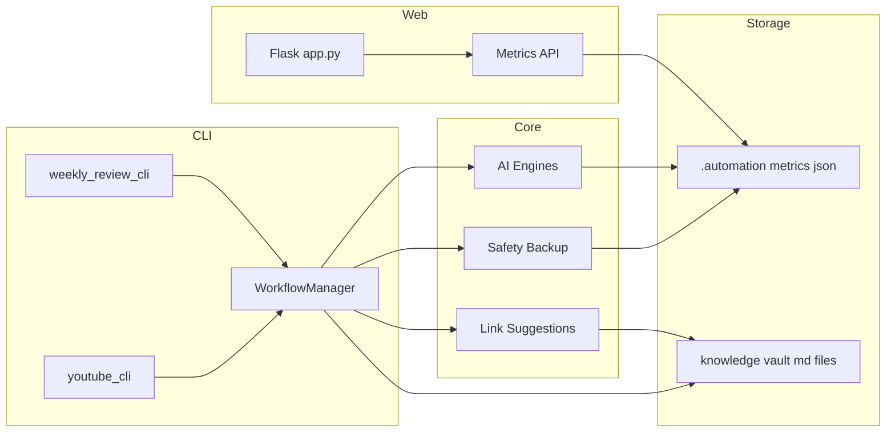

# InnerOS Architecture

## System Overview

## Module Map

- development/src/ai — core analytics and AI helpers
- development/src/cli — user facing commands
- development/src/utils — safety and directory helpers
- development/src/monitoring — metrics and health
- web_ui — Flask app and metrics view

## Key Flows

- Weekly review: CLI reads vault, computes metrics, writes JSON; optional UI reads metrics
- Inbox capture: automation script normalizes files, updates vault, records activity
