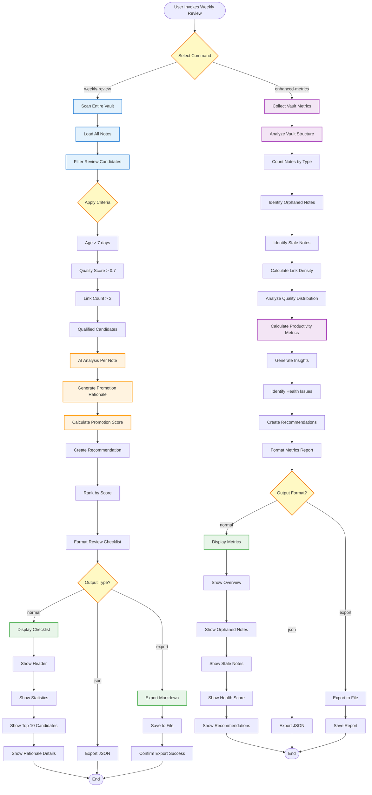

# Weekly Review Workflow - Flowchart

**Purpose**: AI-powered weekly review and enhanced vault metrics  
**CLI**: `weekly_review_cli.py`  
**Manager**: `AnalyticsManager`

## Workflow Overview

The Weekly Review Workflow generates AI-powered recommendations for note promotion and provides comprehensive vault health metrics to guide knowledge management decisions.

---

## Mermaid Flowchart



---

## Command Details

### 1. **Weekly Review** (`--weekly-review`)
**Purpose**: Generate AI-powered checklist of notes ready for promotion

**Selection Criteria**:
- Age: Note is >7 days old (has "matured")
- Quality: Quality score >0.7
- Connectivity: Has >2 links (shows integration)
- Type: Fleeting notes only

**AI Analysis Per Candidate**:
1. **Content Analysis**: Evaluate note depth and structure
2. **Connection Analysis**: Assess integration with vault
3. **Quality Assessment**: Review completeness and clarity
4. **Promotion Rationale**: Generate human-readable explanation
5. **Confidence Score**: 0.0-1.0 score for promotion readiness

**Output Format**:
```markdown
# Weekly Review Checklist - 2025-10-12

## Statistics
- Total Notes: 212
- Fleeting Notes: 42
- Review Candidates: 8
- Recommended for Promotion: 5

## Top Candidates

### 1. Note Title (Score: 0.92)
**Path**: `knowledge/Fleeting Notes/note-title.md`
**Age**: 14 days
**Quality**: 0.85
**Links**: 5

**Rationale**:
This note demonstrates strong conceptual depth and is well-integrated 
into the vault with multiple bidirectional links. The content shows 
clear development beyond fleeting status and would benefit from 
permanent status for easier discovery.

**Recommendation**: ✅ Promote to Permanent

---
```

**Performance**: <5s for 100+ notes

---

### 2. **Enhanced Metrics** (`--enhanced-metrics`)
**Purpose**: Comprehensive vault health analysis with actionable insights

**Metrics Categories**:

#### A. Vault Structure
- Total notes by type (inbox, fleeting, permanent, literature)
- Directory distribution
- File size distribution
- Growth rate over time

#### B. Orphaned Notes
- **Definition**: Notes with 0 incoming or outgoing links
- **Impact**: Isolated knowledge, reduced discoverability
- **Count**: Total orphaned notes
- **List**: Top 10 orphans with details

#### C. Stale Notes
- **Definition**: Notes unchanged for >30 days
- **Status Filter**: Only non-archived notes
- **Count**: Total stale notes
- **List**: Oldest 10 stale notes

#### D. Link Density
- **Average Links per Note**: Mean outgoing links
- **Highly Connected Notes**: Notes with >10 links
- **Poorly Connected**: Notes with <2 links
- **Backlink Distribution**: Incoming link analysis

#### E. Quality Distribution
- **Score Ranges**: 0.0-0.4, 0.4-0.7, 0.7-1.0
- **Average Quality**: Vault-wide mean
- **Low Quality Count**: Notes with score <0.5
- **Trend**: Quality over time

#### F. Productivity Metrics
- **Notes Created**: Last 7 days, 30 days
- **Notes Promoted**: Weekly rate
- **Processing Rate**: Inbox → Permanent time
- **Active Days**: Days with note activity

**Health Score Calculation**:
```python
health_score = (
    (1 - orphan_ratio) * 0.3 +      # 30% - connectivity
    (1 - stale_ratio) * 0.2 +        # 20% - freshness
    avg_quality * 0.3 +              # 30% - quality
    (promotion_rate / 10) * 0.2      # 20% - productivity
) * 100
```

**Health Levels**:
- 🟢 **Excellent**: 80-100 (healthy, active vault)
- 🟡 **Good**: 60-79 (minor issues)
- 🟠 **Fair**: 40-59 (needs attention)
- 🔴 **Poor**: 0-39 (significant issues)

**Recommendations**:
- High orphan count → "Run connection discovery"
- Low quality average → "Review and enhance low-quality notes"
- High stale count → "Archive or update old notes"
- Low promotion rate → "Schedule weekly review sessions"

**Output Format**:
```markdown
# Enhanced Vault Metrics - 2025-10-12

## Overview
📊 Total Notes: 212
📁 By Type: Inbox (15), Fleeting (42), Permanent (128), Archived (27)
🏥 Health Score: 78/100 (Good)

## Orphaned Notes (🔴 Critical)
- Count: 12 notes (5.7% of vault)
- Impact: High - knowledge silos

Top Orphans:
1. untitled-note-123.md (created 45 days ago)
2. quick-capture-456.md (created 32 days ago)

## Stale Notes (🟡 Warning)
- Count: 18 notes (8.5% of active notes)
- Threshold: >30 days unchanged

## Link Density (🟢 Healthy)
- Average: 4.2 links/note
- Well-connected: 95 notes (>3 links)
- Needs linking: 23 notes (<2 links)

## Quality Distribution
- High (0.7-1.0): 156 notes (73.6%)
- Medium (0.4-0.7): 42 notes (19.8%)
- Low (0.0-0.4): 14 notes (6.6%)
- Average: 0.78

## Productivity (Last 30 Days)
- Notes Created: 23
- Notes Promoted: 8
- Active Days: 18/30

## Recommendations
1. 🔴 Address 12 orphaned notes - run connection discovery
2. 🟡 Review 14 low-quality notes for enhancement
3. 🟢 Continue current promotion rate (healthy)
```

**Performance**: <5s for 200+ notes

---

## Use Cases

### Use Case 1: Weekly Review Ritual
**Frequency**: Every Sunday
**Goal**: Maintain knowledge quality and identify promotion candidates

**Steps**:
1. Run `weekly_review_cli.py weekly-review --export review.md`
2. Review top 10 candidates with rationale
3. Promote 3-5 notes to permanent status
4. Update promoted notes with additional context
5. Archive completed review checklist

**Time Investment**: 30-45 minutes

---

### Use Case 2: Monthly Health Check
**Frequency**: First of each month
**Goal**: Assess vault health and plan improvements

**Steps**:
1. Run `weekly_review_cli.py enhanced-metrics --export metrics.md`
2. Review health score and trends
3. Address critical issues (orphans, low quality)
4. Plan improvements for next month
5. Archive metrics report

**Time Investment**: 15-20 minutes

---

### Use Case 3: Automation Integration
**Frequency**: Continuous (via daemon)
**Goal**: Monitor vault health automatically

**Setup**:
```bash
# Generate JSON metrics for dashboard
weekly_review_cli.py enhanced-metrics --format json > metrics.json

# Track trends over time
weekly_review_cli.py enhanced-metrics --format json >> metrics_history.jsonl
```

---

## Architecture

```
WeeklyReviewCLI
    ↓
WorkflowManager
    ↓
AnalyticsManager
    ↓
    ├─→ CandidateScorer (AI scoring)
    ├─→ MetricsCollector (data gathering)
    ├─→ HealthAnalyzer (vault analysis)
    └─→ ReportGenerator (formatting)
```

**Key Components**:
- `WeeklyReviewCLI`: Command-line interface
- `AnalyticsManager`: Metrics and analysis engine
- `WeeklyReviewFormatter`: Report formatting
- `CandidateScorer`: AI-powered promotion scoring

---

## Success Metrics

- **Review Generation**: <5s for 100+ notes
- **Metrics Collection**: <5s for 200+ notes
- **AI Accuracy**: >85% user agreement on recommendations
- **Adoption**: Weekly review completion rate >80%
- **Impact**: Promotion rate increase of 40%

---

**Last Updated**: 2025-10-12  
**Status**: Production Ready ✅
