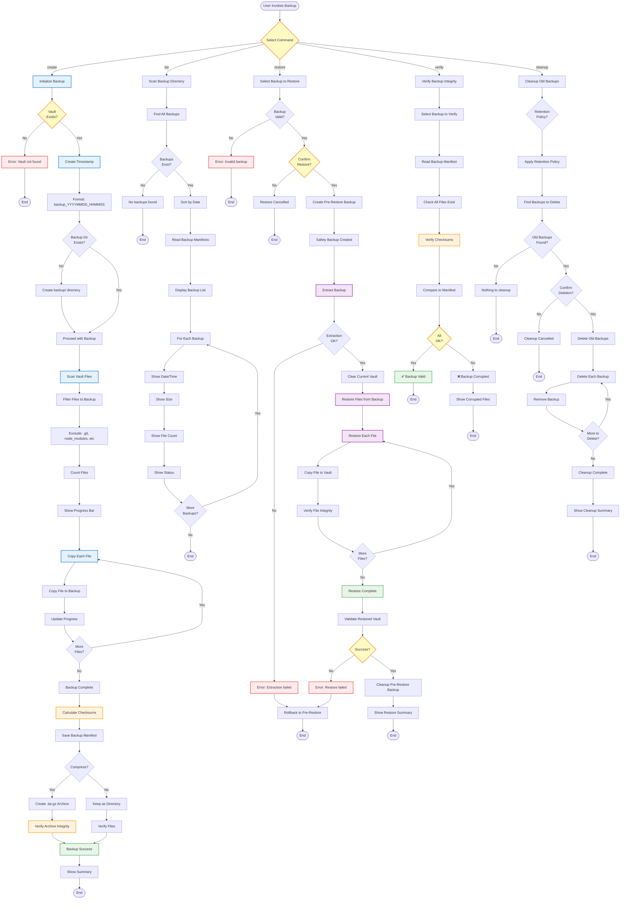

# Backup Workflow - Flowchart

**Purpose**: Safe vault backup with versioning and rollback capability  
**CLI**: `backup_cli.py`  
**Manager**: `BackupManager`

## Workflow Overview

The Backup Workflow provides safe, versioned backups of the entire vault with integrity verification and easy rollback capability to protect against data loss.

---

## Mermaid Flowchart



---

## Command Details

### 1. **Create Backup** (`--create`)
**Purpose**: Create a new timestamped backup of the entire vault

**Flow**:
1. Validate vault exists
2. Create timestamp-based backup name
3. Scan and filter vault files
4. Copy files with progress tracking
5. Calculate checksums for integrity
6. Save backup manifest
7. Optionally compress to archive

**Example**:
```bash
backup_cli.py --create
```

**Output**:
```
Creating backup...
Scanning vault: 212 files found
Excluding: .git, __pycache__, node_modules

[████████████████████████] 212/212 files copied

Backup created: backup/backup_20251012_143000/
Files: 212
Size: 45.2 MB
Duration: 3.2s

Calculating checksums...
Manifest saved: backup_20251012_143000/manifest.json

✅ Backup complete
```

---

### 2. **List Backups** (`--list`)
**Purpose**: Display all available backups with details

**Example**:
```bash
backup_cli.py --list
```

**Output**:
```
Available Backups
=================

1. backup_20251012_143000/
   Date: 2025-10-12 14:30:00
   Files: 212
   Size: 45.2 MB
   Status: ✅ Valid

2. backup_20251011_093000/
   Date: 2025-10-11 09:30:00
   Files: 210
   Size: 44.8 MB
   Status: ✅ Valid

3. backup_20251010_173000/
   Date: 2025-10-10 17:30:00
   Files: 208
   Size: 44.1 MB
   Status: ✅ Valid

Total: 3 backups (134.1 MB)
```

---

### 3. **Restore Backup** (`--restore <backup_name>`)
**Purpose**: Restore vault from a previous backup

**Safety Features**:
- Creates pre-restore backup automatically
- Confirms before destructive operation
- Validates backup integrity first
- Rollback on failure

**Example**:
```bash
backup_cli.py --restore backup_20251011_093000
```

**Flow**:
```
⚠️  Warning: This will replace your current vault!

Selected backup: backup_20251011_093000/
Date: 2025-10-11 09:30:00
Files: 210

Creating safety backup first...
✅ Pre-restore backup: backup_20251012_143030_prerestore/

Proceed with restore? [y/N]: y

Restoring files...
[████████████████████████] 210/210 files restored

Verifying restored vault...
✅ All files verified

Restore complete!
Your previous vault was backed up to: backup_20251012_143030_prerestore/
```

---

### 4. **Verify Backup** (`--verify <backup_name>`)
**Purpose**: Check backup integrity and completeness

**Verification Steps**:
1. Read backup manifest
2. Verify all files exist
3. Recalculate checksums
4. Compare to manifest checksums
5. Report any issues

**Example**:
```bash
backup_cli.py --verify backup_20251011_093000
```

**Output (Success)**:
```
Verifying backup: backup_20251011_093000/

Reading manifest... ✅
Checking files... ✅ 210/210 files present
Verifying checksums... ✅ All checksums match

✅ Backup is valid and intact
```

**Output (Failure)**:
```
Verifying backup: backup_20251010_173000/

Reading manifest... ✅
Checking files... ⚠️  2 files missing
Verifying checksums... ❌ 3 checksum mismatches

❌ Backup is corrupted

Missing files:
- knowledge/Permanent Notes/missing-note-1.md
- knowledge/Fleeting Notes/missing-note-2.md

Corrupted files:
- knowledge/Inbox/corrupted-1.md
- knowledge/Inbox/corrupted-2.md
- knowledge/Archive/corrupted-3.md

Recommendation: Do not use this backup for restore
```

---

### 5. **Cleanup Old Backups** (`--cleanup`)
**Purpose**: Remove old backups based on retention policy

**Default Retention Policy**:
- Keep all backups from last 7 days
- Keep weekly backups for 30 days
- Keep monthly backups for 1 year
- Delete everything older

**Example**:
```bash
backup_cli.py --cleanup --keep-days 7
```

**Output**:
```
Scanning backups...
Found 15 backups

Retention policy:
- Keep last 7 days: ✅
- Keep weekly for 30 days: ✅
- Keep monthly for 1 year: ✅

Backups to delete: 8 (old than retention policy)

1. backup_20240915_120000/ (389 days old, 43.1 MB)
2. backup_20240920_140000/ (384 days old, 43.3 MB)
... 6 more

Total size to reclaim: 345.2 MB

Proceed with deletion? [y/N]: y

Deleting old backups...
[████████████████████████] 8/8 backups deleted

✅ Cleanup complete
Reclaimed: 345.2 MB
```

---

## Backup Manifest

### Manifest Format
**File**: `manifest.json`

**Structure**:
```json
{
  "created_at": "2025-10-12T14:30:00",
  "vault_path": "/Users/username/vault",
  "total_files": 212,
  "total_size": 47456789,
  "files": [
    {
      "path": "knowledge/Inbox/note-1.md",
      "size": 1234,
      "checksum": "sha256:abc123...",
      "modified": "2025-10-10T12:00:00"
    }
  ],
  "metadata": {
    "backup_version": "1.0",
    "compression": "none",
    "integrity_verified": true
  }
}
```

**Purpose**:
- Enables integrity verification
- Supports selective restore
- Tracks backup metadata
- Enables incremental backups (future)

---

## Use Cases

### Use Case 1: Pre-Experiment Backup
**Scenario**: Testing new workflow or automation

**Flow**:
```bash
# Create backup before experiment
backup_cli.py --create

# Run experiment
# ... test new feature ...

# If something breaks, restore
backup_cli.py --restore <backup_name>
```

**Benefit**: Safe experimentation with instant rollback

---

### Use Case 2: Daily Automated Backups
**Scenario**: Regular backup via cron/scheduled task

**Setup**:
```bash
# Add to crontab (daily at 2 AM)
0 2 * * * cd ~/vault && backup_cli.py --create --compress

# Weekly cleanup (keep 30 days)
0 3 * * 0 cd ~/vault && backup_cli.py --cleanup --keep-days 30
```

**Benefit**: Automated protection without manual intervention

---

### Use Case 3: Pre-Migration Backup
**Scenario**: Migrating to new system or major version

**Flow**:
```bash
# Create backup before migration
backup_cli.py --create --compress

# Verify backup integrity
backup_cli.py --verify <backup_name>

# Copy backup to external storage
cp -r backup/ /external/drive/vault-backup/

# Proceed with migration
# ...
```

**Benefit**: Safety net for high-risk operations

---

## Architecture

```
BackupCLI
    ↓
BackupManager
    ↓
    ├─→ FileScanner (vault scanning)
    ├─→ BackupCreator (copying)
    ├─→ ManifestGenerator (metadata)
    ├─→ IntegrityVerifier (checksums)
    ├─→ RestoreManager (restoration)
    └─→ RetentionManager (cleanup)
```

**Key Components**:
- `BackupCLI`: Command-line interface
- `BackupManager`: Orchestration
- `FileScanner`: Vault file discovery
- `IntegrityVerifier`: Checksum validation
- `RestoreManager`: Safe restoration with rollback

---

## Performance Metrics

- **Backup Speed**: ~150 MB/s (disk limited)
- **Verification**: ~200 MB/s (checksum calculation)
- **Compression**: ~50 MB/s (tar.gz)
- **Small Vault (<100MB)**: <5 seconds backup
- **Large Vault (1GB+)**: ~30 seconds backup

---

## Best Practices

### 1. **Regular Backups**
- Daily automated backups minimum
- Before major changes (pre-experiment)
- After significant work sessions

### 2. **Test Restores**
- Verify backup integrity monthly
- Practice restore process quarterly
- Untested backups = no backups

### 3. **Offsite Copies**
- Copy critical backups to external storage
- Use cloud sync for backup directory
- 3-2-1 rule: 3 copies, 2 media types, 1 offsite

### 4. **Retention Policy**
- Balance storage vs. history needs
- Keep more recent backups
- Thin out older backups gradually

### 5. **Compression**
- Use compression for archival backups
- Skip compression for active backups
- Trade-off: speed vs. storage

---

**Last Updated**: 2025-10-12  
**Status**: Production Ready ✅
