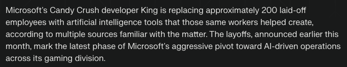

<!--
NOTE: This file uses a static date for validation. For new notes, use:
created: 2025-07-23 20:13
-->

## Thought  
CandyCrush developers are replaced with AI
200 employees were laid off with Microsofts aggresive pivot into AI driven oeprations

"Most of level design has been wiped, which is crazy since they've spent months building tools to craft levels quicker," one King staffer told MobileGamer.biz"

I guess many of the games we will play these days will have 'AI slop' of level design
\

Now we have machines making our family members get more involved with addiction management. 

## Context  
https://www.perplexity.ai/discover/tech/microsoft-s-candy-crush-develo-57l8oM.TQpOZZPj4_SUpmQ
https://www.perplexity.ai/discover/tech/microsoft-s-candy-crush-develo-57l8oM.TQpOZZPj4_SUpmQ

## Next Step  
- [ ] Convert to permanent note?
