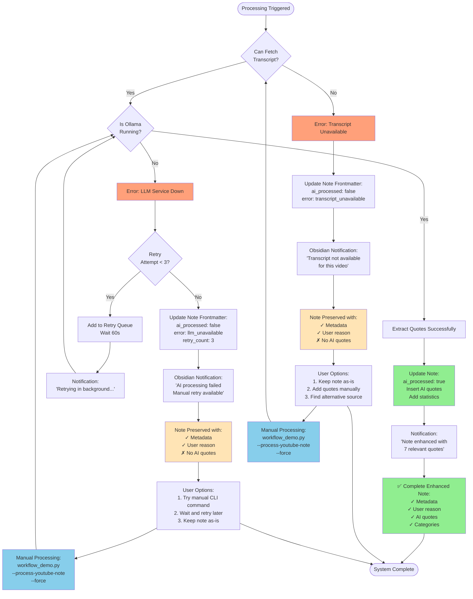

```mermaid
flowchart TD
	Start([Processing Triggered]) --> CheckTranscript{Can Fetch<br/>Transcript?}
	
	CheckTranscript -->|Yes| CheckLLM{Is Ollama<br/>Running?}
	
	CheckTranscript -->|No| TransError[Error: Transcript Unavailable]
	
	CheckLLM -->|Yes| Processing[Extract Quotes Successfully]
	
	CheckLLM -->|No| LLMError[Error: LLM Service Down]
	
	TransError --> UpdateNote1[Update Note Frontmatter:<br/>ai_processed: false<br/>error: transcript_unavailable]
	
	UpdateNote1 --> Notify1[Obsidian Notification:<br/>'Transcript not available<br/>for this video']
	
	Notify1 --> Note1[Note Preserved with:<br/>✓ Metadata<br/>✓ User reason<br/>✗ No AI quotes]
	
	Note1 --> Option1[User Options:<br/>1. Keep note as-is<br/>2. Add quotes manually<br/>3. Find alternative source]
	
	LLMError --> RetryLogic{Retry<br/>Attempt < 3?}
	
	RetryLogic -->|Yes| QueueRetry[Add to Retry Queue<br/>Wait 60s]
	
	QueueRetry --> WaitNotify[Notification:<br/>'Retrying in background...']
	
	WaitNotify --> CheckLLM
	
	RetryLogic -->|No| UpdateNote2[Update Note Frontmatter:<br/>ai_processed: false<br/>error: llm_unavailable<br/>retry_count: 3]
	
	UpdateNote2 --> Notify2[Obsidian Notification:<br/>'AI processing failed<br/>Manual retry available']
	
	Notify2 --> Note2[Note Preserved with:<br/>✓ Metadata<br/>✓ User reason<br/>✗ No AI quotes]
	
	Note2 --> Option2[User Options:<br/>1. Try manual CLI command<br/>2. Wait and retry later<br/>3. Keep note as-is]
	
	Processing --> Success[Update Note:<br/>ai_processed: true<br/>Insert AI quotes<br/>Add statistics]
	
	Success --> NotifySuccess[Notification:<br/>'Note enhanced with<br/>7 relevant quotes']
	
	NotifySuccess --> CompleteNote[✅ Complete Enhanced Note:<br/>✓ Metadata<br/>✓ User reason<br/>✓ AI quotes<br/>✓ Categories]
	
	Option1 --> Manual1[Manual Processing:<br/>workflow_demo.py<br/>--process-youtube-note<br/>--force]
	
	Option2 --> Manual2[Manual Processing:<br/>workflow_demo.py<br/>--process-youtube-note<br/>--force]
	
	Manual1 --> CheckTranscript
	
	Manual2 --> CheckLLM
	
	CompleteNote --> End([System Complete])
	
	Option1 --> End
	
	Option2 --> End
	
	style TransError fill:#FFA07A
	
	style LLMError fill:#FFA07A
	
	style Note1 fill:#FFE4B5
	
	style Note2 fill:#FFE4B5
	
	style CompleteNote fill:#90EE90
	
	style Success fill:#90EE90
	
	style Manual1 fill:#87CEEB
	
	style Manual2 fill:#87CEEB

```