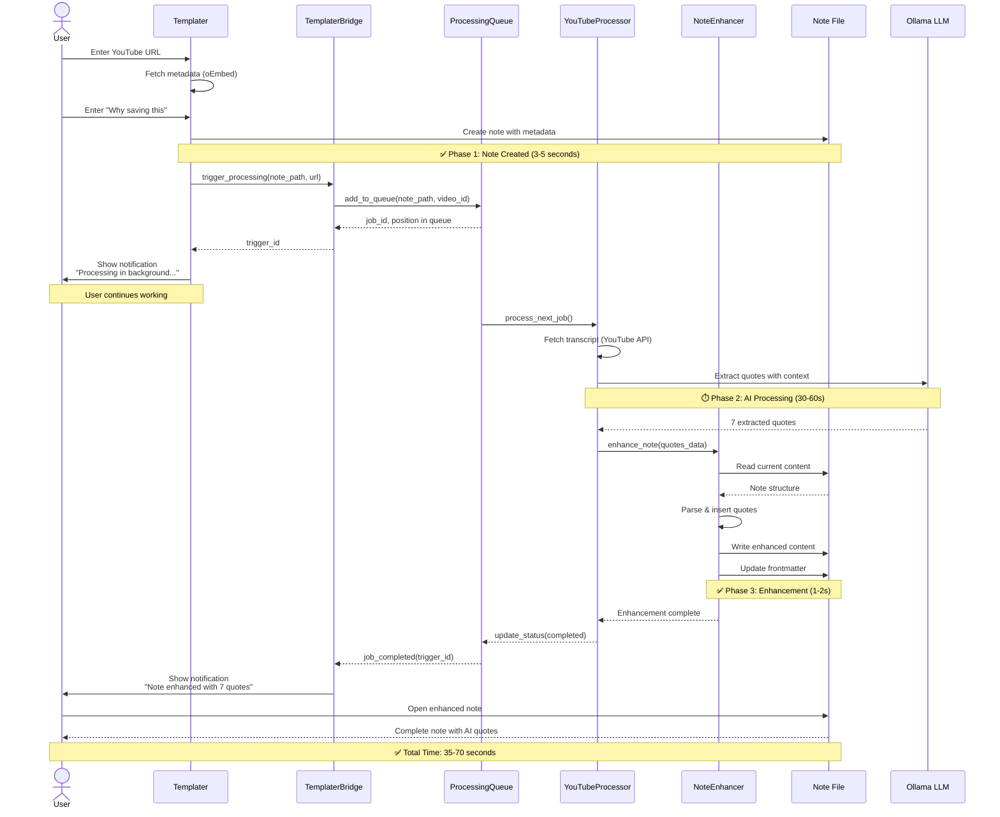

<!--
NOTE: This file uses a static date for validation. For new notes, use:
created: 2025-10-06 16:42
-->

## Thought  
Write the idea that just popped into your head.

## Context  
Where did this come from? (Article, conversation, reflection, etc.)

## Next Step  
- [ ] Convert to permanent note?
