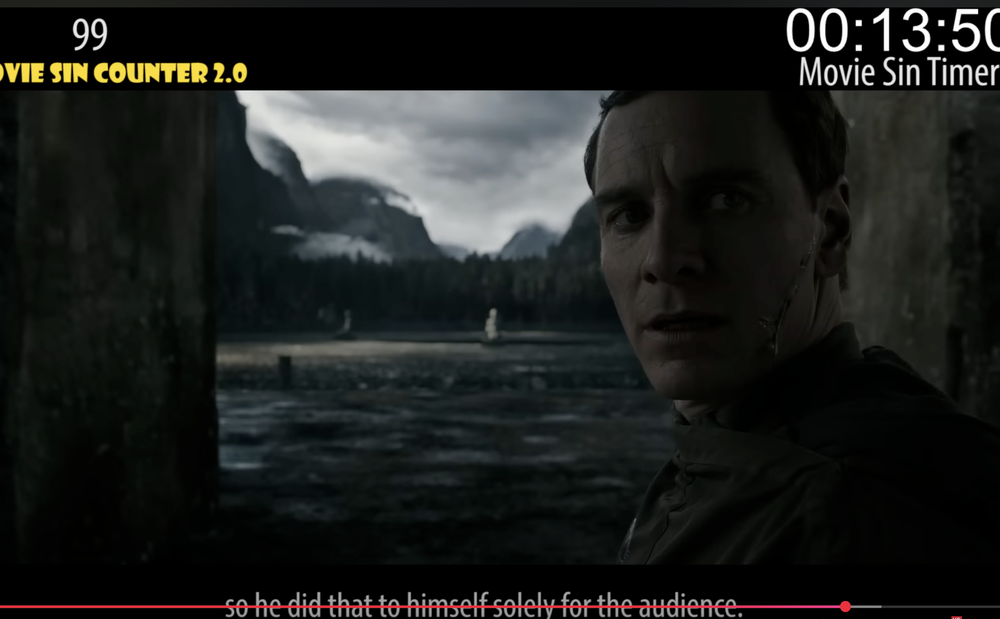

# Image Link Preservation Demo

This is a live test of TDD Iteration 10 - Image Linking System.

## Test Images

Here are some real images from the vault:

**Markdown syntax:**


**Wiki syntax:**
![[image.png]]

**Another markdown image:**


## Expected Behavior

When this note is moved from `Inbox/` to `Fleeting Notes/`:
1. ✅ Markdown image paths will be preserved (already at correct relative path)
2. ✅ Wiki image links will remain unchanged (Obsidian auto-resolves)
3. ✅ DirectoryOrganizer will update links automatically
4. ✅ No manual intervention needed

## Testing Instructions

```bash
# Run directory organizer
python3 development/src/cli/workflow_demo.py knowledge/ --organize-dry-run

# Execute the move
python3 development/src/cli/workflow_demo.py knowledge/ --organize-execute
```

This note will be automatically moved to `Fleeting Notes/` because `type: fleeting`.
